# Поведенческие паттерны проектирования

Решают задачи эффективного и безопасного взаимодействия между объектами программы.

<details>
<summary>
  Chain of Responsibility
</summary>

**Цепочка обязанностей** — это поведенческий паттерн проектирования, который позволяет передавать запросы последовательно по цепочке обработчиков. Каждый последующий обработчик решает, может ли он обработать запрос сам и стоит ли передавать запрос дальше по цепи.

<details>
<summary>
  Проблема
</summary>

Мы создаем банковскую систему. И в нее поступают заявки от клиентов на различные операции. Каждая заявка должна проходить несколько этапов проверки:

- Проверка формата данных
- Проверка лимитов
- Проверка безопасности
- Проверка кредитной истории
- Финальное одобрение

Заявки поступают в класс `LoanApplication` и обрабатываются в его методе `Process()`.

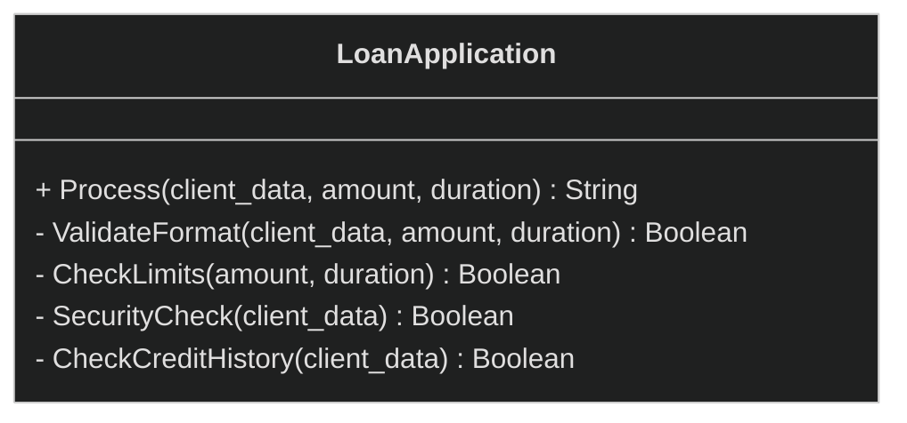

```pseudocode
class LoanApplication {
  function Process(application: Application) : String {
    // Проверка формата данных
    if (!this.ValidateFormat(application)) {
      return "Invalid format"
    }

    // Проверка финансовых лимитов
    if (!this.CheckLimits(application)) {
      return "Limit exceeded"
    }

    // Проверка безопасности
    if (!this.SecurityCheck(application)) {
      return "Security issues"
    }

    // Проверка кредитной истории
    if (!this.CheckCreditHistory(application)) {
      return "Poor credit history"
    }

    // Финальное одобрение
    return "Approved"
  }

  function ValidateFormat(application: Application) : Boolean {
    // Проверяет корректность заполнения полей
    return application.name != null
      and application.amount > 0
      and application.duration > 0
  }

  function CheckLimits(application: Application) : Boolean {
    // Проверяет не превышены ли лимиты
    return application.amount <= 1000000
      and application.duration <= 60
  }

  function SecurityCheck(application: Application) : Boolean {
    // Проверяет безопасность операции
    return !application.client.isBlacklisted()
      and !application.hasFraudIndicators()
  }

  function CheckCreditHistory(application: Application) : Boolean {
    // Проверяет кредитную историю клиента
    return application.client.creditScore >= 650
      and application.client.hasNoDelinquencies()
  }
}
```

Если реализовать всё в одном классе, получится огромный метод с множеством условий. При добавлении новых проверок придется модифицировать существующий код, нарушая принцип открытости/закрытости.

Такой подход сложно поддерживать и расширять.

</details>

<details>
<summary>
  Решение
</summary>

Паттерн Цепочка обязанностей предлагает превратить отдельные поведения в объекты-обработчики. Каждый обработчик содержит метод для выполнения одной конкретной проверки. Данные для таких проверок будут передаваться в метод через параметры. Вместо монолитного метода `Process()` мы создаем отдельные обработчики с методом `Handle()`.

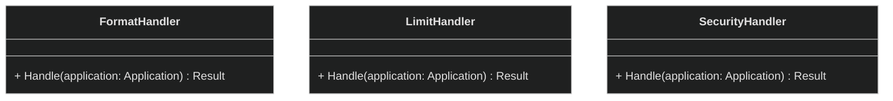

Обработчики объединяются в цепочку, где каждый имеет ссылку на следующего в последовательности. Это позволяет обработчику выполнить собственную логику над запросом
и при необходимости передать запрос следующему звену цепи. Длина цепочки легко масштабируется. Обработчик может прервать передачу запроса дальше, что дает гибкость в некоторых сценариях.

Создадим абстрактный класс LoanHandler, который будет содержать общую логику для всех обработчиков, включая методы и поле-ссылку `next` на следующий обработчик:

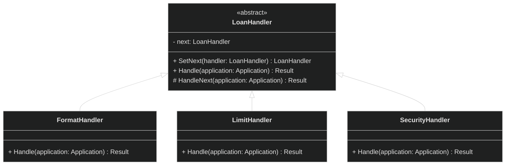

И для удобной работы клиентского кода с объекетами-обработчиками создадим общий интерфейс:

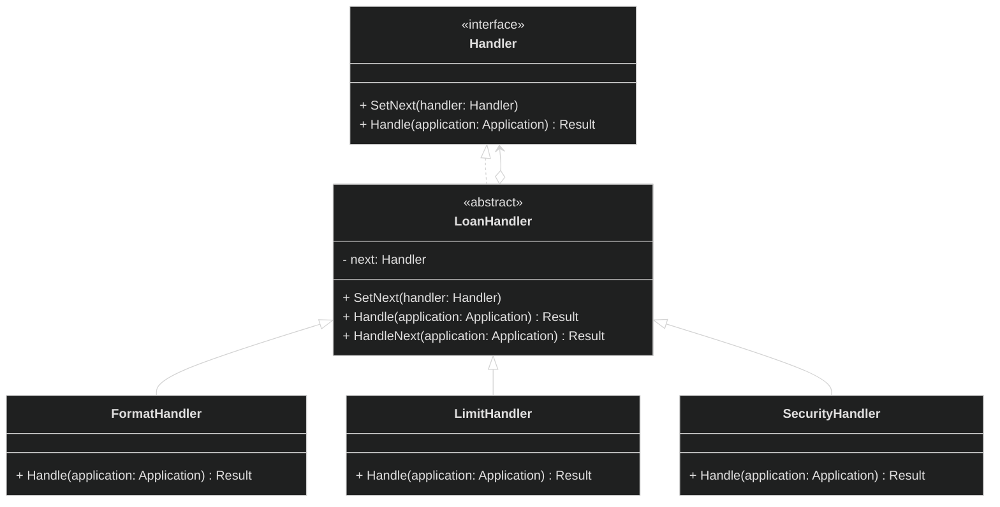

**Псевдокод:**

**Handler (интерфейс):**

```pseudocode
interface Handler {
  function SetNext(handler: Handler)
  function Handle(application: Application) : Result
}
```

**LoanHandler (абстрактный класс):**

```pseudocode
abstract class LoanHandler implements Handler {
  field next: Handler

  function SetNext(handler: Handler) {
    this.next = handler
  }

  abstract function Handle(application: Application) : Result

  function HandleNext(application: Application) : Result {
    if (this.next != null) {
      return this.next.Handle(application)
    }
    return Result("Approved")
  }
}
```

**FormatHandler:**

```pseudocode
class FormatHandler extends LoanHandler {
  function Handle(application: Application) : Result {
    if (!application.hasRequiredFields()) {
      return Result("Error: Invalid format")
    }
    return this.HandleNext(application)
  }
}
```

**LimitHandler:**

```pseudocode
class LimitHandler extends LoanHandler {
  function Handle(application: Application) : Result {
    if (application.amount > 1000000) {
      return Result("Error: Amount exceeds limit")
    }
    return this.HandleNext(application)
  }
}
```

**SecurityHandler:**

```pseudocode
class SecurityHandler extends LoanHandler {
  function Handle(application: Application) : Result {
    if (application.client.isBlacklisted()) {
      return Result("Error: Client blacklisted")
    }
    return this.HandleNext(application)
  }
}
```

**Использование:**

```pseudocode
format_handler = new FormatHandler()
limit_handler = new LimitHandler()
security_handler = new SecurityHandler()

format_handler.SetNext(limitHandler)
limit_handler.SetNext(securityHandler)

result = format_handler.Handle(application)
// Запускаем обработку через цепочку: Формат → Лимиты → Безопасность
```

</details>

**Общая диаграмма паттерна:**

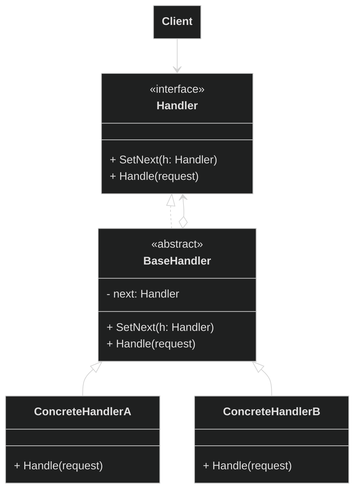

</details>

Command
**Команда** — это поведенческий паттерн проектирования, который превращает запросы в объекты, позволяя передавать их как аргументы при вызове методов, ставить запросы в очередь, логировать их, а также поддерживать отмену операций.

Проблема

Представьте, что вы разрабатываете текстовый редактор, подобный Word или Google Docs. Вы уже реализовали класс `Document`, который содержит бизнес-логику работы с документом.

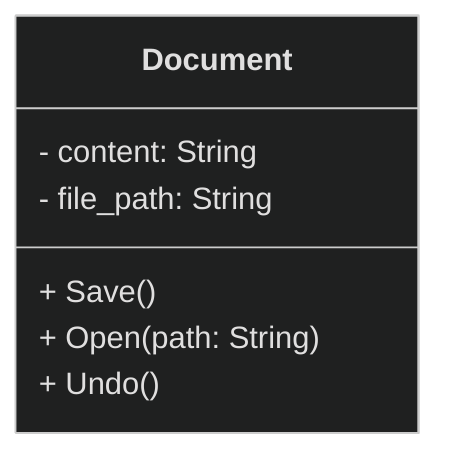

Вам нужно реализовать различные элементы управления(кнопки, ползунки и т.д.) для выполнения операций с документом:

- Сохранить документ
- Открыть новый документ
- Отменить изменения

В нашей программе существует разные способы вызова этих операций:

- Кнопки на панели инструментов
- Пункты в меню (Файл → Сохранить)
- Горячие клавиши (Ctrl+S, Ctrl+O, Ctlr+Z)

Можно создать отдельные классы для каждого элемента управления:


```pseudocode
// Кнопка "Сохранить" на панели инструментов
class SaveButton extends Button {
  field document: Document

  function OnClick() {
    document.Save()
  }
}

// Пункт меню "Сохранить"
class SaveMenuItem extends MenuItem {
  field document: Document

  function OnSelect() {
    document.Save()
  }
}

// Горячие клавиши Ctrl+S
class SaveShortcut extends Shortcut {
  field document: Document

  function OnKeyPress() {
    document.Save()
  }
}

// И так для операций Открыть и Отменить...
```

Это очень плохой подход:

1. Мы создаем огромное количество подклассов
2. Один и тот же код повторяется в разных местах программы.
3. При внесении изменений, например, сохранения файлов придется переписывать код сразу в нескольких местах.

Решение

Паттерн Команда предлагает вынести операции в отдельные классы-команды с единым интерфейсом, содержащим всего один метод для выполнения операции. Это позволяет разным элементам интерфейса работать с любыми командами, не зная их конкретной реализации.

Благодаря такому подходу, одни и те же кнопки, пункты меню или горячие клавиши могут выполнять различные команды, просто подменяя объект команды. Сами команды содержат всю необходимую информацию для выполнения операции — параметры, данные получателя и бизнес-логику. Элементы интерфейса лишь инициируют выполнение команды, не заботясь о том, что именно происходит внутри и какие данные требуются для операции.

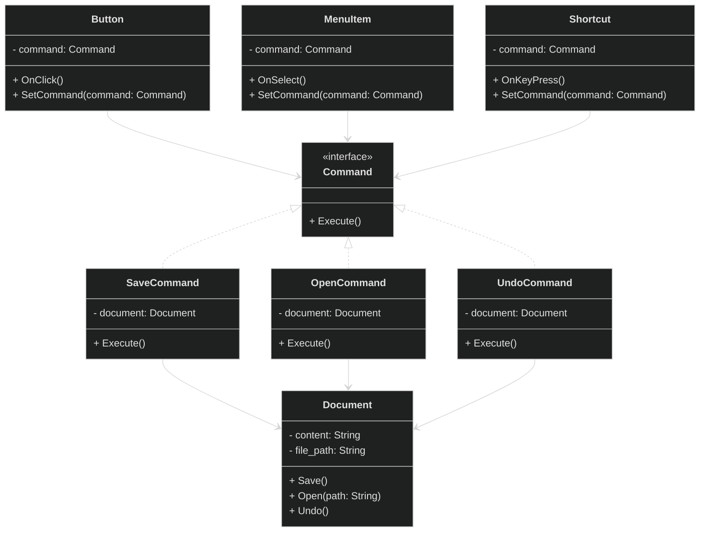

**Псевдокод:**

**Command (интерфейс):**

```pseudocode
interface Command {
  function Execute()
}
```

**SaveCommand:**

```pseudocode
class SaveCommand implements Command {
  field document: Document

  constructor(document: Document) {
    this.document = document
  }

  function Execute() {
    document.Save()
  }
}
```

**OpenCommand:**

```pseudocode
class OpenCommand implements Command {
  field document: Document

  constructor(document: Document) {
    this.document = document
  }

  function Execute() {
    document.Open()
  }
}
```

**UndoCommand:**

```pseudocode
class UndoCommand implements Command {
  field document: Document

  constructor(document: Document) {
    this.document = document
  }

  function Execute() {
    document.Undo()
  }
}
```

**Button:**

```pseudocode
class Button {
  field command: Command

  function SetCommand(cmd: Command) {
    this.command = cmd
  }

  function OnClick() {
    if (command != null) {
      command.Execute()
    }
  }
}
```

**MenuItem:**

```pseudocode
class MenuItem {
  field command: Command

  function SetCommand(cmd: Command) {
    this.command = cmd
  }

  function OnSelect() {
    if (command != null) {
      command.Execute()
    }
  }
}
```

**Shortcut:**

```pseudocode
class Shortcut {
  field command: Command

  function SetCommand(cmd: Command) {
    this.command = cmd
  }

  function OnKeyPress() {
    if (command != null) {
      command.Execute()
    }
  }
}
```

**Использование:**

```pseudocode
document = new Document()

save_command = new SaveCommand(document)
open_command = new OpenCommand(document)
undo_command = new UndoCommand(document)

save_button = new Button()
save_menu_item = new MenuItem()
save_shortcut = new Shortcut()

save_button.SetCommand(save_command)
save_menu_item.SetCommand(save_command)
save_shortcut.SetCommand(save_command)

// Теперь все три элемента выполняют сохранение
save_button.OnClick()      // Сохраняет документ
save_menu_item.OnSelect()  // Сохраняет документ
save_shortcut.OnKeyPress() // Сохраняет документ
```

**Общая диаграмма паттерна:**

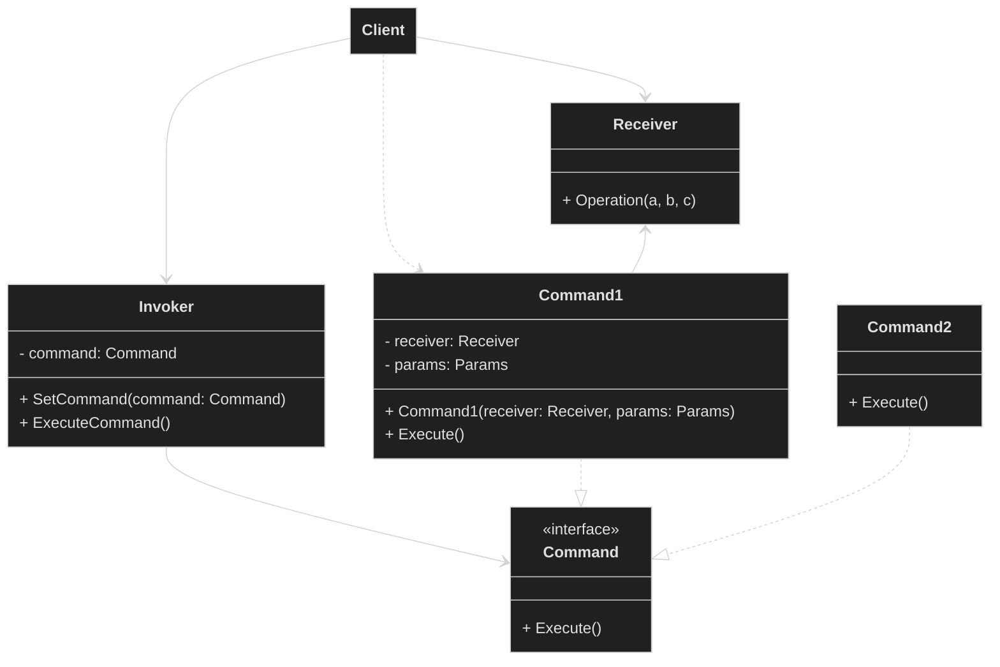

Iterator
**Итератор** — это поведенческий паттерн проектирования, который даёт возможность последовательно обходить элементы составных объектов, не раскрывая их внутреннего представления.

Проблема

В языках программирования встречается множество различных контейнеров для хранения элементов: массив, связный список, хэш-таблица, дерево и т. д. Все они имеют разную внутренюю структуру и для каждого из них приходится использовать свой способ перебора по элементам.

Представьте библиотечную систему, которая хранит книги в разных структурах данных:

- Массив новых поступлений
- Связный список редких книг
- Хэш-таблица книг по авторам

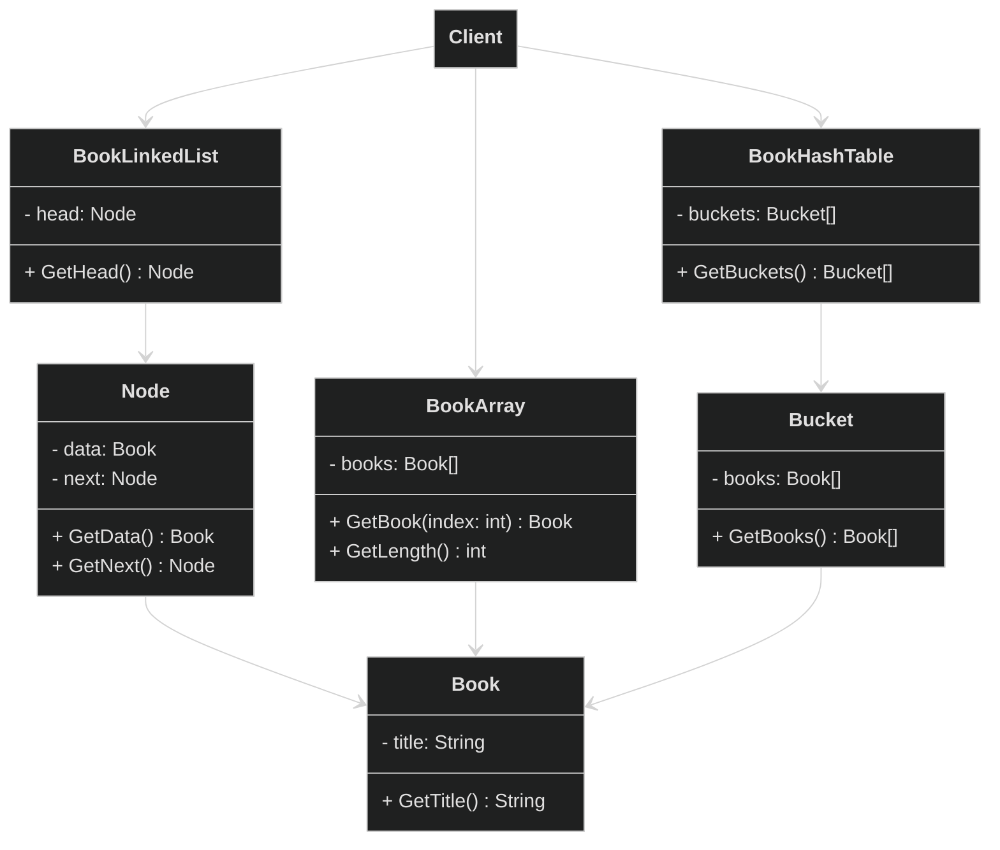

Код клиента:

```pseudocode
// Для массива
for (i = 0; i < array.GetLength(); i++) {
  book = array.GetBook(i)
  print(book.GetTitle())
}

// Для связного списка
current = linked_list.GetHead()
while (current != null) {
  book = current.data
  print(book.GetTitle())
  current = current.next
}

// Для хэш-таблицы
buckets = table.GetBuckets()
for each bucket in buckets {
  books = bucket.GetBooks()
  for each book in books {
    print(book.getTitle())
  }
}
```

Проблема данного подхода в том, что клиентский код должен знать внутреннее устройство каждого контейнера, клиенту видны все внутренние данные контейнеров. И при сменее структуры данных нужно переписывать весь клиентский код.

Решение

Паттерн Итератор предлагает вынести логику обхода коллекций в отдельные классы-итераторы. Вместо того чтобы сама коллекция управляла процессом обхода, для этого создаются специальные объекты-итераторы. Каждый такой итератор самостоятельно отслеживает текущее состояние обхода: какая позиция в коллекции, какие элементы остались, как двигаться дальше. Если нам нужен будет какой-нибудь новый способ обхода, то мы просто добавим новый класс-итератор.

Для начала создадим общий интерфейс Итераторов:

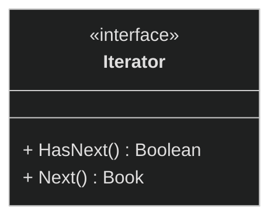

Это позволит клиентскому коду работать с любыми итераторами одинаково и обеспечит заменяемость разных реализаций итераторов.

То же самое проделаем и для самих контейнеров. Интерфейс `IterableCollection` будет гарантировать, что класс коллекции умеет создавать итератор для обхода своих элементов:

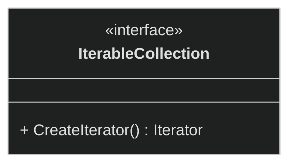

Для библиотечной системы контейнеры с итераторами примут уже такой вид:

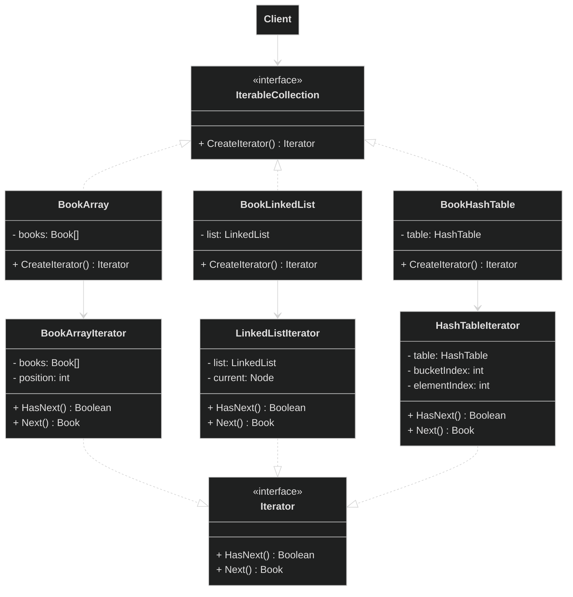

**Общая диаграмма паттерна:**

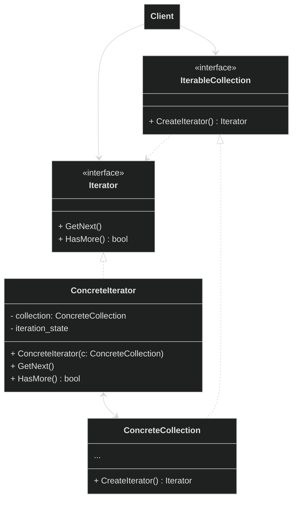

Mediator
**Посредник** — это поведенческий паттерн проектирования, который позволяет уменьшить связанность множества классов между собой, благодаря перемещению этих связей в один класс-посредник.

Проблема
Решение

Memento
**Снимок** — это поведенческий паттерн проектирования, который позволяет сохранять и восстанавливать прошлые состояния объектов, не раскрывая подробностей их реализации.

Проблема
Решение

Observer
**Наблюдатель** — это поведенческий паттерн проектирования, который создаёт механизм подписки, позволяющий одним объектам следить и реагировать на события, происходящие в других объектах.

Проблема
Решение

State
**Состояние** — это поведенческий паттерн проектирования, который позволяет объектам менять поведение в зависимости от своего состояния. Извне создаётся впечатление, что изменился класс объекта.

Проблема
Решение

Strategy
**Стратегия** — это поведенческий паттерн проектирования, который определяет семейство схожих алгоритмов и помещает каждый из них в собственный класс, после чего алгоритмы можно взаимозаменять прямо во время исполнения программы

Проблема
Решение

Template Method
**Шаблонный метод** — это поведенческий паттерн проектирования, который определяет скелет алгоритма, перекладывая ответственность за некоторые его шаги на подклассы. Паттерн позволяет подклассам переопределять шаги алгоритма, не меняя его общей структуры.

Проблема
Решение

Visitor
**Посетитель** — это поведенческий паттерн проектирования, который позволяет добавлять в программу новые операции, не изменяя классы объектов, над которыми эти операции могут выполняться.

Проблема
Решение
