# Поведенческие паттерны проектирования

Решают задачи эффективного и безопасного взаимодействия между объектами программы.

<details>
<summary>
  Chain of Responsibility
</summary>

**Цепочка обязанностей** — это поведенческий паттерн проектирования, который позволяет передавать запросы последовательно по цепочке обработчиков. Каждый последующий обработчик решает, может ли он обработать запрос сам и стоит ли передавать запрос дальше по цепи.

<details>
<summary>
  Проблема
</summary>

Мы создаем банковскую систему. И в нее поступают заявки от клиентов на различные операции. Каждая заявка должна проходить несколько этапов проверки:

- Проверка формата данных
- Проверка лимитов
- Проверка безопасности
- Проверка кредитной истории
- Финальное одобрение

Заявки поступают в класс `LoanApplication` и обрабатываются в его методе `Process()`.

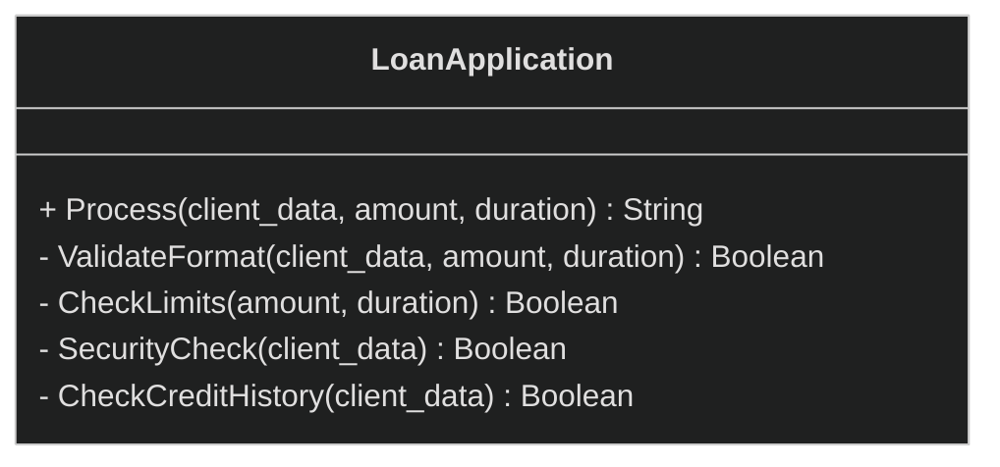

```pseudocode
class LoanApplication {
  function Process(application: Application) : String {
    // Проверка формата данных
    if (!this.ValidateFormat(application)) {
      return "Invalid format"
    }

    // Проверка финансовых лимитов
    if (!this.CheckLimits(application)) {
      return "Limit exceeded"
    }

    // Проверка безопасности
    if (!this.SecurityCheck(application)) {
      return "Security issues"
    }

    // Проверка кредитной истории
    if (!this.CheckCreditHistory(application)) {
      return "Poor credit history"
    }

    // Финальное одобрение
    return "Approved"
  }

  function ValidateFormat(application: Application) : Boolean {
    // Проверяет корректность заполнения полей
    return application.name != null
      and application.amount > 0
      and application.duration > 0
  }

  function CheckLimits(application: Application) : Boolean {
    // Проверяет не превышены ли лимиты
    return application.amount <= 1000000
      and application.duration <= 60
  }

  function SecurityCheck(application: Application) : Boolean {
    // Проверяет безопасность операции
    return !application.client.isBlacklisted()
      and !application.hasFraudIndicators()
  }

  function CheckCreditHistory(application: Application) : Boolean {
    // Проверяет кредитную историю клиента
    return application.client.creditScore >= 650
      and application.client.hasNoDelinquencies()
  }
}
```

Если реализовать всё в одном классе, получится огромный метод с множеством условий. При добавлении новых проверок придется модифицировать существующий код, нарушая принцип открытости/закрытости.

Такой подход сложно поддерживать и расширять.

</details>

<details>
<summary>
  Решение
</summary>

Паттерн Цепочка обязанностей предлагает превратить отдельные поведения в объекты-обработчики. Каждый обработчик содержит метод для выполнения одной конкретной проверки. Данные для таких проверок будут передаваться в метод через параметры. Вместо монолитного метода `Process()` мы создаем отдельные обработчики с методом `Handle()`.

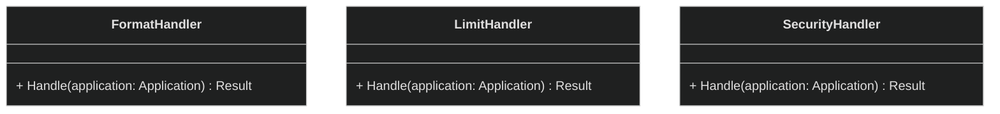

Обработчики объединяются в цепочку, где каждый имеет ссылку на следующего в последовательности. Это позволяет обработчику выполнить собственную логику над запросом
и при необходимости передать запрос следующему звену цепи. Длина цепочки легко масштабируется. Обработчик может прервать передачу запроса дальше, что дает гибкость в некоторых сценариях.

Создадим абстрактный класс LoanHandler, который будет содержать общую логику для всех обработчиков, включая методы и поле-ссылку `next` на следующий обработчик:

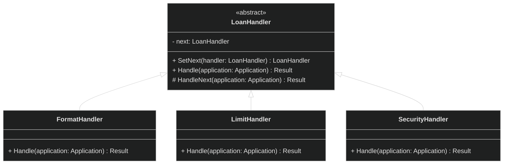

И для удобной работы клиентского кода с объекетами-обработчиками создадим общий интерфейс:

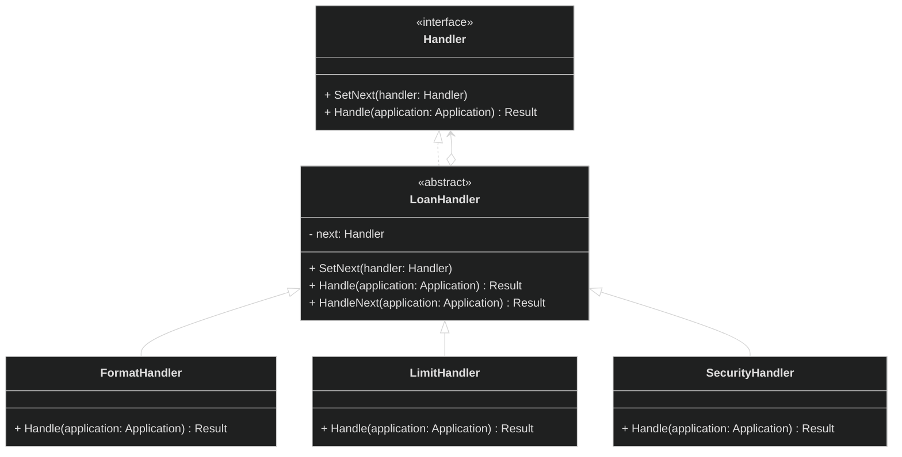

**Псевдокод:**

**Handler (интерфейс):**

```pseudocode
interface Handler {
  function SetNext(handler: Handler)
  function Handle(application: Application) : Result
}
```

**LoanHandler (абстрактный класс):**

```pseudocode
abstract class LoanHandler implements Handler {
  field next: Handler

  function SetNext(handler: Handler) {
    this.next = handler
  }

  abstract function Handle(application: Application) : Result

  function HandleNext(application: Application) : Result {
    if (this.next != null) {
      return this.next.Handle(application)
    }
    return Result("Approved")
  }
}
```

**FormatHandler:**

```pseudocode
class FormatHandler extends LoanHandler {
  function Handle(application: Application) : Result {
    if (!application.hasRequiredFields()) {
      return Result("Error: Invalid format")
    }
    return this.HandleNext(application)
  }
}
```

**LimitHandler:**

```pseudocode
class LimitHandler extends LoanHandler {
  function Handle(application: Application) : Result {
    if (application.amount > 1000000) {
      return Result("Error: Amount exceeds limit")
    }
    return this.HandleNext(application)
  }
}
```

**SecurityHandler:**

```pseudocode
class SecurityHandler extends LoanHandler {
  function Handle(application: Application) : Result {
    if (application.client.isBlacklisted()) {
      return Result("Error: Client blacklisted")
    }
    return this.HandleNext(application)
  }
}
```

**Использование:**

```pseudocode
format_handler = new FormatHandler()
limit_handler = new LimitHandler()
security_handler = new SecurityHandler()

format_handler.SetNext(limitHandler)
limit_handler.SetNext(securityHandler)

result = format_handler.Handle(application)
// Запускаем обработку через цепочку: Формат → Лимиты → Безопасность
```

</details>

**Общая диаграмма паттерна:**

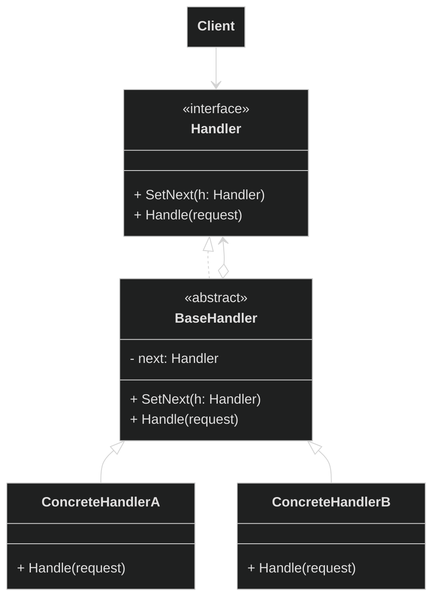

</details>

Command
**Команда** — это поведенческий паттерн проектирования, который превращает запросы в объекты, позволяя передавать их как аргументы при вызове методов, ставить запросы в очередь, логировать их, а также поддерживать отмену операций.

Проблема

Представьте, что вы разрабатываете текстовый редактор, подобный Word или Google Docs. Вы уже реализовали класс `Document`, который содержит бизнес-логику работы с документом.

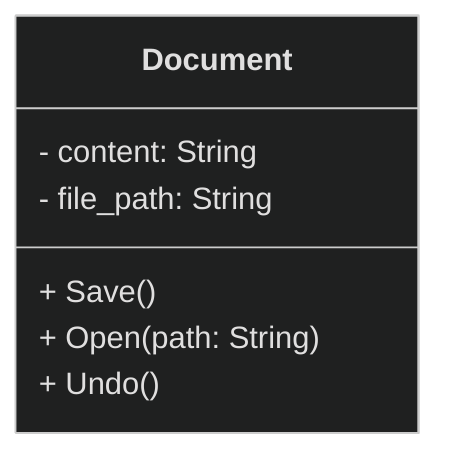

Вам нужно реализовать различные элементы управления(кнопки, ползунки и т.д.) для выполнения операций с документом:

- Сохранить документ
- Открыть новый документ
- Отменить изменения

В нашей программе существует разные способы вызова этих операций:

- Кнопки на панели инструментов
- Пункты в меню (Файл → Сохранить)
- Горячие клавиши (Ctrl+S, Ctrl+O, Ctlr+Z)

Можно создать отдельные классы для каждого элемента управления:

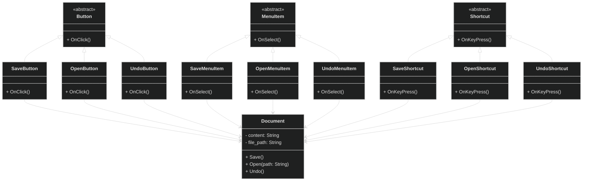

```pseudocode
// Кнопка "Сохранить" на панели инструментов
class SaveButton extends Button {
  field document: Document

  function OnClick() {
    document.Save()
  }
}

// Пункт меню "Сохранить"
class SaveMenuItem extends MenuItem {
  field document: Document

  function OnSelect() {
    document.Save()
  }
}

// Горячие клавиши Ctrl+S
class SaveShortcut extends Shortcut {
  field document: Document

  function OnKeyPress() {
    document.Save()
  }
}

// И так для операций Открыть и Отменить...
```

Это очень плохой подход:

1. Мы создаем огромное количество подклассов
2. Один и тот же код повторяется в разных местах программы.
3. При внесении изменений, например, сохранения файлов придется переписывать код сразу в нескольких местах.

Решение

Паттерн Команда предлагает вынести операции в отдельные классы-команды с единым интерфейсом, содержащим всего один метод для выполнения операции. Это позволяет разным элементам интерфейса работать с любыми командами, не зная их конкретной реализации.

Благодаря такому подходу, одни и те же кнопки, пункты меню или горячие клавиши могут выполнять различные команды, просто подменяя объект команды. Сами команды содержат всю необходимую информацию для выполнения операции — параметры, данные получателя и бизнес-логику. Элементы интерфейса лишь инициируют выполнение команды, не заботясь о том, что именно происходит внутри и какие данные требуются для операции.

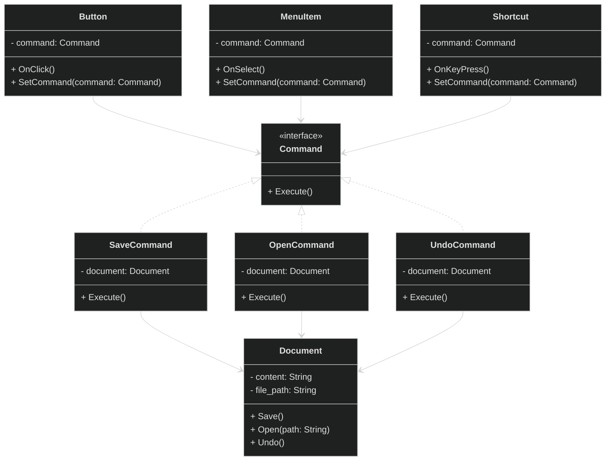

**Псевдокод:**

**Command (интерфейс):**

```pseudocode
interface Command {
  function Execute()
}
```

**SaveCommand:**

```pseudocode
class SaveCommand implements Command {
  field document: Document

  constructor(document: Document) {
    this.document = document
  }

  function Execute() {
    document.Save()
  }
}
```

**OpenCommand:**

```pseudocode
class OpenCommand implements Command {
  field document: Document

  constructor(document: Document) {
    this.document = document
  }

  function Execute() {
    document.Open()
  }
}
```

**UndoCommand:**

```pseudocode
class UndoCommand implements Command {
  field document: Document

  constructor(document: Document) {
    this.document = document
  }

  function Execute() {
    document.Undo()
  }
}
```

**Button:**

```pseudocode
class Button {
  field command: Command

  function SetCommand(cmd: Command) {
    this.command = cmd
  }

  function OnClick() {
    if (command != null) {
      command.Execute()
    }
  }
}
```

**MenuItem:**

```pseudocode
class MenuItem {
  field command: Command

  function SetCommand(cmd: Command) {
    this.command = cmd
  }

  function OnSelect() {
    if (command != null) {
      command.Execute()
    }
  }
}
```

**Shortcut:**

```pseudocode
class Shortcut {
  field command: Command

  function SetCommand(cmd: Command) {
    this.command = cmd
  }

  function OnKeyPress() {
    if (command != null) {
      command.Execute()
    }
  }
}
```

**Использование:**

```pseudocode
document = new Document()

save_command = new SaveCommand(document)
open_command = new OpenCommand(document)
undo_command = new UndoCommand(document)

save_button = new Button()
save_menu_item = new MenuItem()
save_shortcut = new Shortcut()

save_button.SetCommand(save_command)
save_menu_item.SetCommand(save_command)
save_shortcut.SetCommand(save_command)

// Теперь все три элемента выполняют сохранение
save_button.OnClick()      // Сохраняет документ
save_menu_item.OnSelect()  // Сохраняет документ
save_shortcut.OnKeyPress() // Сохраняет документ
```

**Общая диаграмма паттерна:**

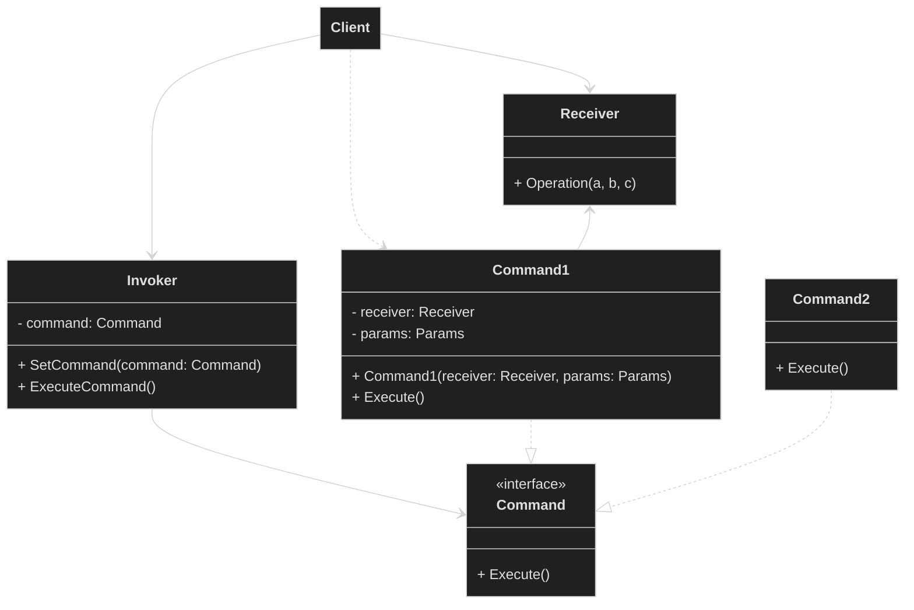

Iterator
**Итератор** — это поведенческий паттерн проектирования, который даёт возможность последовательно обходить элементы составных объектов, не раскрывая их внутреннего представления.

Проблема

В языках программирования встречается множество различных контейнеров для хранения элементов: массив, связный список, хэш-таблица, дерево и т. д. Все они имеют разную внутренюю структуру и для каждого из них приходится использовать свой способ перебора по элементам.

Представьте библиотечную систему, которая хранит книги в разных структурах данных:

- Массив новых поступлений
- Связный список редких книг
- Хэш-таблица книг по авторам

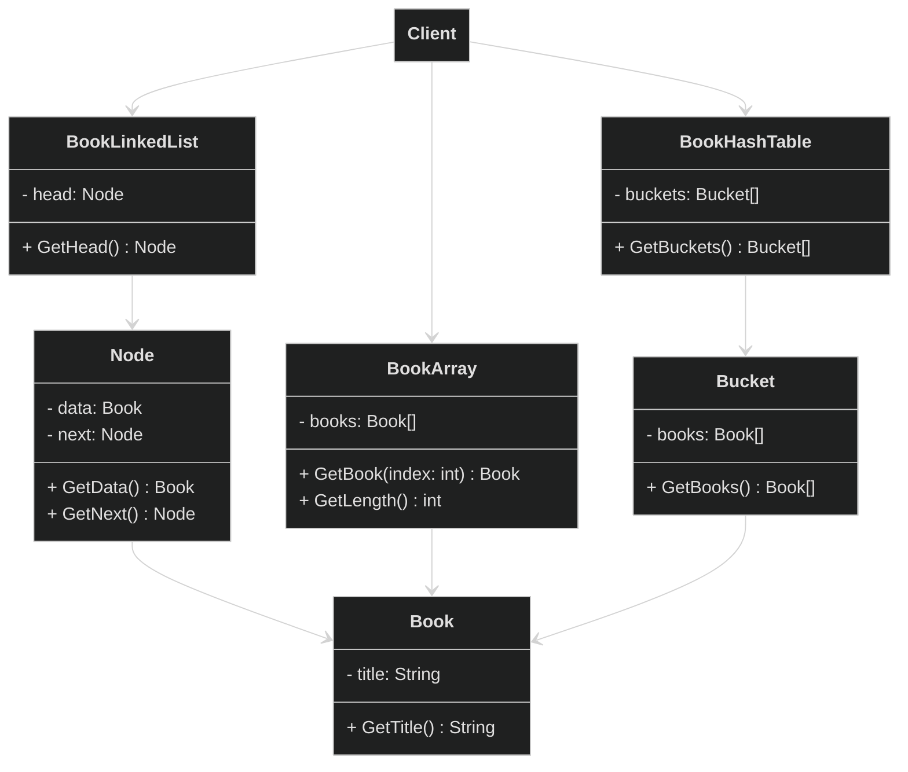

Код клиента:

```pseudocode
// Для массива
for (i = 0; i < array.GetLength(); i++) {
  book = array.GetBook(i)
  print(book.GetTitle())
}

// Для связного списка
current = linked_list.GetHead()
while (current != null) {
  book = current.data
  print(book.GetTitle())
  current = current.next
}

// Для хэш-таблицы
buckets = table.GetBuckets()
for each bucket in buckets {
  books = bucket.GetBooks()
  for each book in books {
    print(book.getTitle())
  }
}
```

Проблема данного подхода в том, что клиентский код должен знать внутреннее устройство каждого контейнера, клиенту видны все внутренние данные контейнеров. И при сменее структуры данных нужно переписывать весь клиентский код.

Решение

Паттерн Итератор предлагает вынести логику обхода коллекций в отдельные классы-итераторы. Вместо того чтобы сама коллекция управляла процессом обхода, для этого создаются специальные объекты-итераторы. Каждый такой итератор самостоятельно отслеживает текущее состояние обхода: какая позиция в коллекции, какие элементы остались, как двигаться дальше. Если нам нужен будет какой-нибудь новый способ обхода, то мы просто добавим новый класс-итератор.

Для начала создадим общий интерфейс Итераторов:

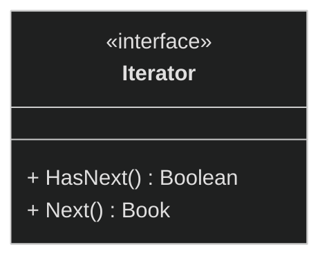

Это позволит клиентскому коду работать с любыми итераторами одинаково и обеспечит заменяемость разных реализаций итераторов.

То же самое проделаем и для самих контейнеров. Интерфейс `IterableCollection` будет гарантировать, что класс коллекции умеет создавать итератор для обхода своих элементов:

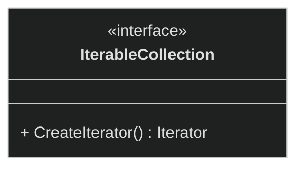

Для библиотечной системы контейнеры с итераторами примут уже такой вид:

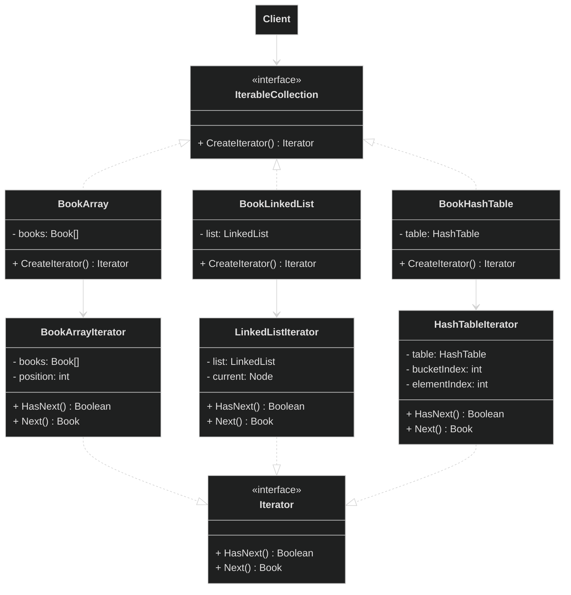

**Общая диаграмма паттерна:**

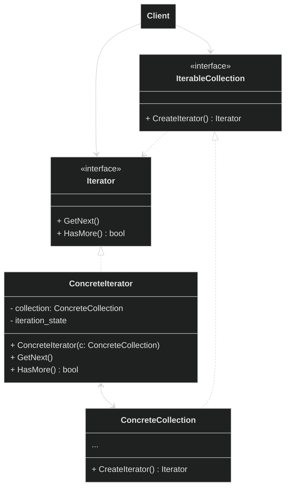

Mediator
**Посредник** — это поведенческий паттерн проектирования, который позволяет уменьшить связанность множества классов между собой, благодаря перемещению этих связей в один класс-посредник.

Проблема

Представьте команду разработки программного продукта, где участвуют заказчик, программисты, тестировщики и дизайнеры. В традиционном подходе все эти участники общаются напрямую друг с другом. Заказчик может одновременно давать разные указания программисту и дизайнеру, программист напрямую сообщает тестировщику о готовности задачи, тестировщик шлет баг-репорты прямо программисту, а дизайнер согласует макеты со всеми сразу.

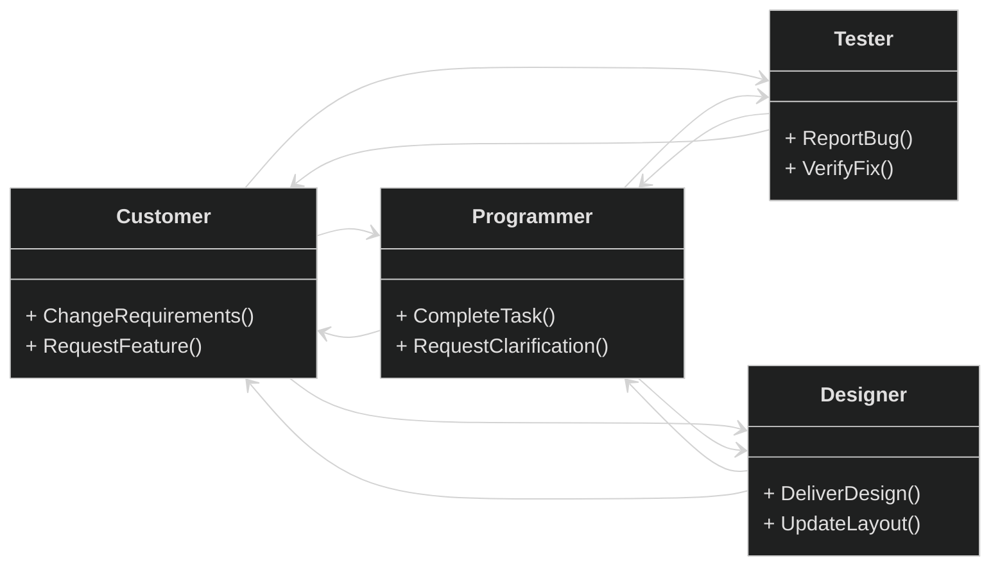

Такой прямой способ коммуникации быстро приводит к хаосу. Заказчик может непоследовательно формулировать требования, давая разные формулировки разным участникам. Программист, получая запросы из нескольких источников, не понимает, какие из них приоритетны. Тестировщик и дизайнер могут получить противоречивые инструкции. Возникает ситуация, когда левая рука не знает, что делает правая - программист реализует одну функциональность, в то время как дизайнер уже переработал макеты, а заказчик и вовсе передумал.

```pseudocode
class Customer {
  field programmer: Programmer
  field tester: Tester
  field designer: Designer

  function ChangeRequirements(new_requirements: String) {
    // Заказчик сам решает, кого уведомлять
    programmer.UpdateRequirements(new_requirements)
    designer.UpdateRequirements(new_requirements)
    tester.UpdateTestCases(new_requirements)
    // Возможны разные формулировки для разных участников
  }

  function RequestFeature(feature: String) {
    // Запросы отправляются напрямую
    programmer.ImplementFeature(feature)
    designer.CreateDesign(feature)
  }
}
```

Решение

Паттерн Посредник предлагает радикально изменить эту схему, введя центральную фигуру - менеджера проектов. В этом случае все участники перестают общаться напрямую. Вместо этого каждый из них регистрируется у менеджера и далее все коммуникации происходят исключительно через него.

Для менеджера создадим интерфейс, который он будет реализовывать, чтобы если что можно было заменять менеджеров. И для удобства работы сделаем общий интерфейс и для всех участников.

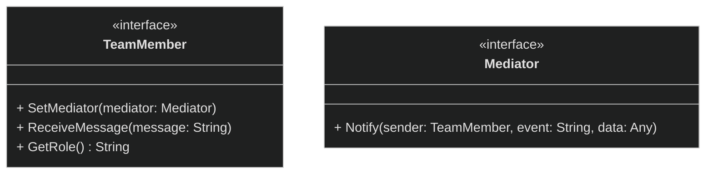

Когда заказчик меняет требования, он не бежит к каждому участнику команды, а просто уведомляет менеджера. Менеджер, получив эту информацию, сам решает, кого и в какой последовательности уведомить. Он может сначала сообщить дизайнеру о необходимости пересмотреть макеты, затем программисту - о изменениях в техническом задании, и наконец тестировщику - о необходимости актуализировать тест-кейсы.

Аналогично, когда программист завершает задачу, он не пишет всем подряд, а просто сообщает менеджеру о готовности. Менеджер уже сам решает, что тестировщик должен начать тестирование, а заказчику можно отправить уведомление о завершении этапа. Если тестировщик находит ошибку, он сообщает о ней менеджеру, и тот уже назначает программисту задачу на исправление, параллельно информируя заказчика о возникшей задержке.

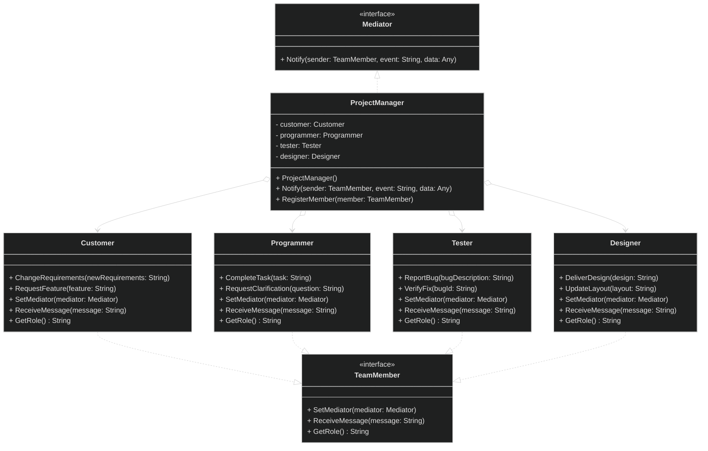

Участники команды больше не связаны друг с другом напрямую - они знают только менеджера и общаются только через него. Это значительно упрощает изменение состава команды или процессов взаимодействия, поскольку не требует перестройки множественных связей между участниками.

**Псевдокод:**

**ProjectManager:**

```pseudocode
class ProjectManager implements Mediator {
  field customer: Customer
  field programmer: Programmer
  field tester: Tester
  field designer: Designer

  function ProjectManager() {
    // Создаем участников команды в конструкторе
    this.customer = new Customer()
    this.programmer = new Programmer()
    this.tester = new Tester()
    this.designer = new Designer()

    // Регистрируем себя как посредника
    this.customer.SetMediator(this)
    this.programmer.SetMediator(this)
    this.tester.SetMediator(this)
    this.designer.SetMediator(this)
  }

  function RegisterMember(member: TeamMember) {
    // Метод может остаться для обратной совместимости,
    // но в этой реализации не используется
  }

  function Notify(sender: TeamMember, event: String, data: Any) {
    if (sender.GetRole() == "Programmer" and event == "task_completed") {
      // Программист завершил задачу
      this.tester.ReceiveMessage("Задача '" + data + "' готова к тестированию")
      this.customer.ReceiveMessage("Этап разработки '" + data + "' завершен")
    }
    else if (sender.GetRole() == "Tester" and event == "bug_reported") {
      // Тестировщик нашел баг
      this.programmer.ReceiveMessage("Обнаружен баг: " + data)
      this.customer.ReceiveMessage("Выявлена проблема, возможна задержка: " + data)
    }
    else if (sender.GetRole() == "Customer" and event == "requirements_changed") {
      // Заказчик изменил требования
      this.programmer.ReceiveMessage("Требования обновлены: " + data)
      this.designer.ReceiveMessage("Учтите новые требования в дизайне: " + data)
      this.tester.ReceiveMessage("Актуализируйте тест-кейсы: " + data)
    }
    else if (sender.GetRole() == "Designer" and event == "design_ready") {
      // Дизайнер завершил макет
      this.programmer.ReceiveMessage("Дизайн готов для реализации: " + data)
      this.tester.ReceiveMessage("Дизайн утвержден, готовьте тесты: " + data)
    }
  }
}
```

**Programmer:**

```pseudocode
class Programmer implements TeamMember {
  field mediator: Mediator

  function SetMediator(mediator: Mediator) {
    this.mediator = mediator
  }

  function GetRole() : String {
    return "Programmer"
  }

  function CompleteTask(task: String) {
    print("Программист завершил задачу: " + task)
    if (mediator != null) {
      mediator.Notify(this, "task_completed", task)
    }
  }

  function RequestClarification(question: String) {
    print("Программист запрашивает уточнение: " + question)
    if (mediator != null) {
      mediator.Notify(this, "clarification_needed", question)
    }
  }

  function ReceiveMessage(message: String) {
    print("Программист получил сообщение: " + message)
  }
}
```

**Использование:**

```pseudocode
// Теперь все просто - создаем менеджера
manager = new ProjectManager()

// Участники уже созданы и зарегистрированы
// Получаем доступ к участникам через менеджера (если нужно)
programmer = manager.programmer
customer = manager.customer

// Работаем через посредника
programmer.CompleteTask("Форма регистрации")
// Автоматически уведомляются тестировщик и заказчик

customer.ChangeRequirements("Добавить темную тему")
// Автоматически уведомляются программист, дизайнер и тестировщик
```

**Общая диаграмма паттерна:**

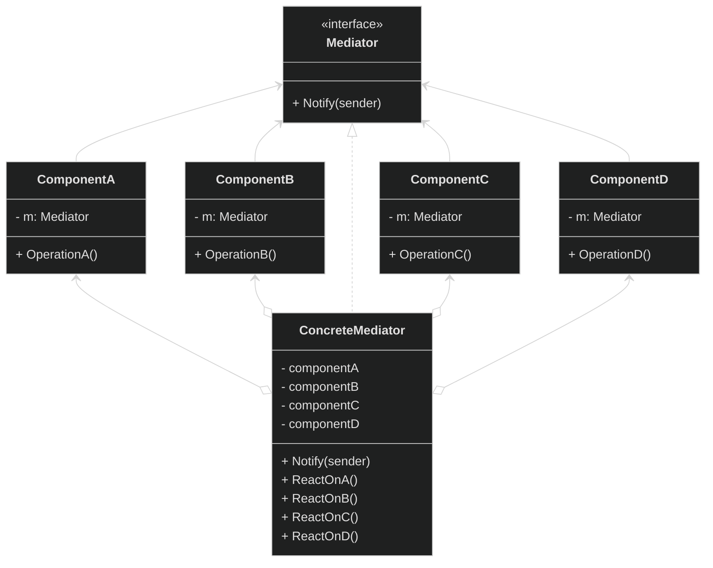

Memento
**Снимок** — это поведенческий паттерн проектирования, который позволяет сохранять и восстанавливать прошлые состояния объектов, не раскрывая подробностей их реализации.

Проблема

Представьте, что мы разрабатываем простой графический редактор для работы с фигурами. Пользователь может:

- Добавлять новые фигуры (круги, прямоугольники)
- Перемещать фигуры
- Изменять размеры фигур
- Удалять фигуры

Класс `GraphicEditor` содержит множество полей с разными настройками:

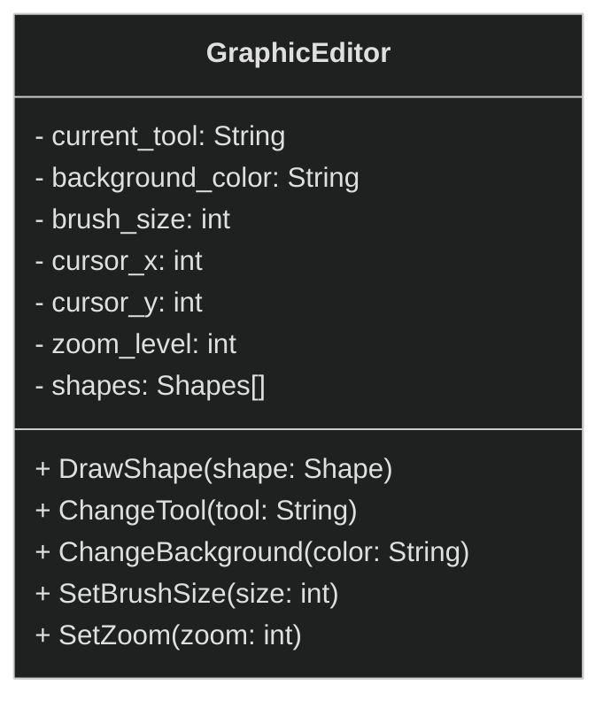

В новой версии программы мы решили реализовать систему отмены действий (undo). Для этого нужно сохранять копии состояний `GraphicEditor`. Все просто, сделаем поля этого класса открытыми для любого другого класса, например, `UndoManager`. Но все ли так просто?

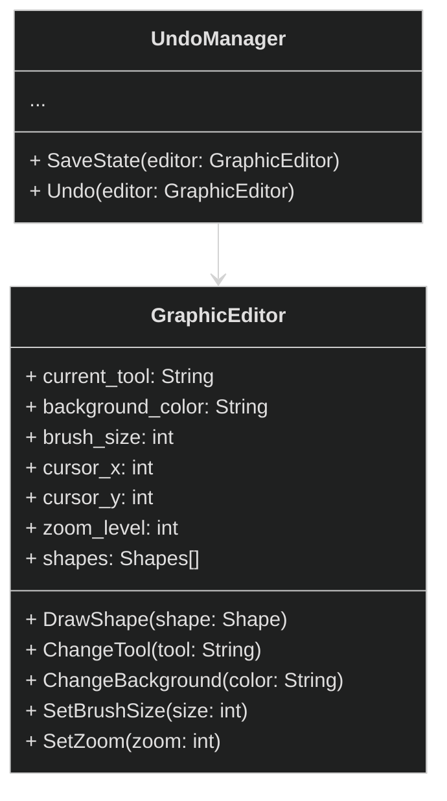

Возникает ряд проблем:

1. Если мы добавим новое поле в `GraphicEditor`, то придется менять код сохранения копии во всех классах, которые работают с состоянием редактора
2. Любой внешний код теперь может изменять состояние редактора непредсказуемым образом

Задумаемся еще о хранении и восстановлении копий при операции `undo`. Для реализации отмены действий нам понадобится отдельный класс-контейнер `EditorState`, который будет хранить копию состояния `GraphicEditor`. Этот класс тоже будет иметь много полей. Когда пользователь выполняет операцию отмены, мы должны извлечь из контейнера `EditorState` все поля и скопировать их обратно в `GraphicEditor`. Это приводит к тем же проблемам нарушения инкапсуляции, но уже для класса, хранящего копии данных.

```mermaid
%%{init: {'theme': 'dark', 'class': {'hideEmptyMembersBox': true}}}%%
classDiagram
class GraphicEditor {
  + current_tool: String
  + background_color: String
  + brush_size: int
  + cursor_x: int
  + cursor_y: int
  + zoom_level: int
  + shapes: Shapes[]
  + DrawShape(shape: Shape)
  + ChangeTool(tool: String)
  + ChangeBackground(color: String)
  + SetBrushSize(size: int)
  + SetZoom(zoom: int)
}

class EditorState {
  + current_tool: String
  + background_color: String
  + brush_size: int
  + cursor_x: int
  + cursor_y: int
  + zoom_level: int
  + shapes: Shapes[]
  + EditorState(editor: GraphicEditor)
}

class UndoManager {
  - history: Stack~EditorState~
  + SaveState(editor: GraphicEditor)
  + Undo(editor: GraphicEditor)
}

UndoManager --> EditorState
EditorState --> GraphicEditor
```

Решение

Паттерн Снимок предлагает делегировать создание и восстановление состояния самому **объекту-создателю**, скрывая детали его внутренней реализации.

Сохраняемое состояние помещается в специальный **объект-снимок**, который имеет ограниченный интерфейс. Этот интерфейс позволяет получать только информацию (например, название снимка), но не дает доступа к самим данным. Полный доступ к внутреннему состоянию снимка предоставляется только его создателю для чтения и восстановления данных.

```mermaid
%%{init: {'theme': 'dark', 'class': {'hideEmptyMembersBox': true}}}%%
classDiagram

namespace Creator {
class GraphicEditor {
  - current_tool: String
  - background_color: String
  - brush_size: int
  - cursor_x: int
  - cursor_y: int
  - zoom_level: int
  - shapes: Shapes[]
  + CreateMemento() Memento
  + RestoreMemento(memento: Memento)
  + DrawShape(shape: Shape)
  + ChangeTool(tool: String)
  + ChangeBackground(color: String)
}

class EditorState {
  - current_tool: String
  - background_color: String
  - brush_size: int
  - cursor_x: int
  - cursor_y: int
  - zoom_level: int
  - shapes: Shapes[]
  - Snapshot(state)
  - GetState() : state
  + GetName() String
}
}

class Memento {
  <<interface>>
  + GetName() String
}

EditorState --|> Memento
```

Как правило, классы снимков `EditorState` реализуют как вложенные классы создателя. Такой подход предоставляет создателю прямой доступ к методам снимка для чтения и модификации состояния. В диаграмме вложенность показана через обромление в виде прямоугольника.

Хранение снимков осуществляется в специальных **классах-опекунах**. Опекуны взаимодействуют со снимками только через их ограниченный интерфейс, что предотвращает возможность изменения данных снимка. При необходимости опекун может запросить у создателя восстановление предыдущего состояния, передав ему соответствующий снимок.

```mermaid
%%{init: {'theme': 'dark', 'class': {'hideEmptyMembersBox': true}}}%%
classDiagram

namespace Creator {
class GraphicEditor {
  - current_tool: String
  - background_color: String
  - brush_size: int
  - cursor_x: int
  - cursor_y: int
  - zoom_level: int
  - shapes: Shapes[]
  + CreateMemento() Memento
  + RestoreMemento(memento: Memento)
  + DrawShape(shape: Shape)
  + ChangeTool(tool: String)
  + ChangeBackground(color: String)
}

class EditorState {
  - current_tool: String
  - background_color: String
  - brush_size: int
  - cursor_x: int
  - cursor_y: int
  - zoom_level: int
  - shapes: Shapes[]
  - EditorState(state)
  - GetState() : state
  + GetName() String
}
}

class Memento {
  <<interface>>
  + GetName() String
}

class UndoManager {
  - history: Stack~Memento~
  + SaveState(editor: GraphicEditor)
  + Undo(editor: GraphicEditor)
}

EditorState --|> Memento
UndoManager --> Memento
GraphicEditor <-- UndoManager
```

**Псевдокод:**

**Класс-создатель и класс-снимок:**

```pseudocode
// Создание снимка
class GraphicEditor {
  private field current_tool: String
  private field background_color: String
  private field brush_size: int
  private field cursor_x: int
  private field cursor_y: int
  private field zoom_level: int
  private field shapes: Shapes[]
  private field active_layer: String
  private field grid_enabled: boolean
  private field snap_to_grid: boolean
  private field selection: Shape[]
  private field history_enabled: boolean

  function CreateMemento() : Memento {
    // Создаем снимок с текущим состоянием
    return new Snapshot(
      this.current_tool,
      this.background_color,
      this.brush_size,
      copy(this.shapes)
    )
  }

  function RestoreMemento(memento: Memento) {
    if (memento instanceof Snapshot) {
      // Восстанавливаем состояние из снимка
      this.current_tool = memento.current_tool
      this.background_color = memento.background_color
      this.brush_size = memento.brush_size
      this.shapes = memento.shapes
    }
  }

  // Вложенный класс снимка
  class EditorState {
    field tool: String
    field background: String
    field brush: int
    field cursor_x: int
    field cursor_y: int
    field zoom: int
    field shapes: Shapes[]

    Сonstructor(tool, background, brush, cursor_x, cursor_y, zoom, shapes) {
        this.tool = tool
        this.background = background
        this.brush = brush
        this.cursor_x = cursor_x
        this.cursor_y = cursor_y
        this.zoom = zoom
        this.shapes = shapes
    }

    function GetState() : EditorState {
      return new EditorState(
        this.current_tool,
        this.background_color,
        this.brush_size,
        this.cursor_x,
        this.cursor_y,
        this.zoom_level,
        copy(this.shapes)
      )
    }
    function GetName() : String {
      return "Snapshot_" + DateTime.now()
    }
  }
}
```

**Класс-опекун:**

```pseudocode
class UndoManager {
  - history: Stack~Memento~

  function SaveState(editor: GraphicEditor) {
    // Альтернативный подход: опекун сразу сохраняет состояние
    memento = editor.CreateMemento()
    this.history.push(memento)
  }

  function Undo(editor: GraphicEditor) {
    if (!this.history.IsEmpty()) {
      // Опекун извлекает последний снимок из истории
      savedMemento = this.history.Pop()

      // Опекун инициирует восстановление состояния
      editor.RestoreMemento(savedMemento)
    }
  }
}
```

**Общая диаграмма паттерна:**

```mermaid
%%{init: {'theme': 'dark', 'class': {'hideEmptyMembersBox': true}}}%%
classDiagram
direction LR
namespace _ {
class Originator {
  - state
  + Save() Memento
  + Restore(m: Memento)
}

class Memento {
  - state
  - Memento(state)
  - GetState()
}
}

class Caretaker {
  - originator: Originator
  - history: Memento[]
  + DoSomething()
  + Undo()
}

Originator ..> Memento
Memento <--o Caretaker
```

Observer
**Наблюдатель** — это поведенческий паттерн проектирования, который создаёт механизм подписки, позволяющий одним объектам следить и реагировать на события, происходящие в других объектах.

Проблема

Представьте интернет-магазин электроники, где клиенты хотят получать уведомления только о конкретных товарах:

- Геймер ждет поступления новой видеокарты RTX 5080
- Фотограф ищет конкретный объектив Sony 85mm f/1.4
- Студент следит за скидками на ноутбуки Apple
- Коллекционеры хотят знать о поступлении редких виниловых пластинок

```mermaid
%%{init: {'theme': 'dark', 'class': {'hideEmptyMembersBox': true}}}%%
classDiagram
class Product {
  - name: String
  - price: double
  - stock: int
  - category: String
  + UpdateStock(new_stock: int)
  + SetPrice(new_price: double)
}

class Gamer {
  - wishlist: String[]
  - notification_сhannels: String[]
  + CheckProductAvailability()
  + CheckPriceDrops()
}

class Photographer {
  - equipment_interests: String[]
  - budget: double
  + CheckProductAvailability()
  + CheckPriceDrops()
}

class Student {
  - desiredBrands: String[]
  - maxBudget: double
  + CheckProductAvailability()
  + CheckPriceDrops()
}

class Collector {
  - collection_items: String[]
  - rarity_threshold: String
  + CheckProductAvailability()
}

Gamer --> Product
Photographer --> Product
Student --> Product
Collector --> Product

note for Gamer "Постоянно опрашивает продукты из wishlist"
note for Photographer "Регулярно проверяет наличие оборудования"
note for Student "Часто проверяет цены на нужные бренды"
note for Collector "Поиск редких товаров требует постоянных проверок"
```

**Проблемы этого подхода:**

- Клиенты вынуждены постоянно проверять наличие товаров
- Тысячи клиентов одновременно опрашивают базу данных и создается нагрузка
- Клиенты узнают о поступлении с опозданием
- Товар может распродаться между проверками клиентов
- Массовые рассылки приводят к спаму — клиенты получают уведомления о товарах, которые их не интересуют, в результате они отписываются от всех уведомлений магазина

С архитектурной точки зрения, такой подход приводит к жесткой связанности компонентов системы — классы клиентов оказываются напрямую зависимы от внутренней реализации продуктов, что нарушает принципы инкапсуляции и открытости/закрытости, усложняет тестирование и поддержку кода, а также создает распределенную и дублирующуюся бизнес-логику, когда каждый клиент вынужден самостоятельно реализовывать механизмы опроса и обработки изменений, вместо того чтобы полагаться на централизованную систему уведомлений.

Решение

**Немного определений:**

- **Издатели** - это объекты, которые содержат некоторое важное или интересное для других состояние и оповещают подписчиков о его изменениях.
- **Подписчики** - это объекты, которые хотят следить за изменениями издателя, но не должны влиять на его работу и состояние.

Паттерн Наблюдатель предлагает создать механизм подписки, позволяющий объектам-подписчикам получать уведомления об изменениях состояния объекта-издателя. Издатель хранит список подписчиков и предоставляет методы для подписки и отписки: `Subscrive(subscribere)`, `Unsubscribe(subscriber)`. Когда происходит важное событие, издатель проходит по списку подписчиков и вызывает определённый метод каждого из них, передавая данные о произошедшем изменении. Издатель не знает о конкретных деталях реализации подписчиков, он взаимодействует с ними через общий интерфейс.

```mermaid
%%{init: {'theme': 'dark', 'class': {'hideEmptyMembersBox': true}}}%%
classDiagram

class Product {
  - subscribers: Subscriber[]
  - name: String
  - price: double
  - stock: int
  - category: String
  + Subscribe(subscriber: Subscriber)
  + Unsubscribe(subscriber: Subscriber)
  + NotifySubscribers()
  + UpdateStock(new_stock: int)
  + SetPrice(new_price: double)
}

class Subscriber {
  <<interface>>
  + OnProductUpdated(product: Product, event_type: String)
}

class Gamer {
  - wishlist: String[]
  - notification_channels: String[]
  + OnProductUpdated(product: Product, event_type: String)
}

class Photographer {
  - equipment_interests: String[]
  - budget: double
  + OnProductUpdated(product: Product, event_type: String)
}

class Student {
  - desired_brands: String[]
  - max_budget: double
  + OnProductUpdated(product: Product, event_type: String)
}

class Collector {
  - collection_items: String[]
  - rarity_threshold: String
  + OnProductUpdated(product: Product, event_type: String)
}

Product o--> Subscriber
Subscriber <|.. Gamer
Subscriber <|.. Photographer
Subscriber <|.. Student
Subscriber <|.. Collector
```

**Псевдокод:**

**Издатель:**

```preudocode
// Класс товара (Издатель)
class Product {
  private field subscribers: List~Subscriber~ = []
  private field name: String
  private field price: double
  private field stock: int
  private field category: String

  function Subscribe(subscriber: Subscriber) {
    if (!this.subscribers.contains(subscriber)) {
      this.subscribers.Add(subscriber)
    }
  }

  function Unsubscribe(subscriber: Subscriber) {
    this.subscribers.Remove(subscriber)
  }

  private function NotifySubscribers(eventType: String) {
    for each subscriber in this.subscribers {
      subscriber.OnProductUpdated(this, eventType)
    }
  }

  function UpdateStock(new_stock: int) {
    oldStock = this.stock
    this.stock = new_stock

    if (oldStock == 0 && new_stock > 0) {
      this.NotifySubscribers("STOCK_AVAILABLE")
    } else if (new_stock == 0) {
      this.NotifySubscribers("OUT_OF_STOCK")
    }
  }

  function SetPrice(new_price: double) {
      oldPrice = this.price
      this.price = new_price

      if (new_price < oldPrice) {
          this.NotifySubscribers("PRICE_DROP")
      } else if (new_price > oldPrice) {
          this.NotifySubscribers("PRICE_INCREASE")
      }
  }
}
```

**Пример работы подписчика:**

```pseudocode
class Gamer implements Subscriber {
  private field wishlist: Set~String~ = {"RTX 5080", "PlayStation 6", "Gaming Mouse"}
  private field notificationChannels: Set~String~ = {"PUSH", "EMAIL"}

  function OnProductUpdated(product: Product, event_type: String) {
    if (this.wishlist.Contains(product.name)) {
      if (event_type == "STOCK_AVAILABLE") {
        print("Геймер: Ура! " + product.name + " появился в наличии!")
        this.SendPushNotification(product)
      } else if (event_type == "PRICE_DROP") {
        print("Геймер: Цена на " + product.name + " упала до " + product.price)
        this.SendEmailNotification(product)
      }
    }
  }
}
```

**Клиентский код:**

```pseudocode
// Создаем товары
video_card = new Product("RTX 5080", 1500, 0, "Graphics Cards")
macbook = new Product("MacBook Air M3", 1200, 10, "Laptops")

// Создаем подписчиков
gamer = new Gamer()
student = new Student()

// Подписываем клиентов на интересующие товары
video_card.Subscribe(gamer)    // Геймер подписан на видеокарту
macbook.Subscribe(student)    // Студент подписан на ноутбук
video_card.Subscribe(student)  // Студент тоже подписан на видеокарту

// Симулируем события в магазине
print("=== Поступление видеокарты ===")
video_card.UpdateStock(5)      // Геймер и студент получат уведомления

print("=== Снижение цены на ноутбук ===")
macbook.SetPrice(750)         // Только студент получит уведомление

print("=== Снижение цены на видеокарту ===")
video_card.SetPrice(1400)      // Геймер и студент получат уведомления

// Отписка от уведомлений
video_card.Unsubscribe(student) // Студент больше не следит за видеокартой
```

**Общая диаграмма паттерна:**

```mermaid
%%{init: {'theme': 'dark', 'class': {'hideEmptyMembersBox': true}}}%%
classDiagram

class Client

class Publisher {
  - subscribers: Subscriber[]
  - mainState
  + subscribe(s: Subscriber)
  + Unsubscribe(s: Subscriber)
  + NotifySubscribers()
  + MainBusinessLogic()
}

class Subscriber {
  <<interface>>
  + Update(context)
}

class ConcreteSubscriber {
  + Update(context)
}

Publisher o--> Subscriber
Subscriber <|.. ConcreteSubscriber
Client --> Publisher
Client ..> ConcreteSubscriber
```

State
**Состояние** — это поведенческий паттерн проектирования, который позволяет объектам менять поведение в зависимости от своего состояния. Извне создаётся впечатление, что изменился класс объекта.

Проблема

Для начала рассмотрим что такое машина состояний (Finite State Machine - FSM).

Машина состояний состоит из конечного числа состояний, переходов между ними и событий, которые контролируют эти переходы. В разных состояниях программа может реагировать по разному на одни и те же события. Рассмотрим машину состояний для игры "Змейка":

```mermaid
%%{init: {'theme': 'dark', 'class': {'hideEmptyMembersBox': true}}}%%
stateDiagram-v2

[*] --> Start
Start --> Spawn
Spawn --> Move
Move --> Eat
Eat --> Move
Move --> Pause
Pause --> Move
Move --> GameOver
Move --> Win
GameOver --> Spawn
Win --> Spawn
GameOver --> [*] : exit
Pause --> [*] : exit
Win --> [*] : exit
```

Данная диаграмма описывает полный жизненный цикл игры через состояния и переходы между ними:

**Основные состояния:**

- **Start** - начальное состояние игры, инициализация ресурсов
- **Spawn** - появление змейки и яблока на игровом поле
- **Move** - основное игровое состояние, движение змейки
- **Eat** - состояние обработки поедания яблока
- **Pause** - игра на паузе
- **GameOver** - завершение игры из-за проигрыша
- **Win** - завершение игры из-за победы

**Логика переходов:**

1. **Start → Spawn** - после инициализации игра переходит к созданию игровых объектов
2. **Spawn → Move** - после появления объектов начинается игровой процесс
3. **Move → Eat** и **Eat → Move** - змейка съедает яблоко и игра продолжается
4. **Move → Pause** и **Pause → Move** - игрок ставит игру на паузу и возобновляет её с паузы
5. **Move → GameOver** - змейка врезается в стену или себя
6. **Move → Win** - достижение победного условия (например, заполнение всего поля)
7. **GameOver → Spawn** и **Win → Spawn**- рестарт игры после завершения
8. **GameOver → exit**, **Pause → exit** и **Win → exit** - полный выход из игры

Обычно машину состояний строят через условные операторы `if` или `switch`, которые проверяют текущее состояние и выполняют какое-то поведение. Для змейки это будет выглядить следующим образом:

**Класс игры Змейка:**

```peudocode
class SnakeGame {
  private field current_state: String = "Start"
  private field score: int = 0
  private field snake: Snake
  private field apple: Apple
  private field is_running: boolean = true

  function FSM() {
    while (this.is_running) {
      switch (this.current_state) {
        case "Start":
          this.HandleStartState()
          break
        case "Spawn":
          this.HandleSpawnState()
          break
        case "Move":
          this.HandleMoveState()
          break
        case "Eat":
          this.HandleEatState()
          break
        case "Pause":
          this.HandlePauseState()
          break
        case "GameOver":
          this.HandleGameOverState()
          break
        case "Win":
          this.HandleWinState()
          break
      }
      this.Render()
    }
  }

  function handleStartState() {
    // Инициализация ресурсов
    this.initializeGame()
    this.current_state = "Spawn"
  }

  function handleSpawnState() {
    // Создание змейки и яблока
    this.snake = new Snake()
    this.apple = this.GenerateApple()
    this.current_state = "Move"
  }

  function handleMoveState() {
    input = this.GetInput()

    // Обработка ввода
    if (input == "PAUSE") {
      this.current_state = "Pause"
      return
    }

    // Движение змейки
    this.snake.move(input)

    // Проверка столкновений
    if (this.CheckWallCollision() || this.CheckSelfCollision()) {
      this.current_state = "GameOver"
      return
    }

    // Проверка победы
    if (this.CheckWinCondition()) {
      this.current_state = "Win"
      return
    }

    // Проверка съедания яблока
    if (this.CheckAppleCollision()) {
      this.current_state = "Eat"
      return
    }
  }

  function HandleEatState() {
    // Обработка съедания яблока
    this.score += 10
    this.snake.grow()
    this.apple = this.GenerateApple()
    this.current_state = "Move"
  }

  function HandlePauseState() {
    input = this.GetInput()

    if (input == "RESUME") {
      this.current_state = "Move"
    } else if (input == "EXIT") {
      this.is_running = false
    }
  }

  function HandleGameOverState() {
    input = this.GetInput()

    if (input == "RESTART") {
      this.ResetGame()
      this.current_state = "Spawn"
    } else if (input == "EXIT") {
      this.is_running = false
    }
  }

  function HandleWinState() {
    input = this.GetInput()

    if (input == "RESTART") {
      this.ResetGame()
      this.current_state = "Spawn"
    } else if (input == "EXIT") {
      this.is_running = false
    }
  }

  function processInput(input: String) {
    // Обработка глобального ввода (выход из игры)
    if (input == "QUIT") {
      this.is_running = false
    }
  }
}
```

**Использование:**

```pseudocode
game = new SnakeGame()
game.FSM()
```

**Проблема такой реализации:**
Каждое состояние содержит свою логику обработки ввода, обновления и отрисовки, что приводит к сложному коду с множеством условных операторов, проверяющих текущее состояние игры. Такой код сложен в поддержке. При добавлении нового состояния (например, ускорение змейки при нажатии пробела) нам придется перелопатить весь существующий код.

Решение

**Контекст** — это объект, поведение которого должно изменяться в зависимости от состояния. В нашем случае контекстом является класс `SnakeGame`.

Паттерн Состояние предлагает вынести каждое состояние и соответствующее ему поведение в отдельный класс с общим интерфейсом. Вместо одного большого класса-контекста с множеством условий мы создаем иерархию классов состояний. Контекст будет содержать ссылку на текущий объект-состояние и делегировать ему всю работу. Его поведение можно изменить в любой момент, подключив другой объект-состояние.

```mermaid
%%{init: {'theme': 'dark', 'class': {'hideEmptyMembersBox': true}}}%%
classDiagram
class SnakeGame {
  - current_state: GameState
  - score: int
  - snake: Snake
  - apple: Apple
  - is_running: boolean
  + setState(state: GameState)
  + HandleInput(input: String)
  + Update()
  + Render()
}

class GameState {
  <<interface>>
  + HandleInput(game: SnakeGame, input: String)
  + Update(game: SnakeGame)
  + Render(game: SnakeGame)
}

class StartState {
  + HandleInput(game: SnakeGame, input: String)
  + Update(game: SnakeGame)
  + Render(game: SnakeGame)
}

class SpawnState {
  + HandleInput(game: SnakeGame, input: String)
  + Update(game: SnakeGame)
  + Render(game: SnakeGame)
}

class MoveState {
  + HandleInput(game: SnakeGame, input: String)
  + Update(game: SnakeGame)
  + Render(game: SnakeGame)
}

class EatState {
  + HandleInput(game: SnakeGame, input: String)
  + Update(game: SnakeGame)
  + Render(game: SnakeGame)
}

class PauseState {
  + HandleInput(game: SnakeGame, input: String)
  + Update(game: SnakeGame)
  + Render(game: SnakeGame)
}

class GameOverState {
  + HandleInput(game: SnakeGame, input: String)
  + Update(game: SnakeGame)
  + Render(game: SnakeGame)
}

class WinState {
  + HandleInput(game: SnakeGame, input: String)
  + Update(game: SnakeGame)
  + Render(game: SnakeGame)
}

SnakeGame --> GameState
GameState <|.. StartState
GameState <|.. SpawnState
GameState <|.. MoveState
GameState <|.. EatState
GameState <|.. PauseState
GameState <|.. GameOverState
GameState <|.. WinState
```

**Псведокод:**

**Состояния:**

```pseudocode
// Интерфейс состояния
interface GameState {
  method HandleInput(game: SnakeGame, input: String)
  method Update(game: SnakeGame)
  method Render(game: SnakeGame)
}

// Конкретные состояния
class StartState implements GameState {
  method HandleInput(game: SnakeGame, input: String) {
    // Можно начать игру по нажатию пробела
    if (input == "SPACE") {
      game.SetState(new SpawnState())
    }
  }

  method Update(game: SnakeGame) {
    // Инициализация игры
    game.Initialize()
  }

  method Render(game: SnakeGame) {
    // Отрисовка стартового экрана
  }
}

class MoveState implements GameState {
  method HandleInput(game: SnakeGame, input: String) {
    if (input == "PAUSE") {
      game.SetState(new PauseState())
    } else {
      game.Snake.ChangeDirection(input)
    }
  }

  method Update(game: SnakeGame) {
    game.Snake.Move()

    if (game.CheckCollision()) {
      game.SetState(new GameOverState())
    } else if (game.CheckWin()) {
      game.SetState(new WinState())
    } else if (game.CheckAppleEaten()) {
      game.SetState(new EatState())
    }
  }

  method Render(game: SnakeGame) {
    // Отрисовка игрового процесса
  }
}

// и т.д.
```

**Контекст:**

```pseudocode
class SnakeGame {
  private field current_state: GameState = new StartState()
  private field score: int = 0
  private field snake: Snake
  private field apple: Apple
  private field is_running: boolean = true

  method SetState(state: GameState) {
    this.current_state = state
  }

  method HandleInput(input: String) {
    this.current_state.HandleInput(this, input)
  }

  method Update() {
    this.current_state.Update(this)
  }

  method Render() {
    this.current_state.Render(this)
  }

  method Run() {
    while (this.is_running) {
      input = this.GetInput()
      this.HandleInput(input)
      this.Update()
      this.Render()
    }
  }
}
```

Теперь добавление нового состояния становится простой задачей.

**Общая диаграмма паттерна:**

```mermaid
%%{init: {'theme': 'dark', 'class': {'hideEmptyMembersBox': true}}}%%
classDiagram

class Client

class Context {
  - state: State
  + Context(initial_state: State)
  + ChangeState(state: State)
  + DoThis()
  + DoThat()
}

class State {
  <<interface>>
  + DoThis()
  + DoThat()
}

class ConcreteStates {
  - context: Context
  + SetContext(context: Context)
  + DoThis()
  + DoThat()
}

Client --> Context
Client ..> ConcreteStates
ConcreteStates --> Context
Context o--> State
State <|.. ConcreteStates
```

Strategy
**Стратегия** — это поведенческий паттерн проектирования, который определяет семейство схожих алгоритмов и помещает каждый из них в собственный класс, после чего алгоритмы можно взаимозаменять прямо во время исполнения программы

Проблема

Мы создали мобильное навигационное приложение `MNP 1.0`, которое строит маршруты разными способами: автомобильные, пешеходные.

```mermaid
%%{init: {'theme': 'dark', 'class': {'hideEmptyMembersBox': true}}}%%
classDiagram

class Navigator {
  + BuildRoute(point_a: Point, point_b: Point, route_type: String)
}
```

```pseudocode
class Navigator {
  method BuildRoute(point_a: Point, point_b: Point, route_type: String) {
    if (route_type == "DRIVING") {
      // Логика для автомобильного маршрута
      // ... 15+ строк специфической логики
    } else if (route_type == "WALKING") {
      // Логика для пешеходного маршрута
      // ... 10+ строк специфической логики
    }
  }
}
```

От пользователей поступают жалобы на то, что нет возможности строить маршруты для поездки на общественном транспорте. В новом приложении мы исправили это и добавили новый алгоритм для поиска маршрута для общественного транспорта.

На дорогах общественного пользования появились электросамокаты. Теперь нужно и для них добавлять алгоритм поиска маршрута. С каждым новым алгоритмом код увеличивается, и мы вынуждены постоянно модифицировать основной класс навигатора. Это приводит к нескольким проблемам:

- С увеличением количества алгоритмов становится сложнее покрывать тестами все возможные варианты маршрутов
- Любое изменение в основном классе `Navigator` может случайно сломать работу существующих алгоритмов
- Класс `Navigator` становится слишком большим и сложным для понимания и поддержки

Решение

Паттерн Стратегия предлагает вынести семейство схожих алгоритмов в свои собственные классы, называемый **стратегиями**. Класс `Navigator` будет контекстом, хранящим ссылку на конкретную стратегию и делегируя ей работу. Все стратегии должны иметь единый общий интерфейс. Это делает контекст независимым от конкретных классов стратегий — он работает только с интерфейсом. С другой стороны, вы можете свободно изменять, добавлять или удалять алгоритмы, вообще не затрагивая код контекста.

```mermaid
%%{init: {'theme': 'dark', 'class': {'hideEmptyMembersBox': true}}}%%
classDiagram

class Navigator {
  - strategy: RouteStrategy
  + SetStrategy(strategy: RouteStrategy)
  + BuildRoute(point_a: Point, point_b: Point)
}

class RouteStrategy {
  <<interface>>
  + BuildRoute(point_a: Point, point_b: Point)
}

class DrivingStrategy {
  + BuildRoute(point_a: Point, point_b: Point)
}

class WalkingStrategy {
  + BuildRoute(point_a: Point, point_b: Point)
}

class PublicTransportStrategy {
  + BuildRoute(point_a: Point, point_b: Point)
}

Navigator o--> RouteStrategy
RouteStrategy <|.. DrivingStrategy
RouteStrategy <|.. WalkingStrategy
RouteStrategy <|.. PublicTransportStrategy
```

**Псевдокод:**

**Стратегии:**

```pseudocode
// Общий интерфейс для всех стратегий
interface RouteStrategy {
  method buildRoute(point_a: Point, point_b: Point)
}

// Конкретные стратегии
class DrivingStrategy implements RouteStrategy {
  method buildRoute(point_a: Point, point_b: Point) {
    // Специфическая логика для автомобильного маршрута
  }
}

class WalkingStrategy implements RouteStrategy {
  method buildRoute(point_a: Point, point_b: Point) {
    // Специфическая логика для пешеходного маршрута
  }
}

class PublicTransportStrategy implements RouteStrategy {
  method buildRoute(point_a: Point, point_b: Point) {
    // Специфическая логика для общественного транспорта
  }
}
```

**Контекст:**

```pseudocode
// Контекст - класс Navigator
class Navigator {
  private strategy: RouteStrategy

  method SetStrategy(strategy: RouteStrategy) {
    this.strategy = strategy
  }

  method BuildRoute(point_a: Point, point_b: Point) {
    strategy.BuildRoute(point_a, point_b)
  }
}
```

**Клиент:**

```pseudocode
navigator = new Navigator()

// Автомобильный маршрут
navigator.SetStrategy(new DrivingStrategy())
navigator.BuildRoute(pointA, pointB)

// Пешеходный маршрут
navigator.SetStrategy(new WalkingStrategy())
navigator.BuildRoute(pointA, pointB)

// Маршрут на общественном транспорте
navigator.SetStrategy(new PublicTransportStrategy())
navigator.BuildRoute(pointA, pointB)
```

**Общая диаграмма паттерна:**

```mermaid
%%{init: {'theme': 'dark', 'class': {'hideEmptyMembersBox': true}}}%%
classDiagram

class Client

class Context {
  - strategy: Strategy
  + SetStrategy(strategy: Strategy)
  + DoSomething()
}

class Strategy {
  <<interface>>
  + Execute(data)
}

class ConcreteStrategies {
  + Execute(data)
}

Context o--> Strategy
Strategy <|.. ConcreteStrategies
Client --> Context
Client ..> ConcreteStrategies
```

Template Method
**Шаблонный метод** — это поведенческий паттерн проектирования, который определяет скелет алгоритма, перекладывая ответственность за некоторые его шаги на подклассы. Паттерн позволяет подклассам переопределять шаги алгоритма, не меняя его общей структуры.

Проблема

В кофейне автоматизируют процесс приготовления напитков. Каждый напиток (кофе, чай, горячий шоколад) готовится по уникальному рецепту.

Рассмотрим три популярных напитка: капучино, зеленый чай и горячий шоколад.

**Капучино:**

1. Вскипятить воду
2. Помолоть кофейные зерна
3. Налить в чашку

**Зеленый чай:**

1. Вскипятить воду
2. Заварить чайные листья 3 минуты
3. Перелить в чашку

**Горячий шоколад:**

1. Подогреть молоко
2. Растворить шоколадную пасту в молоке
3. Перелить в чашку

```mermaid
%%{init: {'theme': 'dark', 'class': {'hideEmptyMembersBox': true}}}%%
classDiagram
class CappuccinoMaker {
  + MakeBeverage()
}

class GreenTeaMaker {
  + MakeBeverage()
}

class HotChocolateMaker {
  + MakeBeverage()
}
```

```pseudocode
// Капучино
class CappuccinoMaker {
  method MakeBeverage() {
    print("Вскипятить воду")
    print("Помолоть кофейные зерна")
    print("Налить в чашку")
  }
}

// Зеленый чай
class GreenTeaMaker {
  method MakeBeverage() {
    print("Вскипятить воду")
    print("Заварить чайные листья 3 минуты")
    print("Перелить в чашку")
  }
}

// Горячий шоколад
class HotChocolateMaker {
  method MakeBeverage() {
    print("Подогреть молоко")
    print("Растворить шоколадную пасту в молоке")
    print("Перелить в чашку")
  }
}
```

Мы можем заметить общую последовательность шагов при приготовлении:

1. Подготовка жидоксти
2. Приготовление основного ингредиента
3. Переливание в чашку

В текущей реализации каждый класс напитка дублирует общую последовательность шагов приготовления. Это приводит к дублированию кода, сложности внесения изменений и отсутствию единой структуры алгоритма. При добавлении нового напитка или изменении общего процесса приходится править все классы, что нарушает принципы поддержки кода и увеличивает риск ошибок.

Решение

Паттерн **Шаблонный метод** предлагает разделить алгоритм на отдельные шаги, вынести каждый шаг в свой метод и собрать их в правильной последовательности внутри одного главного метода. Такой главный метод будет называться **шаблонным**.

Часть шагов может быть реализована непосредственно в базовом классе, а другие шаги объявляются абстрактными. Это дает возможность подклассам переопределять только те шаги алгоритма, которые требуют изменения, не затрагивая общую структуру процесса и оставляя неизменными остальные этапы.

В примере с приготовлением напитков это означает, что мы можем создать базовый класс с общим алгоритмом приготовления, где такие шаги как **подготовка жидкости** и **переливание в чашку** имеет реализацию по умолчанию, а шаг **приготовление основного ингредиента** объявляется абстрактным, позволяя конкретным классам напитков реализовать его специфичное поведение.

```mermaid
%%{init: {'theme': 'dark', 'class': {'hideEmptyMembersBox': true}}}%%
classDiagram
class BeverageMaker {
  <<abstract>>
  + MakeBeverage()
  + PrepareLiquid()
  + PrepareMainIngredient()*
  + PourIntoCup()
}

class CappuccinoMaker {
  + PrepareLiquid()
  + PrepareMainIngredient()
}

class GreenTeaMaker {
  + PrepareLiquid()
  + PrepareMainIngredient()
}

class HotChocolateMaker {
  + PrepareLiquid()
  + PrepareMainIngredient()
}

BeverageMaker <|-- CappuccinoMaker
BeverageMaker <|-- GreenTeaMaker
BeverageMaker <|-- HotChocolateMaker
```

**Псевдокод:**

**Базовый класс с шаблонным методом:**

```pseudocode
// Абстрактный базовый класс
abstract class BeverageMaker {
  // Шаблонный метод
  method MakeBeverage() {
    this.PrepareLiquid()
    this.PrepareMainIngredient()
    this.PourIntoCup()
  }

  // Абстрактный метод для переопределения
  abstract method PrepareMainIngredient()

  // Общие методы с реализацией по умолчанию
  method PrepareLiquid() {
    print("Вскипятить воду")
  }

  method PourIntoCup() {
    print("Перелить в чашку")
  }
}
```

**Напитки:**

```pseudocode
// Конкретные реализации
class CappuccinoMaker extends BeverageMaker {
  method PrepareMainIngredient() {
    print("Помолоть кофейные зерна")
  }
}

class GreenTeaMaker extends BeverageMaker {
  method PrepareMainIngredient() {
    print("Заварить чайные листья 3 минуты")
  }
}

class HotChocolateMaker extends BeverageMaker {
  method PrepareLiquid() {
    print("Подогреть молоко")
  }

  method PrepareMainIngredient() {
    print("Растворить шоколадную пасту в молоке")
  }
}
```

**Общая диаграмма паттерна:**

```mermaid
%%{init: {'theme': 'dark', 'class': {'hideEmptyMembersBox': true}}}%%
classDiagram
class AbstractClass {
  <<abstract>>
  + TemplateMethod()
  + step1()
  + step2()
  + step3()*
  + step4()*
}

class ConcreteClass1 {
  ...
  + step3()
  + step4()
}

class ConcreteClass2 {
  ...
  + step1()
  + step2()
  + step3()
  + step4()
}

AbstractClass <|-- ConcreteClass1
AbstractClass <|-- ConcreteClass2
```

Visitor
**Посетитель** — это поведенческий паттерн проектирования, который позволяет добавлять в программу новые операции, не изменяя классы объектов, над которыми эти операции могут выполняться.

Проблема
Решение

**Общая диаграмма паттерна:**

```mermaid
%%{init: {'theme': 'dark', 'class': {'hideEmptyMembersBox': true}}}%%
classDiagram
```
