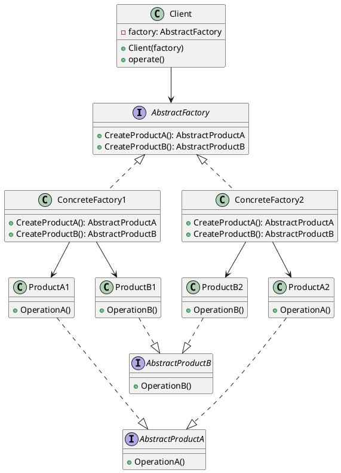
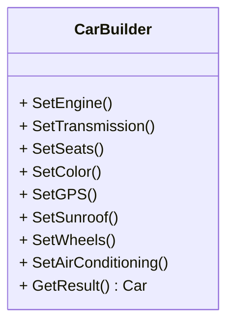
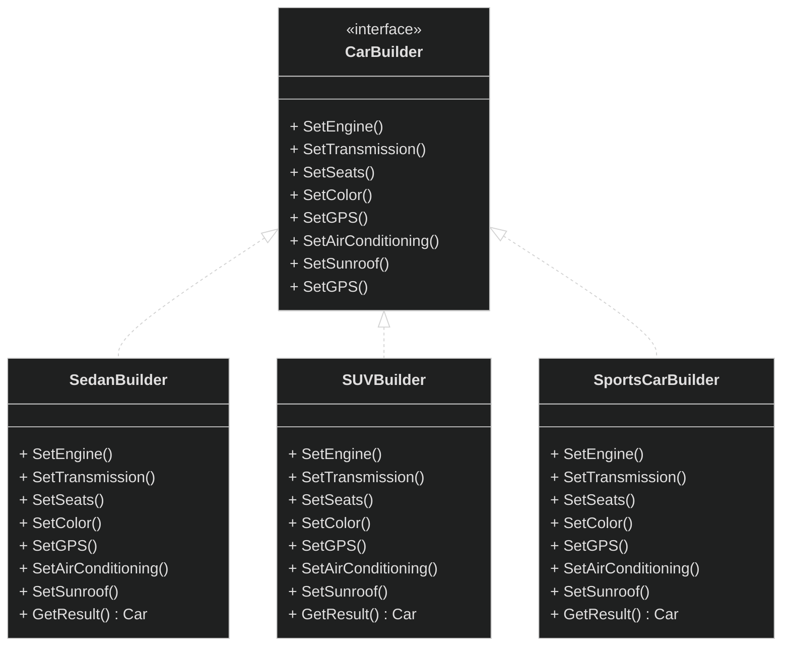
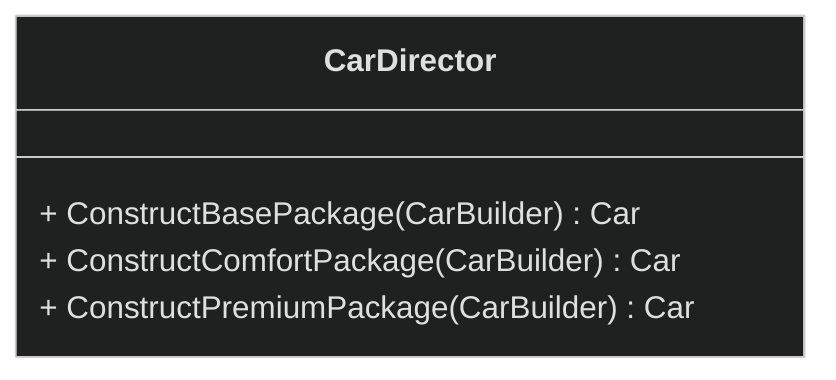
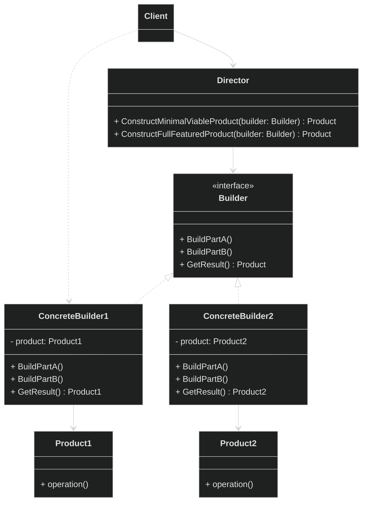
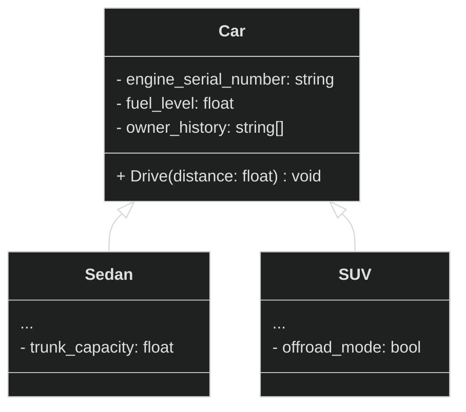
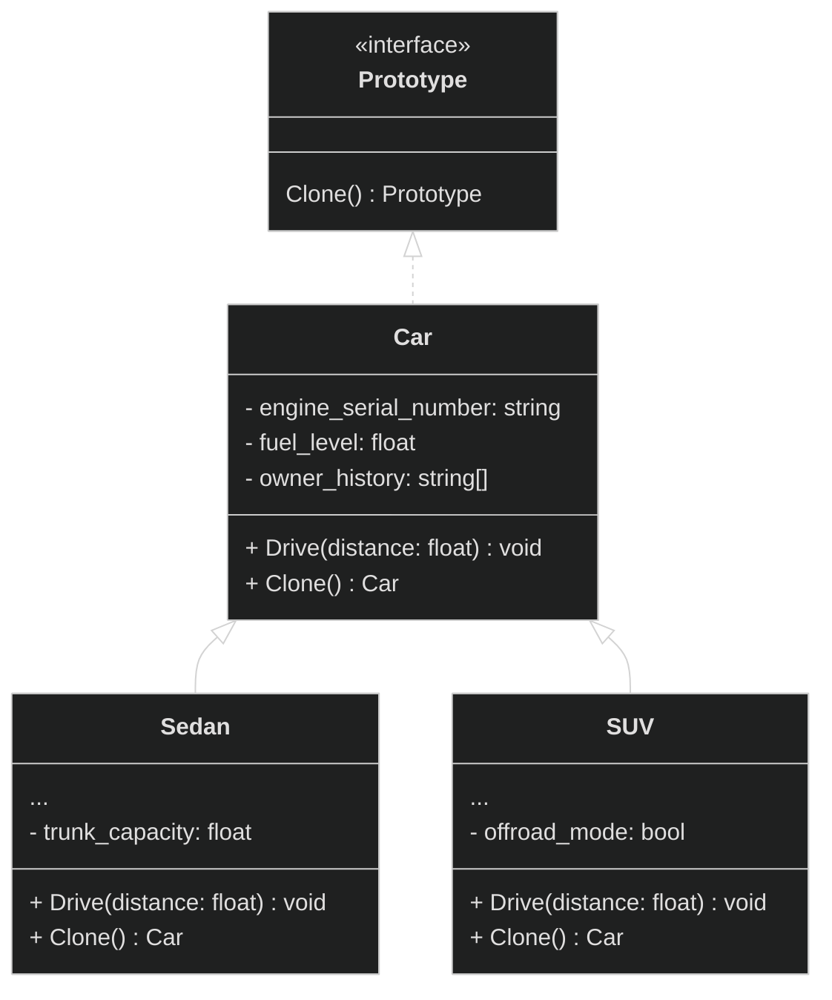
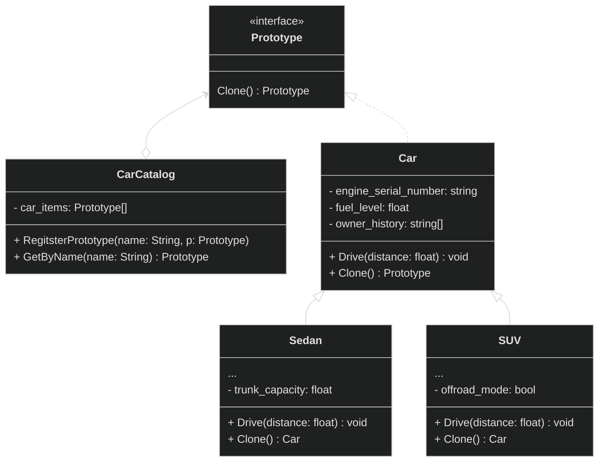
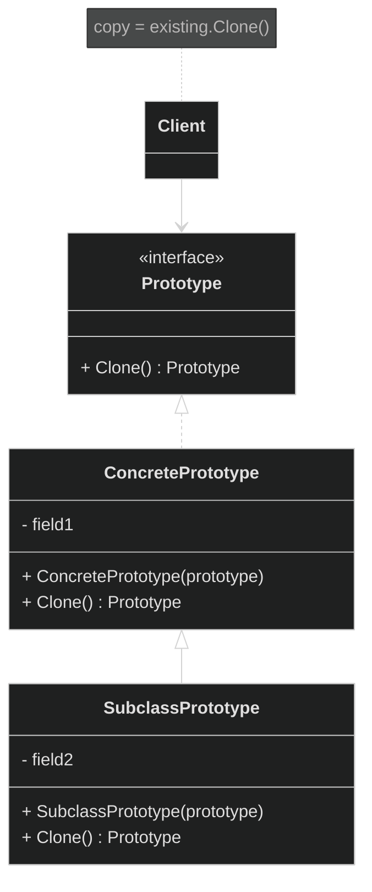

## Принципы проектирования архитектуры

### Повторное использование кода

###

### SOLID

<details>
<summary>
  Single Responsibility Principle
</summary>

**Принцип единственной ответственности** -
`класс должен быть ответственным только за одну конкретную функцию или задачу.`

Если класс решает много задач, то получается много связанного кода, что влечет плохую читабельность. Так же приходится изменять его каждый раз, когда одна из частей класса ломается. При этом есть риск сломать остальные части класса.

В классе `User` используется метод для сохранения в базу данных. При изменении работы с базами данных этот класс тоже будет изменен.

```plantuml
class User {
  - name
  - email
  + GetName()
  + GetEmail()
  + SaveToDatabase()
}
```

Решение: для базы данных создадим отдельный класс и пернесем сохранения пользователя в него.

```plantuml
class User {
  - name
  - email
  + GetName()
  + GetEmail()
}

class DataBase {
  ...
  + SaveToDatabase(User)
}

DataBase .> User
```

</details>

<details>
<summary>
  Open/Closed Principle
</summary>

**Принцип открытости/закрытости** -
`Расширяйте классы, но не изменяйте их первоначальный код`

**Открытый** - класс доступный для расширения. Есть возможность расширить набор его операций или добавить к нему новые поля, создав собсвенный подкласс.

**Закрытый** - класс с окончательно определенным интерфейсов, он не будет изменяться в будещем и готов для использования другими классами.

Если класс был окончательно написан и протестирован, в дальнейшем изменять его не желательно и если требуется расширение, то делать это только за счет добавления подклассов, не изменяя код родительского класса.

**Проблема:** Рассмотрим класс для обработки заказов, который содержит метод `GetShippingCost()`, рассчитывающий стоимость доставки. В текущей реализации при добавлении нового способа доставки приходится модифицировать этот метод, что нарушает принцип открытости/закрытости.

```plantuml
class Order {
  - shipping
  + GetTotal()
  + GetShippingCost()
}

note right of Order::GetShippingCost()
  if (shipping == "ground") {
    return 10; // 10 $
  }
  if (shipping == "air") {
    return 20; // 20 $
  }
end note

```

**Решение:** Вместо одного метода, который работает со всеми способами доставки, создадим отдельные классы `Ground` и `Air`, реализующие общий интерфейс доставки. Каждый класс будет самостоятельно рассчитывать стоимость доставки для своего способа. В классе `Order` мы будем вызывать методы этих классов доставки через общий интерфейс. Таким образом, при добавлении нового способа доставки в будущем достаточно будет создать соответствующий класс, реализующий этот интерфейс, без необходимости изменять существующие методы в классе `Order`.

```plantuml
class Order {
  - shipping: Shipping
  + GetTotal()
  + GetShippingCost()
}

interface Shipping {
  + GetCost()
}

class Ground {
  ...
  + GetCost()
}

class Air {
  ...
  + GetCost()
}

Order o-> Shipping
Shipping <|.. Air
Shipping <|.. Ground

note left of Order::GetShippingCost()
  return shipping.GetCost();
end note

note right of Air::GetCost()
  подсчитывает цену для заказов
end note

```


</details>

<details>
<summary>
  Liskov Substitution Principle
</summary>

**Принцип подстановки Лисков** -
`Подклассы должны дополнять, а не заменять функционал базового класса`.

Требования к переопределенным в подклассах методам:
<details>
<summary>
  Т1
</summary>

Типы параметров метода подкласса должны `совпадать` или быть более `абстрактными`, чем типы параметров базового метода.

**Пример:**
- Базовый класс содержит метод `AssignDriver(CarDriver d)`, который позволяет назначать водителей для автомобилей. Клиентский код всегда передает в метод водителя машины.
- **Хорошо:** Мы создали подкласс и переопределили метод назначения для любого водителя: `AssignDriver(Driver d)`. При передаче клиентским кодом водителя автомобиля новый метод сможет его назначить, ведь он умеет работать со всеми типами водителей.
- **Плохо:** Мы создали подкласс и переопределили метод только для гоночных водителей: `AssignDriver(RaceCarDriver d)`. Клиентский код все так же подаст обычного водителя. Но метод умеет работать только с гоночными водителями, и клиентский код сломается.

</details>

<details>
<summary>
  Т2
</summary>

Тип возвращаемого значения метода подкласса должен `совпадать` или быть `подтипом` возвращаемого значения базового метода.

Здесь все так же как и в первом требовании, но наоборот.

- **Базовый метод:** `GetUser(): User`. Клиентский код ожидает на выходе объект пользователя с базовыми полями _like_ и _email_.

- **Хорошо:** Метод подкласса: `GetUser(): AdminUser`. Клиентский код получит администратора, который является пользователем, но с дополнительными правами. Всё будет работать корректно.

- **Плохо:** Метод подкласса: `GetUser(): Object`. Клиентский код сломается, так как получит непонятный объект (возможно, строку или число), у которого нет полей _like_ и _email_, необходимых для работы.

</details>

<details>
<summary>
  Т3
</summary>

Метод подкласса не должен выбрасывать исключения, которые не свойственны базовому методу.

При переопределении метода нельзя выбрасывать новые типы исключений, которых нет в базовом методе. Клиентский код уже настроен на обработку конкретных исключений базового класса. Если подкласс добавит новое исключение, оно может не перехватиться и "уронить" клиентскую программу.

</details>

<details>
<summary>
  Т4
</summary>

Метод подкласса не должен ужесточать `пред-условие`.

Например, если базовый метод принимает любые целые числа, то подкласс не может ограничить работу только положительными значениями. Это нарушит ожидания клиентского кода.

</details>

<details>
<summary>
  Т5
</summary>

Метод подкласса не должен ослаблять `пост-условие`.

Если базовый метод гарантирует закрытие файлов после выполнения, то подкласс не может нарушать это обязательство, оставляя файлы открытыми. Клиентский код полагается на поведение базового класса и может некорректно завершить работу с висящими файловыми дескрипторами.

</details>

<details>
<summary>
  Т6
</summary>

Инварианты класса должны остаться без изменений.

**Инвариант** — это внутреннее правило объекта, которое никогда не нарушается. Например:

- У класса **Прямоугольник**: `ширина > 0 и высота > 0`
- У класса **Пользователь**: `email содержит "@"`
- У класса **КорзинаПокупок**: `общая_сумма >= 0`

Если базовый класс гарантирует, что у него `баланс >= 0`, то наследник не может разрешить отрицательный баланс. Все "правила жизни" объекта должны сохраняться.

</details>

<details>
<summary>
  Т7
</summary>

Подкласс не должен изменять значения приватных полей базового класса.

Это возможно в языке программирования Python, где нет четкой защиты полей.

</details>

</details>

<details>
<summary>
  Interface Segregation Principle
</summary>

Принцип разделения интерфейса -
`Клиенты не должны зависеть от методов, которые они не используют.`

"Толстые" интерфейсы необходимо разделять на более мелкие и специализированные, решающие конкретную задачу.

**Пример:**

Данным двум классам приходится реализовывать методы не относящиеся к их задачам. Для программиста нужны только методы для написания и тестирования кода, а для повара только метод готовки.

```plantuml
interface Worker {
  + Code()
  + Test()
  + Cooking()
}

class Programmer {
  + <color:green>Code()</color>
  + <color:green>Test()</color>
  + <color:red>Cooking()</color>
}

class Cook {
  + <color:red>Code()</color>
  + <color:red>Test()</color>
  + <color:green>Cooking()</color>
}

Worker <|.. Programmer
Worker <|.. Cook
```

Решение: разделим интерфейс `Worker` на тонкие `Coder`, `Tester` и `Chef`. Теперь классам не придется реализовывать лишние методы.

```plantuml
interface Coder {
  + Code()
}

interface Tester {
  + Test()
}

interface Chef {
  + Cooking()
}

class Programmer {
  + Code()
  + Test()
}

class Cook {
  + Cooking()
}

Coder <|.. Programmer
Tester <|.. Programmer
Chef <|.. Cook
```

</details>

<details>
<summary>
  Dependency Inversion Principle
</summary>

Принцип инверсии зависимостей -
`Классы верхних уровней не должны зависеть от классов нижних уровней. Оба должны зависеть от абстракций. Абстракции не должны зависеть от деталей. Детали должны зависеть от абстракций.`

Классы `нижнего уровня` — это исполнители: они выполняют конкретные поручения(сохранить данные, прочитать данные и т.д.), в то время как классы `верхнего уровня` — управленцы, которые координируют работу и реализуют бизнес-процессы.

Как реализовать принцип:

1. Определите интерфейс с операциями, которые бизнес-логика требует от низкоуровневых компонентов
2. Сделайте бизнес-логику зависимой от этого интерфейса, а не от конкретных реализаций — это создаёт гибкую связь
3. Обеспечьте соответствие низкоуровневых классов созданному интерфейсу — теперь они зависят от контракта, определённого бизнес-логикой

**Пример:**

Есть рабочий, который умеет работать только с одним конкретным станком. Если станок сломался и нужно поставить новый - рабочий не сможет с ним работать, потому что новый станок работает по-другому.

```plantuml
class Worker {
  + Work()
}

class OldMachine {
  + StartOldWay()
}

Worker -> OldMachine : умеет работать только так
```

Решение: создадим универсальный пульт управления. Теперь рабочий учится работать с пультом, а не со станком. Любой станок можно подключить к этому пульту.

```plantuml
class Worker {
  + Work()
}

interface Controller {
  + Start()
  + Stop()
}

class UniversalController implements Controller {
  + Start()
  + Stop()
}

class OldMachine {
  + StartOldWay()
}

class NewMachine {
  + StartNewWay()
}

Worker -> Controller
UniversalController --> OldMachine
UniversalController --> NewMachine
```

</details>

## Паттерны проектирования

### Порождающие паттерны

Паттерны отвечают за удобное и безопасное создание новых объектов или даже целых семейт объектов.

Factory Method
Фабричный метод - это порождающий паттерн проектирования, который определяет общий интерфейс для создания объектов в суперклассе, позволяя подклассам изменять тип создаваемых объектов.

</details>

<details>
<summary>
  Abstract Factory
</summary>

Абстрактная фабрика - это порождающий паттерн проектирования, который позволяет создавать семейства связных объектов, не привязываясь к конкретным классам создаваемых объектов.

<details>
<summary>
  Проблема
</summary>

Представим, что мы пишем магазин автомобилей. Магазин занимается продажей семейства седанов, внедорожников, спорткаров от разных производителей: Toyota, BMW.

На ранних этапах наш код создания автомобилей будет выглядить вот так:

```cpp
Car* CreateSedan(string brand) {
  if (brand == "Toyota") {
    return new ToyotaSedan();
  } else if (brand == "BMW") {
    return new BMWSedan();
  }
}

Car* CreateSUV(string brand) {
  if (brand == "Toyota") {
    return new ToyotaSUV();
  } else if (brand == "BMW") {
    return new BMWSUV();
  }
}

Car* CreateSportsCar(string brand) {
  if (brand == "Toyota") {
    return new ToyotaSportsCar();
  } else if (brand == "BMW") {
    return new BMWSportsCar();
  }
}
```

**Какие проблемы возникают?**

1. Клиент заказывает автомобили `BMW`, но получает Седан(BMW 5 Series), Внедорожник(Toypta RAV4), Спорткар(BMW M8). Клиент растроится. А ошибка произошла во время создания автомобилей:

```cpp
Car* sedan = CreateSedan("BMW");      // BMW 5 Series
Car* suv = CreateSUV("Toyota");       // Toypta RAV4 - ОШИБКА!
Car* sports = CreateSportsCar("BMW"); // BMW M8
```

2. Если мы захотим расширить парк машин, то придется изменять существующий код создания авто.
3. Дублирование кода.

</details>

<details>
<summary>
  Решение
</summary>

Для начала паттерн предлагает выделить общие интерфейсы для отдельных продуктов семейсв. Так каждое семейство автомобилей получат общий интерфейс `Седан`, `Внедорожник`, `Спорткар`. Например:

```plantuml
interface SUV {
  + Drive()
  + OffRoad()
}

class ToyotaSUV implements SUV{
  ...
  + Drive()
  + OffRoad()
}

class BMWSUV implements SUV{
  ...
  + Drive()
  + OffRoad()
}
```

Далее необходимо создать **абстракную фабрику**. Это общий интерфейс, который будет содержать методы создания всех автомобилей семейства: `CrateSedan()`, `CreateSUV()`, `CreateSportCar()`.

```plantuml
interface CarFactory {
  + CrateSedan()
  + CreateSUV()
  + CreateSportCar()
}
```

Для каждого бренда семейства мы должны создать свою собственную фабрику, реализуя абстрактный интерфейс.

```plantuml
interface CarFactory {
  + CrateSedan(): Sedan
  + CreateSUV(): SUV
  + CreateSportCar(): SportCar
}

class BMWFactory implements CarFactory {
  ...
  + CrateSedan(): Sedan
  + CreateSUV(): SUV
  + CreateSportCar(): SportCar
}

class ToyotaFactory implements CarFactory {
  ...
  + CrateSedan(): Sedan
  + CreateSUV(): SUV
  + CreateSportCar(): SportCar
}
```

Клиентский код работает только через общие интерфейсы:

- Клиент использует `CarFactory`, не зная конкретной фабрики
- Клиент использует `Sedan`/`SUV`/`SportsCar`, не зная конкретных моделей
- Не важно, какая фабрика - Toyota или BMW
- Важно, что все автомобили совместимы и одного бренда

**Пример:**

```cpp
// Клиенту безразлично, какая фабрика
void ClientCode(CarFactory& factory) { // Любая фабрика: Toyota или BMW
  // Фабрика сама "знает" какие модели создавать
  Sedan* sedan = factory.CreateSedan();     // Toyota Camry или BMW 5 Series
  SUV* suv = factory.CreateSUV();           // Toyota RAV4 или BMW X5
}
```

Можно легко заменять фабрики, не меняя клиентский код. Все созданные автомобили гарантированно совместимы друг с другом.

**Замечание:** фабрика создается отдельно - обычно через конфигурацию или системные настройки.

</details>

**Общая диаграмма паттерна:**



</details>

<details>
<summary>
  Builder
</summary>

Строитель - это порождающий паттерн проектирования, который позволяет создавать сложные объекты пошагово. Строитель дает возможность использовать один и тот же код строительства для получения разных представлений объектов.

<details>
<summary>
  Проблема
</summary>

Представим, что мы хотим создать автомобиль. Но автомобиль — это сложный объект, который может иметь множество различных конфигураций:

- Разные типы двигателей (бензиновый, дизельный, электрический)
- Разные варианты трансмиссии (автоматическая, механическая, робот)
- Разное количество мест (2, 5, 7)
- Разные опции (кондиционер, GPS, кожаные сиденья)
- Разные цвета кузова

Если мы попытаемся создать конструктор для такого объекта, он будет иметь десятки параметров, большинство из которых будут необязательными. Это приведет к:

1. **Очень длинным конструкторам** с множеством параметров
2. **Сложности чтения кода** — непонятно, что означает каждый параметр
3. **Ошибкам при создании** — легко перепутать порядок параметров

```cpp
// Пример огромного конструктора
Car car("V6", 5, true, false, true, "automatic", "red", true, false, true, "leather");
```

</details>

<details>
<summary>
  Решение
</summary>

Паттерн Строитель предлагает вынести конструирование объекта за пределы его собственного класса, поручив это дело отдельным объектам, называемыми строителями.

Мы должны разбить процесс создания объекта на отдельные шаги, поочередно вызывая методы для каждого шага. Например: `SetEngine()`, `SetSeats(count)`, `SetColor()` и т.д.



Один и тот же процесс сборки автомобиля выполняется по-разному для каждого типа: седан, внедорожник, спорткар. Используя разных строителей в одном и том же процессе сборки, можно получать на выходе различные автомобили.

Например, строитель седана установит экономичный двигатель и комфортные сиденья, строитель внедорожника — мощный мотор и полный привод, а строитель спорткара — мощный двигатель и спортивные сиденья.

Каждый такой строитель будет реализовывать общий интерфейс, а код, который будет вызывать шаги строительства, должен работать со ними через этот интерфейс, чтобы строителей можно было легко взаимозаменять.



Заметим, что классы-строители имеют метод `GetResult()`, который возвращает готовый автомобиль. Этот метод должен вызываться после выполнения всех шагов настройки и служит для получения финального результата.

**Директор**
Мы можем создать отдельный класс с вызовом методов строителей. Он сам будет задавать порядок строительства. Этот класс будет называться `Директор`. Данный класс особо полезен когда у нас есть несколько способой конструкирования объектов.

Например, в случае автомобилей директор может определять различные комплектации:

- **BasePackage** — базовая комплектация (только двигатель, трансмиссия и сиденья)
- **ComfortPackage** — комфортная комплектация (добавляется GPS и кондиционер)
- **PremiumPackage** — премиальная комплектация (все опции, включая люк)

Директор не обязателен в реализации паттерна Строитель, можно обойтись и без него, но он позволяет полностью скрыть от клиентского кода процесс конструирования объектов.



Клиент получает понятный и чистый интерфейс, через который может легко менять тип автомобиля и комплектацию, не разбираясь в сложностях процесса сборки.

```cpp
CarDirector director;

SedanBuilder sedan_builder;
SUVBuilder suv_builder;
SportsCarBuilder sportscar_builder;

Car* basic_sedan = director.ConstructBasePackage(sedasedan_buildernBuilder);
Car* comfort_suv = director.ConstructComfortPackage(suv_builder);
Car* premium_sports = director.ConstructPremiumPackage(sportscar_builder);
```

</details>

**Общая диаграмма паттерна:**



</details>

<details>
<summary>
  Prototype
</summary>

Прототип - это порождающий паттерн проектирования, который позволяет создавать копии объектов, не вдаваясь в детали реализации.

<details>
<summary>
  Проблема
</summary>

Представьте, что у нас есть автомобиль, который нужно скопировать. Казалось бы, что может быть проще — создать новый автомобиль такой же модели и скопировать все его характеристики.



Функция создания клона машины, копируя каждое его поле:

```pseudocode
function СloneCar(original_сar) {
  // Приходится проверять конкретный тип авто
  if (original_car is Sedan) {
    new_сar = new Car()
  }
  else if (original_car is SUV) {
    new_сar = new Car()
  }

  // Попытка скопировать приватные поля
  new_сar.engine_serial_number = original_сar.engine_serial_number
  new_сar.fuel_level = original_сar.fuel_level

  // Копирование в зависимости от типа автомобиля
  if (original_car is Sedan) {
    new_car.trunk_capacity = original_car.trunk_capacity
  }
  else if (original_car is SUV) {
    new_car.offroad_mode = original_car.offroad_mode
  }

  return new_сar
}
```

Возникают несколько проблем в этом коде:

1. **Нарушение инкапсуляции**
У автомобиля есть множество внутренних характеристик, которые скрыты от внешнего мира. Мы не можем просто обратиться к серийному номеру двигателя engine_serial_number или текущему уровню топлива fuel_level — эти данные являются приватными и недоступны для прямого копирования извне.

2. **Зависимость от конкретных классов**
Наша функция копирования должна точно знать, с каким типом автомобиля она работает — является ли это седаном Sedan или внедорожником SUV. Мы не можем работать с автомобилями через общий интерфейс, а должны знать каждый конкретный класс и все его специфичные поля. Это создает жесткую связь между кодом копирования и конкретными реализациями автомобилей.

</details>

<details>
<summary>
  Решение
</summary>

Паттерн Прототип перекладывает задачу копирования на сами копируемые объекты. Вместо того чтобы пытаться скопировать автомобиль извне, мы предоставляем каждому автомобилю свою возможность создавать свою собственную копию.

Это решает проблему инкапсуляции — поскольку метод копирования находится внутри класса автомобиля, он имеет полный доступ ко всем приватным полям, включая серийный номер двигателя и уровень топлива. Объект может скопировать своё внутреннее состояние, не раскрывая его внешнему миру.

Одновременно решается и проблема зависимости от конкретных классов. Мы вводим общий интерфейс, который объявляет метод клонирования(обычно это метод `Clone()`). Теперь клиентскому коду не нужно знать конкретный тип автомобиля — достаточно того, что он поддерживает операцию клонирования. Мы можем работать с любым автомобилем через этот интерфейс, не привязываясь к конкретным классам Sedan или SUV.

Объект, который копируют, называется **прототипом**.
Паттерн Прототип открывает возможность использования предварительно настроенных прототипов. Мы можем создать **каталог** эталонных автомобилей с различными конфигурациями, и когда потребуется новый автомобиль, просто создать копию соответствующего прототипа. Это особенно полезно когда объекты имеют сложную структуру или требуют затратной настройки.

Внеся исправления мы получим следующую диаграмму:



Клиенту достаточно будет вызывать метод `Clone` для копирования объектов:

```pseudocode
function ClientCode() {
  // Создаем оригинальные автомобили
  original_sedan = new Sedan()
  original_suv = new SUV()

  // Простое клонирование - один вызов метода
  sedan_copy = original_sedan.Clone()
  suv_copy = original_suv.Clone()

  // Использование копий
  sedan_copy.Drive(100)
  suv_copy.Drive(200)
}
```

Напишем реализацию с использованмем вышеупомянутого каталога.



Клиентский код с использованием каталога:

```pseudocode
function ClientCode() {
  // Создаем каталог прототипов
  catalog = new CarCatalog()

  // Создаем и регистрируем прототипы в каталоге
  sedan_prototype = new Sedan()
  sedan_prototype.SetEngine("V6")
  sedan_prototype.SetFuelLevel(100)
  catalog.RegisterPrototype("family_sedan", sedan_prototype)

  suv_prototype = new SUV()
  suv_prototype.SetEngine("V8")
  suv_prototype.SetOffroadMode(true)
  catalog.RegisterPrototype("adventure_suv", suv_prototype)

  // Клиент получает прототипы из каталога и клонирует их
  sedan_prototype = catalog.GetByName("family_sedan")
  suv_prototype = catalog.GetByName("adventure_suv")

  // Создаем копии автомобилей
  my_sedan = sedan_prototype.Clone()
  my_suv = suv_prototype.Clone()

  // Используем автомобили
  my_sedan.Drive(150)
  my_suv.Drive(200)
}
```

За счет этого облегчается доступ к часто используемым прототипам.

Простейшая реализация каталога может быть построена на основе хеш-таблицы, где ключом выступает имя прототипа, а значением — сам объект-прототип. Однако для удобства поиска прототипы можно маркировать не только условными именами, но и другими критериями: типом кузова, классом оснащения и другими характеристиками.

</details>

**Общая диаграмма паттерна без каталога:**



**Общая диаграмма паттерна с каталогом:**

```mermaid
%%{init: {'theme': 'dark'}}%%
classDiagram

class Client {
  <Client>
}

class PrototypeRegistry {
  - items: Prototype[]
  + AddItem(id: String, p: Prototype)
  + GetById(id: String) Prototype
}

class Prototype {
  <<interface>>
  + Сlone() Prototype
}

class ConcretePrototype {
  - field1
  + ConcretePrototype(prototype)
  + Сlone() Prototype
}

class SubclassPrototype {
  - field2
  + SubclassPrototype(prototype)
  + Сlone() Prototype
}

Client --> PrototypeRegistry
PrototypeRegistry o--> Prototype
Prototype <|.. ConcretePrototype
ConcretePrototype <|-- SubclassPrototype

note for Client "copy = existing.Clone()"
```

</details>

Singleton
Одиночка

