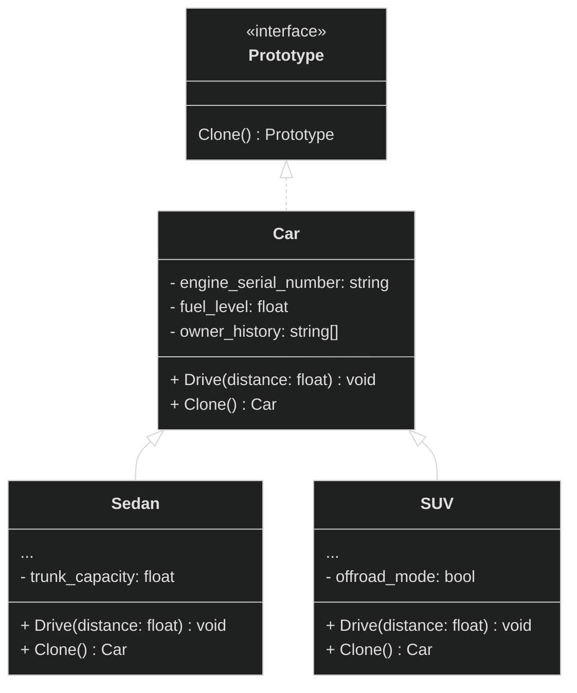

# Порождающие паттерны

Паттерны отвечают за удобное и безопасное создание новых объектов или даже целых семейт объектов.

## Factory Method

<details>
<summary>
  Определение
</summary>

**Фабричный метод** - это порождающий паттерн проектирования, который определяет общий интерфейс для создания объектов в суперклассе, позволяя подклассам изменять тип создаваемых объектов.

</details>

<details>
<summary>
  Проблема
</summary>

Представьте мы разрабатываем программу для компании, которая занимается грузоперевозками. Изначально компания работала только с автомобильными перевозками — товары доставлялись грузовиками по дорогам. Вся система была заточена под этот тип транспорта.


```pseudocode
// система логистики
class Logistic {
  method PlanDelivery() {
    truck = new Truck()
    truck.Deliver()
  }
}

// автомобиль
class Truck {
  method Deliver() {
    Print("Доставка груза грузовиком")
  }
}

// Использование
logistic = new Logistic()
logistic.PlanDelivery()
```

Со временем бизнес расширился. Появилась необходимость в морских перевозках для международных заказов, затем в авиаперевозках для срочных доставок, а позже — в железнодорожных перевозках для крупных партий товаров.

```pseudocode
// Система логистики
class Logistic {
  method PlanDelivery(transport_type) {
    if (transport_type == "truck") {
      truck = new Truck()
      truck.Deliver()
    } else if (transport_type == "ship") {
      ship = new Ship()
      ship.Deliver()
    } else if (transport_type == "airplane") {
      airplane = new Airplane()
      airplane.Deliver()
    } else if (transport_type == "train") {
      train = new Train()
      train.Deliver()
    }
  }
}

// Различные виды транспорта
class Truck {
  method Deliver() {
    Print("Доставка груза грузовиком по дороге")
  }
}

class Ship {
  method Deliver() {
    Print("Доставка груза кораблем по морю")
  }
}

class Airplane {
  method Deliver() {
    Print("Доставка груза самолетом по воздуху")
  }
}

class Train {
  method Deliver() {
    Print("Доставка груза поездом по железной дороге")
  }
}

// Использование
logistic = new Logistic()
logistic.PlanDelivery("truck")    // Доставка груза грузовиком по дороге
logistic.PlanDelivery("ship")     // Доставка груза кораблем по морю
logistic.PlanDelivery("airplane") // Доставка груза самолетом по воздуху
logistic.PlanDelivery("train")    // Доставка груза поездом по железной дороге
```

Каждый раз при добавлении нового типа транспорта разработчики приходится менять код, добавляя сложные условные конструкции для выбора подходящего транспорта.
Основная логика планирования доставки оказывалась перегружена деталями создания конкретных видов транспорта. Система становилась хрупкой — любое изменение в одном типе перевозок могло случайно задеть другие. Тестирование усложнялось, поскольку невозможно было изолировать общую логику планирования от конкретных реализаций транспорта.

</details>

<details>
<summary>
  Решение
</summary>

Паттерн **Фабричный метод** предлагает вынести создание транспорта в отдельный метод. Основной класс логистики будет использовать этот метод для получения транспорта, не зная конкретного типа. Такой метод будем называть **фабричным**.

Для каждого типа перевозок создается свой класс-наследник: автомобильная логистика, морская логистика, воздушная логистика и так далее. Каждый из этих классов переопределяет фабричный метод и возвращает соответствующий тип транспорта.


Для работы этой системы все возвращаемые объекты транспорта должны иметь общий интерфейс. Например, классы `Truck` и `Ship` реализуют интерфейс `Transport` с методом `Deliver()`. Каждый класс реализует этот метод по-своему: грузовики везут грузы по земле, а корабли — по морю. Для клиентского кода нет разницы между этими объектами, так как он работает с ними через общий интерфейс `Transport`. Важно лишь, что у объекта есть метод `Deliver()`, а как именно он работает — не имеет значения.


Посмотрим как это выглядит в коде:

**Транспорт:**

```pseudocode
// Общий интерфейс для транспорта
interface Transport {
  method Deliver()
}

// Конкретные реализации транспорта
class Truck implements Transport {
  method Deliver() {
    Print("Доставка груза по дороге")
  }
}

class Ship implements Transport {
  method Deliver() {
    Print("Доставка груза по морю")
  }
}
```

**Логистика:**

```pseudocode
// Базовый класс логистики
abstract class Logistic {
  // Фабричный метод
  abstract method CreateTransport() Transport

  // Общая логика доставки
  method PlanDelivery() {
    transport = this.CreateTransport()
    transport.Deliver()
  }
}

// Конкретные создатели логистики
class TruckLogistic extends Logistic {
  method CreateTransport() Transport {
    return new Truck()
  }
}

class ShipLogistic extends Logistic {
  method CreateTransport() Transport {
    return new Ship()
  }
}
```

**Клиентский код:**

```pseudocode
// Используем автомобильную логистику
truckLogistic = new TruckLogistic()
truckLogistic.PlanDelivery()  // Доставка груза по дороге

// Используем морскую логистику
shipLogistic = new ShipLogistic()
shipLogistic.PlanDelivery()   // Доставка груза по морю

// Клиенту не важно, какая именно логистика используется
// Все работают через общий интерфейс
logistics = [new TruckLogistic(), new ShipLogistic()]
for (logistic : logistics) {
  logistic.PlanDelivery()
}
```

</details>

<details>
<summary>
  Общая диаграмма паттерна
</summary>


</details>

## Abstract Factory

<details>
<summary>
  Определение
</summary>

**Абстрактная фабрика** - это порождающий паттерн проектирования, который позволяет создавать семейства связных объектов, не привязываясь к конкретным классам создаваемых объектов.

</details>

<details>
<summary>
  Проблема
</summary>

Представим, что мы пишем магазин автомобилей. Магазин занимается продажей семейства седанов, внедорожников, спорткаров от разных производителей: Toyota, BMW.

На ранних этапах наш код создания автомобилей будет выглядить вот так:

```cpp
Car* CreateSedan(string brand) {
  if (brand == "Toyota") {
    return new ToyotaSedan();
  } else if (brand == "BMW") {
    return new BMWSedan();
  }
}

Car* CreateSUV(string brand) {
  if (brand == "Toyota") {
    return new ToyotaSUV();
  } else if (brand == "BMW") {
    return new BMWSUV();
  }
}

Car* CreateSportsCar(string brand) {
  if (brand == "Toyota") {
    return new ToyotaSportsCar();
  } else if (brand == "BMW") {
    return new BMWSportsCar();
  }
}
```

**Какие проблемы возникают?**

1. Клиент заказывает автомобили `BMW`, но получает Седан(BMW 5 Series), Внедорожник(Toypta RAV4), Спорткар(BMW M8). Клиент растроится. А ошибка произошла во время создания автомобилей:

    ```cpp
    Car* sedan = CreateSedan("BMW");      // BMW 5 Series
    Car* suv = CreateSUV("Toyota");       // Toypta RAV4 - ОШИБКА!
    Car* sports = CreateSportsCar("BMW"); // BMW M8
    ```

2. Если мы захотим расширить парк машин, то придется изменять существующий код создания авто.
3. Дублирование кода.

</details>

<details>
<summary>
  Решение
</summary>

Для начала паттерн предлагает выделить общие интерфейсы для отдельных продуктов семейсв. Так каждое семейство автомобилей получат общий интерфейс `Седан`, `Внедорожник`, `Спорткар`. Например:

```plantuml
interface SUV {
  + Drive()
  + OffRoad()
}

class ToyotaSUV implements SUV{
  ...
  + Drive()
  + OffRoad()
}

class BMWSUV implements SUV{
  ...
  + Drive()
  + OffRoad()
}
```

Далее необходимо создать **абстракную фабрику**. Это общий интерфейс, который будет содержать методы создания всех автомобилей семейства: `CrateSedan()`, `CreateSUV()`, `CreateSportCar()`.

```plantuml
interface CarFactory {
  + CrateSedan()
  + CreateSUV()
  + CreateSportCar()
}
```

Для каждого бренда семейства мы должны создать свою собственную фабрику, реализуя абстрактный интерфейс.

```plantuml
interface CarFactory {
  + CrateSedan(): Sedan
  + CreateSUV(): SUV
  + CreateSportCar(): SportCar
}

class BMWFactory implements CarFactory {
  ...
  + CrateSedan(): Sedan
  + CreateSUV(): SUV
  + CreateSportCar(): SportCar
}

class ToyotaFactory implements CarFactory {
  ...
  + CrateSedan(): Sedan
  + CreateSUV(): SUV
  + CreateSportCar(): SportCar
}
```

Клиентский код работает только через общие интерфейсы:

- Клиент использует `CarFactory`, не зная конкретной фабрики
- Клиент использует `Sedan`/`SUV`/`SportsCar`, не зная конкретных моделей
- Не важно, какая фабрика - Toyota или BMW
- Важно, что все автомобили совместимы и одного бренда

**Пример:**

```cpp
// Клиенту безразлично, какая фабрика
void ClientCode(CarFactory& factory) { // Любая фабрика: Toyota или BMW
  // Фабрика сама "знает" какие модели создавать
  Sedan* sedan = factory.CreateSedan();     // Toyota Camry или BMW 5 Series
  SUV* suv = factory.CreateSUV();           // Toyota RAV4 или BMW X5
}
```

Можно легко заменять фабрики, не меняя клиентский код. Все созданные автомобили гарантированно совместимы друг с другом.

**Замечание:** фабрика создается отдельно - обычно через конфигурацию или системные настройки.

</details>

<details>
<summary>
Общая диаграмма паттерна
</summary>


</details>

## Builder

<details>
<summary>
  Определение
</summary>

**Строитель** - это порождающий паттерн проектирования, который позволяет создавать сложные объекты пошагово. Строитель дает возможность использовать один и тот же код строительства для получения разных представлений объектов.

</details>

<details>
<summary>
  Проблема
</summary>

Представим, что мы хотим создать автомобиль. Но автомобиль — это сложный объект, который может иметь множество различных конфигураций:

- Разные типы двигателей (бензиновый, дизельный, электрический)
- Разные варианты трансмиссии (автоматическая, механическая, робот)
- Разное количество мест (2, 5, 7)
- Разные опции (кондиционер, GPS, кожаные сиденья)
- Разные цвета кузова

Если мы попытаемся создать конструктор для такого объекта, он будет иметь десятки параметров, большинство из которых будут необязательными. Это приведет к:

1. **Очень длинным конструкторам** с множеством параметров
2. **Сложности чтения кода** — непонятно, что означает каждый параметр
3. **Ошибкам при создании** — легко перепутать порядок параметров

```cpp
// Пример огромного конструктора
Car car("V6", 5, true, false, true, "automatic", "red", true, false, true, "leather");
```

</details>

<details>
<summary>
  Решение
</summary>

Паттерн Строитель предлагает вынести конструирование объекта за пределы его собственного класса, поручив это дело отдельным объектам, называемыми строителями.

Мы должны разбить процесс создания объекта на отдельные шаги, поочередно вызывая методы для каждого шага. Например: `SetEngine()`, `SetSeats(count)`, `SetColor()` и т.д.


Один и тот же процесс сборки автомобиля выполняется по-разному для каждого типа: седан, внедорожник, спорткар. Используя разных строителей в одном и том же процессе сборки, можно получать на выходе различные автомобили.

Например, строитель седана установит экономичный двигатель и комфортные сиденья, строитель внедорожника — мощный мотор и полный привод, а строитель спорткара — мощный двигатель и спортивные сиденья.

Каждый такой строитель будет реализовывать общий интерфейс, а код, который будет вызывать шаги строительства, должен работать со ними через этот интерфейс, чтобы строителей можно было легко взаимозаменять.


Заметим, что классы-строители имеют метод `GetResult()`, который возвращает готовый автомобиль. Этот метод должен вызываться после выполнения всех шагов настройки и служит для получения финального результата.

**Директор**
Мы можем создать отдельный класс с вызовом методов строителей. Он сам будет задавать порядок строительства. Этот класс будет называться `Директор`. Данный класс особо полезен когда у нас есть несколько способой конструкирования объектов.

Например, в случае автомобилей директор может определять различные комплектации:

- **BasePackage** — базовая комплектация (только двигатель, трансмиссия и сиденья)
- **ComfortPackage** — комфортная комплектация (добавляется GPS и кондиционер)
- **PremiumPackage** — премиальная комплектация (все опции, включая люк)

Директор не обязателен в реализации паттерна Строитель, можно обойтись и без него, но он позволяет полностью скрыть от клиентского кода процесс конструирования объектов.


Клиент получает понятный и чистый интерфейс, через который может легко менять тип автомобиля и комплектацию, не разбираясь в сложностях процесса сборки.

```cpp
CarDirector director;

SedanBuilder sedan_builder;
SUVBuilder suv_builder;
SportsCarBuilder sportscar_builder;

Car* basic_sedan = director.ConstructBasePackage(sedasedan_buildernBuilder);
Car* comfort_suv = director.ConstructComfortPackage(suv_builder);
Car* premium_sports = director.ConstructPremiumPackage(sportscar_builder);
```

</details>

<details>
<summary>
  Общая диаграмма паттерна
</summary>


</details>

## Prototype

<details>
<summary>
  Определение
</summary>

Прототип - это порождающий паттерн проектирования, который позволяет создавать копии объектов, не вдаваясь в детали реализации.

</details>

<details>
<summary>
  Проблема
</summary>

Представьте, что у нас есть автомобиль, который нужно скопировать. Казалось бы, что может быть проще — создать новый автомобиль такой же модели и скопировать все его характеристики.


Функция создания клона машины, копируя каждое его поле:

```pseudocode
function СloneCar(original_сar) {
  // Приходится проверять конкретный тип авто
  if (original_car is Sedan) {
    new_сar = new Car()
  }
  else if (original_car is SUV) {
    new_сar = new Car()
  }

  // Попытка скопировать приватные поля
  new_сar.engine_serial_number = original_сar.engine_serial_number
  new_сar.fuel_level = original_сar.fuel_level

  // Копирование в зависимости от типа автомобиля
  if (original_car is Sedan) {
    new_car.trunk_capacity = original_car.trunk_capacity
  }
  else if (original_car is SUV) {
    new_car.offroad_mode = original_car.offroad_mode
  }

  return new_сar
}
```

Возникают несколько проблем в этом коде:

1. **Нарушение инкапсуляции**
У автомобиля есть множество внутренних характеристик, которые скрыты от внешнего мира. Мы не можем просто обратиться к серийному номеру двигателя engine_serial_number или текущему уровню топлива fuel_level — эти данные являются приватными и недоступны для прямого копирования извне.

2. **Зависимость от конкретных классов**
Наша функция копирования должна точно знать, с каким типом автомобиля она работает — является ли это седаном Sedan или внедорожником SUV. Мы не можем работать с автомобилями через общий интерфейс, а должны знать каждый конкретный класс и все его специфичные поля. Это создает жесткую связь между кодом копирования и конкретными реализациями автомобилей.

</details>

<details>
<summary>
  Решение
</summary>

Паттерн Прототип перекладывает задачу копирования на сами копируемые объекты. Вместо того чтобы пытаться скопировать автомобиль извне, мы предоставляем каждому автомобилю свою возможность создавать свою собственную копию.

Это решает проблему инкапсуляции — поскольку метод копирования находится внутри класса автомобиля, он имеет полный доступ ко всем приватным полям, включая серийный номер двигателя и уровень топлива. Объект может скопировать своё внутреннее состояние, не раскрывая его внешнему миру.

Одновременно решается и проблема зависимости от конкретных классов. Мы вводим общий интерфейс, который объявляет метод клонирования(обычно это метод `Clone()`). Теперь клиентскому коду не нужно знать конкретный тип автомобиля — достаточно того, что он поддерживает операцию клонирования. Мы можем работать с любым автомобилем через этот интерфейс, не привязываясь к конкретным классам Sedan или SUV.

Объект, который копируют, называется **прототипом**.
Паттерн Прототип открывает возможность использования предварительно настроенных прототипов. Мы можем создать **каталог** эталонных автомобилей с различными конфигурациями, и когда потребуется новый автомобиль, просто создать копию соответствующего прототипа. Это особенно полезно когда объекты имеют сложную структуру или требуют затратной настройки.

Внеся исправления мы получим следующую диаграмму:



Клиенту достаточно будет вызывать метод `Clone` для копирования объектов:

```pseudocode
function ClientCode() {
  // Создаем оригинальные автомобили
  original_sedan = new Sedan()
  original_suv = new SUV()

  // Простое клонирование - один вызов метода
  sedan_copy = original_sedan.Clone()
  suv_copy = original_suv.Clone()

  // Использование копий
  sedan_copy.Drive(100)
  suv_copy.Drive(200)
}
```

Напишем реализацию с использованмем вышеупомянутого каталога.


Клиентский код с использованием каталога:

```pseudocode
function ClientCode() {
  // Создаем каталог прототипов
  catalog = new CarCatalog()

  // Создаем и регистрируем прототипы в каталоге
  sedan_prototype = new Sedan()
  sedan_prototype.SetEngine("V6")
  sedan_prototype.SetFuelLevel(100)
  catalog.RegisterPrototype("family_sedan", sedan_prototype)

  suv_prototype = new SUV()
  suv_prototype.SetEngine("V8")
  suv_prototype.SetOffroadMode(true)
  catalog.RegisterPrototype("adventure_suv", suv_prototype)

  // Клиент получает прототипы из каталога и клонирует их
  sedan_prototype = catalog.GetByName("family_sedan")
  suv_prototype = catalog.GetByName("adventure_suv")

  // Создаем копии автомобилей
  my_sedan = sedan_prototype.Clone()
  my_suv = suv_prototype.Clone()

  // Используем автомобили
  my_sedan.Drive(150)
  my_suv.Drive(200)
}
```

За счет этого облегчается доступ к часто используемым прототипам.

Простейшая реализация каталога может быть построена на основе хеш-таблицы, где ключом выступает имя прототипа, а значением — сам объект-прототип. Однако для удобства поиска прототипы можно маркировать не только условными именами, но и другими критериями: типом кузова, классом оснащения и другими характеристиками.

</details>

<details>
<summary>
  Общая диаграмма паттерна  без каталога
</summary>


</details>

<details>
<summary>
  Общая диаграмма паттерна с каталогом
</summary>


</details>

## Singleton

<details>
<summary>
  Определение
</summary>

**Одиночка** - это порождающий паттерн проектирования, который гарантирует, что у класса будет только один экземпляр, и предоставляет глобальную точку доступа.

</details>

<details>
<summary>
  Проблема
</summary>

Представим, что мы разрабатываем систему логирования для приложения. Разные модули программы должны записывать логи в один и тот же файл, с одинаковыми настройками формата и уровня детализации.


Если каждый модуль создает свой собственный логгер, возникают проблемы:

```pseudocode
class AuthService {
  function Login() {
    auth_logger = new Logger()  // Создается первый экземпляр
    auth_logger.SetLogLevel("DEBUG")
    auth_logger.WriteLog("Login attempt")
    // логика аутентификации...
    auth_logger.WriteLog("Login successful")
  }
}

class DatabaseService {
  function Query() {
    db_logger = new Logger()  // Создается второй экземпляр
    db_logger.SetLogLevel("ERROR")
    db_logger.WriteLog("Executing database query")
    // логика запроса...
    db_logger.WriteLog("Query completed")
  }
}

class PaymentService {
  function ProcessPayment() {
    payment_logger = new Logger() // Избыточное потребление ресурсов!
    payment_logger.WriteLog("Payment processing started")
    // логика платежа...
    payment_logger.WriteLog("Payment processed successfully")
  }
}
```

**Возникают следующие проблемы:**

1. **Дублирование функциональности и избыточное потребление ресурсов** - каждый модуль создает собственный экземпляр логгера, хотя все они выполняют идентичные задачи. Это приводит к нерациональному использованию памяти и вычислительных ресурсов без какого-либо преимущества.

2. **Сложность поддержания согласованного состояния** - при изменении требований к логированию (новый формат, другой уровень детализации) необходимо обновлять каждый экземпляр логгера отдельно. Это усложняет обслуживание системы.

</details>

<details>
<summary>
  Решение
</summary>

Паттерн Одиночка решает эти две проблемы:

**1. Гарантирует наличие единственного экземпляра класса.**
Скрывает конструктор и предоставляет статический метод для получения экземпляра `GetInstance()`. При первом вызове создаётся объект, а при последующих — возвращается ранее созданный. Это гарантирует, что все модули работают с одним логгером, избегая конфликтов и несогласованных настроек.

**2. Предоставляет глобальную точку доступа.**
Статический метод `GetInstance()` служит контролируемой глобальной точкой доступа. В отличие от обычной глобальной переменной, экземпляр защищён от случайной перезаписи, а логика инициализации инкапсулирована в одном месте. Это упрощает использование логгера из любого модуля, обеспечивая централизованное управление.


Метод `GetInstance()` будет выполнять слудующий код:

```pseudocode
if (instance == null) {
  instance = new Logger()
}
return instance
```

Клиенту будет получать экземпляр логгера через `GetInstance()`. Этот метод обеспечивает контролируемый доступ к единственному экземпляру, скрывая сложность его создания и инициализации от клиента:

```pseudocode
// При старте приложения
function InitializeApplication() {
  logger = Logger.GetInstance()
  logger.SetLogLevel("DEBUG")
  logger.WriteLog("Application initialized")
}

class AuthService {
  function Login() {
    logger = Logger.GetInstance()  // Тот же логгер
    logger.WriteLog("Login attempt")
    // логика аутентификации...
    logger.WriteLog("Login successful")
  }
}

class DatabaseService {
  function Query() {
    logger = Logger.GetInstance()  // Тот же логгер
    logger.WriteLog("Executing database query")
    // логика запроса...
    logger.WriteLog("Query completed")
  }
}

class PaymentService {
  function ProcessPayment() {
    logger = Logger.GetInstance()  // Тот же логгер
    logger.WriteLog("Payment processing started")
    // логика платежа...
    logger.WriteLog("Payment processed successfully")
  }
}
```

</details>

<details>
<summary>
  Общая диаграмма паттерна
</summary>


</details>
