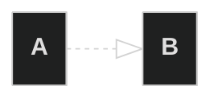
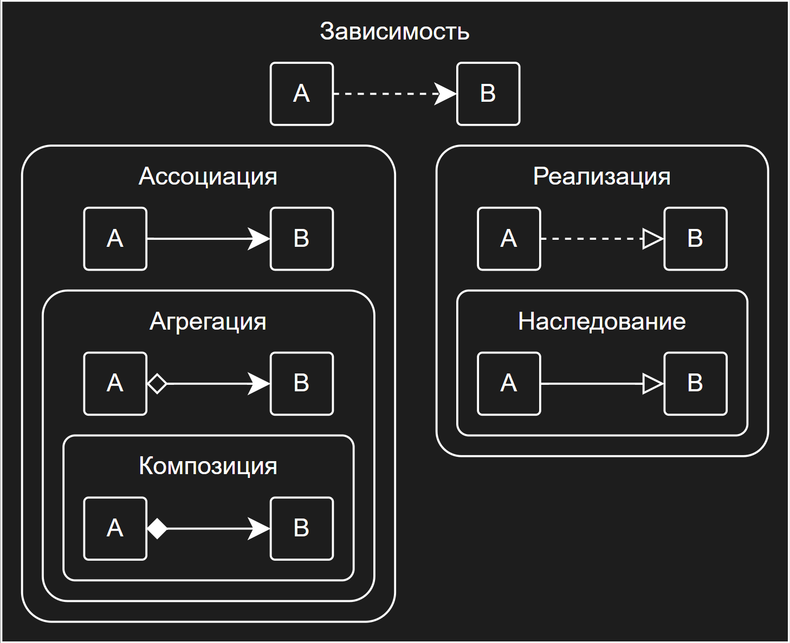

# Отношения между объектами

## Зависимость

Класс А могут затронуть изменения в классе B.

## Ассоциация

Объект А знает об объекте B.
Класс А зависит от B.

## Агрегация

Объект А знает об объекте B и состоит из него.
Класс А зависит от B.

## Композиция

Объект А знает об объекте B, состоит из него и управляет его жизненным циклом.
Класс А зависит от B.

## Реализация

Класс А определяет методы объявленные интерфейсом B. Объекты А можно рассматривать через интерфейс B.
Класс А зависит от B.

## Наследование

Класс А наследует интерфейс и реализацию класса B, но может переопределить её. Объекты А можно рассматривать через интерфейс класса B.
Класс А зависит от B.

## Итоговая диаграмма

