# Структурные паттерны проектирования

Отвечают за построение удобных в поддержке иерархий классов.

<details>
<summary>
  Adapter
</summary>

**Адаптер** - это структурный паттерн проектирования, который позволяет объектам с несовместимыми интерфейсами работать вместе.

<details>
<summary>
  Проблема
</summary>

Главный герой: Александр - опытный путешественник, который годами путешествовал по Европе на своём надежном автомобиле "Феникс", который реализует конкретный интерфейс управления. На этой машине он умеет: рулить `Steer()`, давать газ `Accelerate()` и тормозить `Brake()`

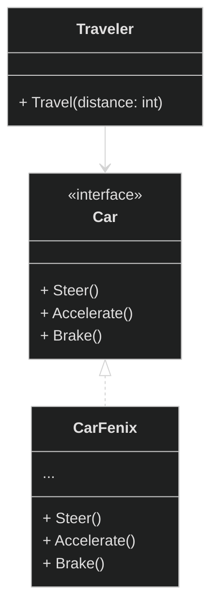

Александр решает отправиться в путешествие по Сахаре. Автомобиль "Феникс" беспомощно застревает в песках. Александр понимает, что единственный способ продолжить путь - нанять верблюда у местных бедуинов.

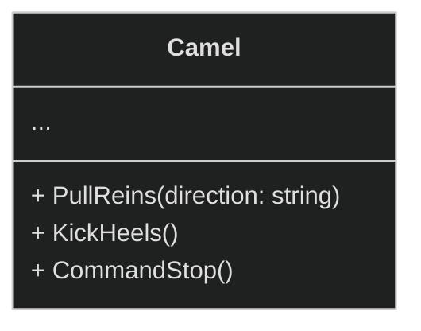

Главный герой не умеет управлять верблюдом, он не знает его команд. Для поворота нужно тянуть за поводья в нужную сторону, для движения вперед - легонько ударить пятками по бокам верблюда, а для остановки - натянуть поводья.

</details>

<details>
<summary>
  Решение
</summary>

Бедуины предлагают Александру создать **адаптер**. Это объект-переводчик, который трансформирует интерфейс или данные одного объекта в такой вид, чтобы он стал понятен другому объекту

В нашем случае это специальное седло, оснащенное рулём и педалями, которое преобразует автомобильные команды в верблюжьи:

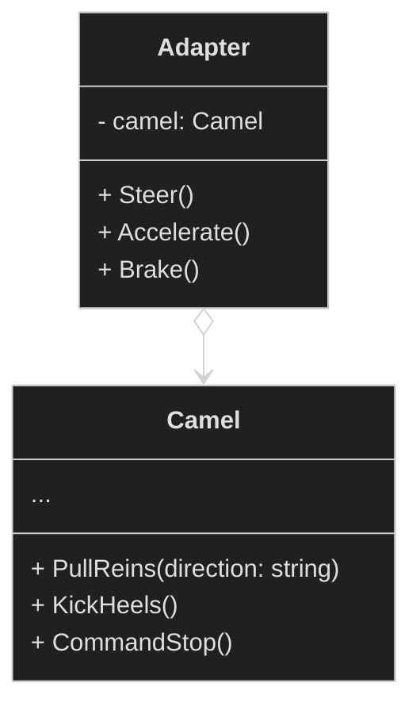

- `Steer("left")` → Поворот руля налево → `PullReins("left")` (механизм тянет левый повод)
- `Accelerate()` → Нажатие педали газа → `KickHeels()` (механизм легенько ударяет пятками по бокам верблюда)
- `Brake()` → Нажатие педали тормоза → `CommandStop()` (механизм натягивает поводья)

Итоговое управление нашего путешественника будет выглядить следующим образом:

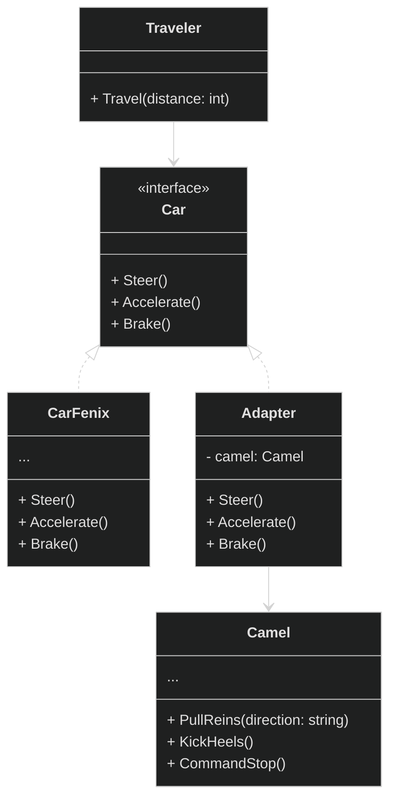

Заметим, что в данной реализации используется **ассоциация**. Адаптер содержит ссылку на служебный объект(Camel).

</details>

**Общая диаграмма паттерна через агрегацию:**

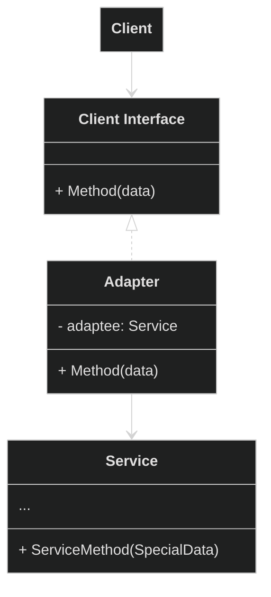

**Общая диаграмма паттерна через наследование:**

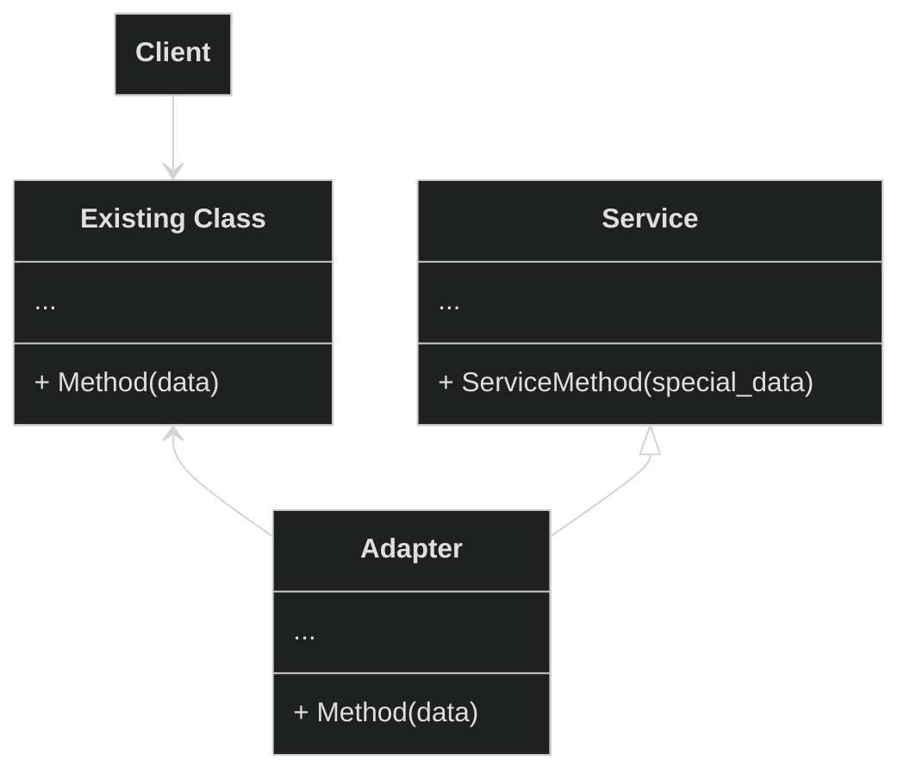

В данном случае адаптеру не нужен вложенный объект, так как он может наследовать как часть существующего класса так и часть сервиса.

</details>

<details>
<summary>
  Bridge
</summary>

**Мост** — это структурный паттерн проектирования, который разделяет один или несколько классов на две отдельные иерархии — абстракцию и реализацию, позволяя изменять их независимо друг от друга.

<details>
<summary>
  Проблема
</summary>

У вас есть базовый класс `Принтер` с двумя видами принтеров: `Лазерный` и `Струйный`. Теперь вы хотите добавить поддержку разных типов печати: `цветной` и `чёрно-белой`.

Если пойти простым путём наследования, придётся создать четыре отдельных класса:
- `ЛазерныйЦветной`
- `ЛазерныйЧернобелый`
- `СтруйныйЦветной`
- `СтруйныйЧернобелый`

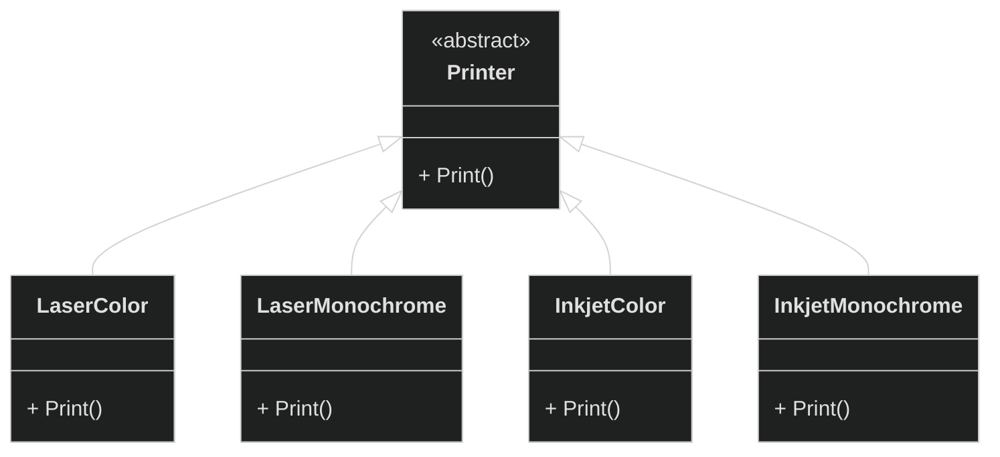

- `Printer` = Принтер
- `LaserColor` = ЛазерныйЦветной
- `LaserMonochrome` = ЛазерныйЧернобелый
- `InkjetColor` = СтруйныйЦветной
- `InkjetMonochrome` = СтруйныйЧернобелый

На данный момент у нас `2 принтера` x `2 печати`, всего 4 подкласса. При добавлении новых видов принтеров и типов печати количество комбинаций будет расти. Так, если добавим еще один тип печати, то получится `3 х 2 = 6` подклассов. И это очень печально.

</details>

<details>
<summary>
  Решение
</summary>

Паттерн Мост предлагает отказаться от создания множества комбинаций через наследование. Вместо этого мы разделяем наши характеристики на две независимые части и связываем их через "мост".

Разделяем на две самостоятельные иерархии:

- Первая иерархия - типы принтеров (лазерный, струйный)
- Вторая иерархия - типы печати (цветная, чёрно-белая)

И заменяем наследование агрегацией:

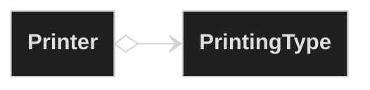

Таким образом, мы разделили систему: тип печати стал отдельной иерархией с классами `Color` и `Monochrome`. Класс `Printer` теперь содержит ссылку на объект `PrintingType` и может поручать ему работу по обработке цветности. Эта связь между принтером и типом печати и есть тот самый "мост".

Главное преимущество: когда мы добавляем новые типы печати, классам принтеров не нужны изменения, и наоборот - новые принтеры легко работают с существующими типами печати.

Итак, **абстракция** — это образный слой управления чем-либо(`Printer`). Он не делает работу самостоятельно, а делегирует её слою реализации(`PrintingType`).

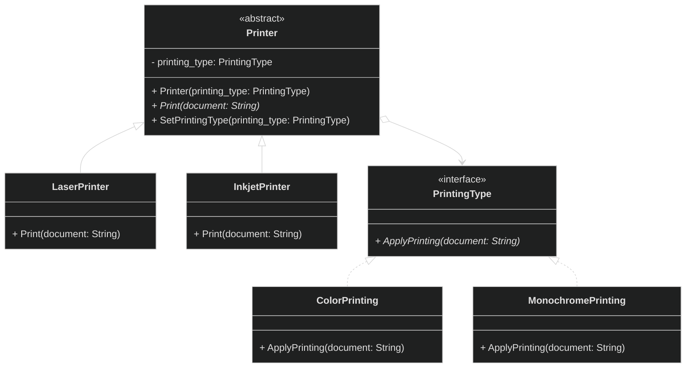

Реализация используя псевдокод:

**Абстракция:**

```pseudocode
class Printer {
  field printing_type: PrintingType  // Мост к реализации

  Constructor(printing_type: PrintingType) {
    this.printing_type = printing_type
  }

  abstract function Print(document: String)

  function SetPrintingType(printing_type: PrintingType) {
    this.printing_type = printing_type  // Меняем реализацию на лету!
  }
}

class LaserPrinter extends Printer {
  function Print(document: String) {
    Print("Лазерная печать: ")
    printing_type.ApplyPrinting(document)  // Делегируем реализацию
  }
}

class InkjetPrinter extends Printer {
  function Print(document: String) {
    Print("Струйная печать: ")
    printing_type.ApplyPrinting(document)  // Делегируем реализацию
  }
}
```

**Реализация:**

```pseudocode
interface PrintingType {
  function ApplyPrinting(document: String)
}

class ColorPrinting implements PrintingType {
  function ApplyPrinting(document: String) {
    Print("ЦВЕТНАЯ печать: " + document)
  }
}

class MonochromePrinting implements PrintingType {
  function ApplyPrinting(document: String) {
    Print("ЧЁРНО-БЕЛАЯ печать: " + document)
  }
}
```

**Клиент:**

```pseudocode
laser_сolor = new LaserPrinter(new ColorPrinting())
inkjet_mono = new InkjetPrinter(new MonochromePrinting())

// Работаем через абстракцию
laser_сolor.Print("Отчёт компании")
// Вывод: "Лазерная печать: ЦВЕТНАЯ печать: Отчёт компании"

inkjet_mono.Print("Черновик документа")
// Вывод: "Струйная печать: ЧЁРНО-БЕЛАЯ печать: Черновик документа"

// Меняем реализацию на лету!
laser_сolor.SetPrintingType(new MonochromePrinting())
laser_сolor.Print("Новый документ")
// Вывод: "Лазерная печать: ЧЁРНО-БЕЛАЯ печать: Новый документ"
```

</details>

**Общая диаграмма паттерна:**

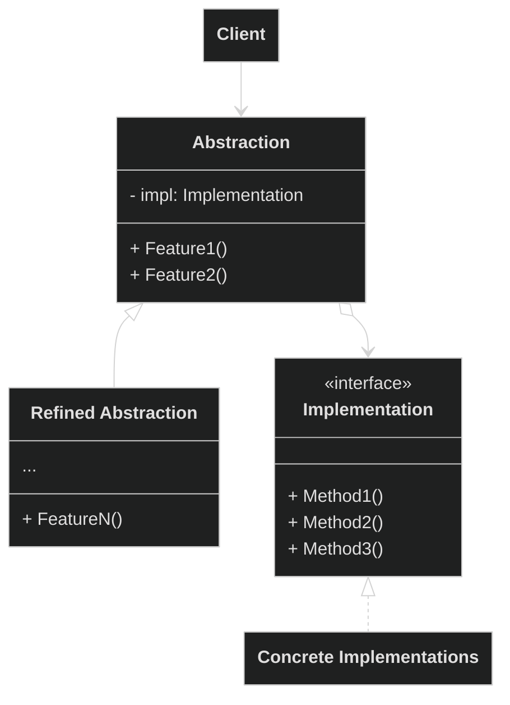

</details>

<details>
<summary>
  Composite
</summary>

**Компоновщик** — это структурный паттерн проектирования, который позволяет сгруппировать множество объектов в древовидную структуру, а затем работать с ней так, как будто это единичный объект.

<details>
<summary>
  Проблема
</summary>

Представим, что мы разрабатываем свою файловую систему. Она состоит из папок и файлов. Папка может содержать другие папки и файлы.

Мы решили, что хотим добавить функционал для подсчета размера, независимо папка это или файл.

**Пример файловой системы:**
```text
📁 Документы [5130 KB]
  📁 Работа [430 KB]
    📄 Резюме.pdf (250 KB)
    📄 Отчёт.docx (180 KB)
  📁 Фотографии [4700 KB]
    📄 Отпуск.jpg (1500 KB)
  📄 Проект.pptx (3200 KB)
```

Если решать задачу напрямую, то потребуется открыть все папки, перебрать все файлы внутри и посчитать их суммарный размер. Но это слишком сложно, так как структура папок и их содержимое могут быть неизвестны заранее.

Кроме того, невозможно предсказать количество уровней вложенности папок. Поэтому обойти такую структуру простым циклом не получится.

</details>


<details>
<summary>
  Решение
</summary>

Паттерн Компоновщик предлагает элегантное решение этой проблемы. Мы создаём общий интерфейс для всех элементов файловой системы — как для файлов, так и для папок. Этот интерфейс объявляет операции, которые поддерживаются как отдельными файлами, так и целыми группами папок.

Файл просто вернет свой размер, а папка запросит размер у вложенных файлов и папок и вернет их сумму. Вложенные папки, в свою очередь, также будут рекурсивно перебирать свои собственные вложенные элементы, запрашивая их размеры и суммируя результаты.

Нам, как клиенту, не придется теперь открывать все папки вручную, мы просто будем запрашивать размер у файловой системы, не думая о ее структуре.

**Общий интерфейс компонентов файловой системы:**

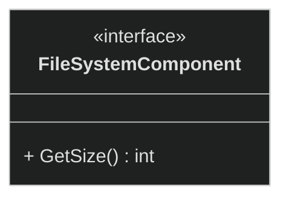

Определяет метод для получения размера компонентов.

**Компоненты файловой системы:**

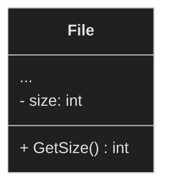

**File (Файл)** - конечный элемент системы, "лист" дерева. Содержит конкретные данные и просто возвращает свой размер при вызове `GetSize()`.

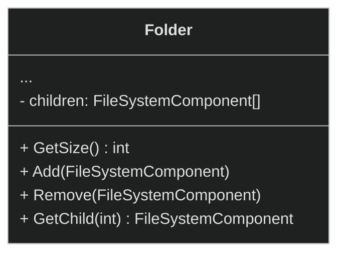

`Folder (Папка)` - компоновщик, может содержать другие компоненты. При вызове `GetSize()` рекурсивно обходит всех детей и суммирует их размеры. Управляет коллекцией через `Add()`, `Remove()`, `GetChild()`.

**Общая структура:**

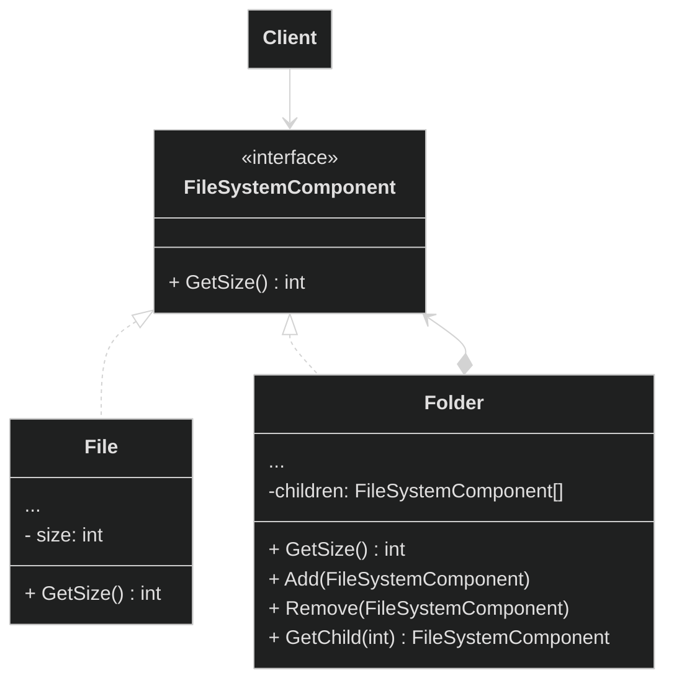

**Реализация в псевдокоде:**

**File:**

```pseudocode
class File {
  field size: int

  function GetSize() : int {
    return this.size  // Просто возвращаем свой размер
  }
}
```

**Folder:**

```pseudocode
class Folder {
  field children: Array FileSystemComponent

  function GetSize() : int {
    total = 0
    for each child in this.children {
      total = total + child.GetSize()  // Рекурсивный вызов!
    }
    return total
  }

  function Remove(component: FileSystemComponent) {
    this.children.Remove(component)
  }

  function GetChild(index: int) : FileSystemComponent {
    return this.children.Get(index)
  }
}
```

**Client:**

```pseudocode
function CreateFileSystem() : FileSystemComponent{
  // Создаём файлы
  resume = new File("Резюме.pdf", 250)
  report = new File("Отчёт.docx", 180)
  vacation_photo = new File("Отпуск.jpg", 1500)
  project = new File("Проект.pptx", 3200)

  // Создаём папки
  documents = new Folder("Документы")
  work_folder = new Folder("Работа")
  photos_folder = new Folder("Фотографии")

  // Добавляем файлы в папки
  work_folder.Add(resume)
  work_folder.Add(report)
  photos_folder.Add(vacation_photo)

  // Строим иерархию
  documents.Add(work_folder)
  documents.Add(photos_folder)
  documents.Add(project)  // Файл напрямую в корневую папку

  return documents
}

// Клиенту не нужно знать о вложенности!
function ClientCode() {
  file_system = CreateFileSystem()
  total_size = file_system.GetSize()
}
```

</details>

**Общая диаграмма паттерна:**

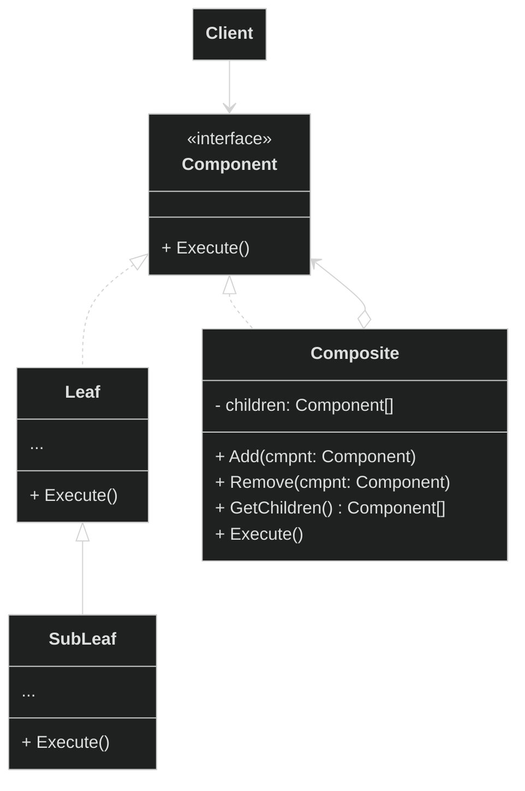

</details>

<details>
<summary>
  Decorator
</summary>

**Декоратор** — это структурный паттерн проектирования, который позволяет динамически добавлять объектам новую функциональность, оборачивая их в полезные «обёртки».

<details>
<summary>
  Проблема
</summary>

Мы работаем над системой для кофейни, которая позволяет формировать заказы на кофе. Основой системы является класс `Coffee` с методом `GetDescription()`, который возвращает описание напитка, и методом `GetCost()`, который рассчитывает его стоимость.

Изначально в кофейне был только базовый кофе без молока и добавок.

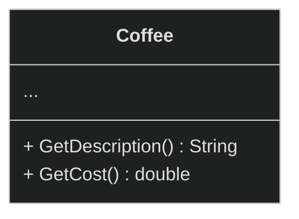

Сторонние программы (терминалы заказов) создавали объекты кофе и использовали их для формирования заказов.

Одного базового напитка клиентам мало. Некоторые хотели бы добавлять в кофе больше молока. Другие просили карамельный сироп. Третьи хотели взбитые сливки или шоколад.

Каждый тип добавки живёт в собственном подклассе. Сначала мы добавим каждый из этих типов добавок в программу, унаследовав их от базового класса `Coffee`.

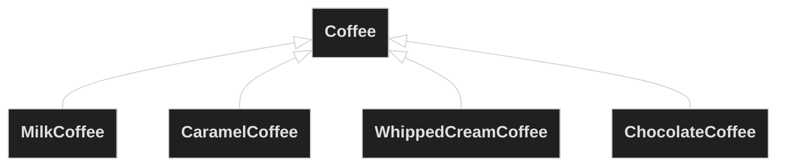

Теперь клиент выбирал один тип напитка с одной добавкой, который и использовался в заказе.

Но многие клиенты хотели бы заказать, например, "латте с молоком, карамельным сиропом и взбитыми сливками"!

Попытка реализовать все возможные комбинации добавок через наследование приведёт к созданию громоздкой и неудобной иерархии классов, количество которых растёт в геометрической прогрессии.

</details>

<details>
<summary>
  Решение
</summary>

Паттерн Декоратор предлагает заменить наследование агрегацией (или композицией). Мы помещаем исходный объект в специальную обёртку, которая вызывает поведение у вложенного объекта и добавляет свою функциональность.

В нашем кофейном примере мы помещаем базовый напиток`Coffee` в специальную обёртку (например, "с молоком"). Мгновенно напиток приобретает новые вкусовые ноты, а его ценность закономерно возрастает на 20 рублей.

Поскольку и исходный объект, и обёртка реализуют одинаковый интерфейс, клиент может работать с ними одинаково.

При этом можно создавать цепочки из нескольких обёрток - например, Кофе → Молоко → Карамель → Сливки.

**Итоговая структура классов кофейни c применением паттерна:**

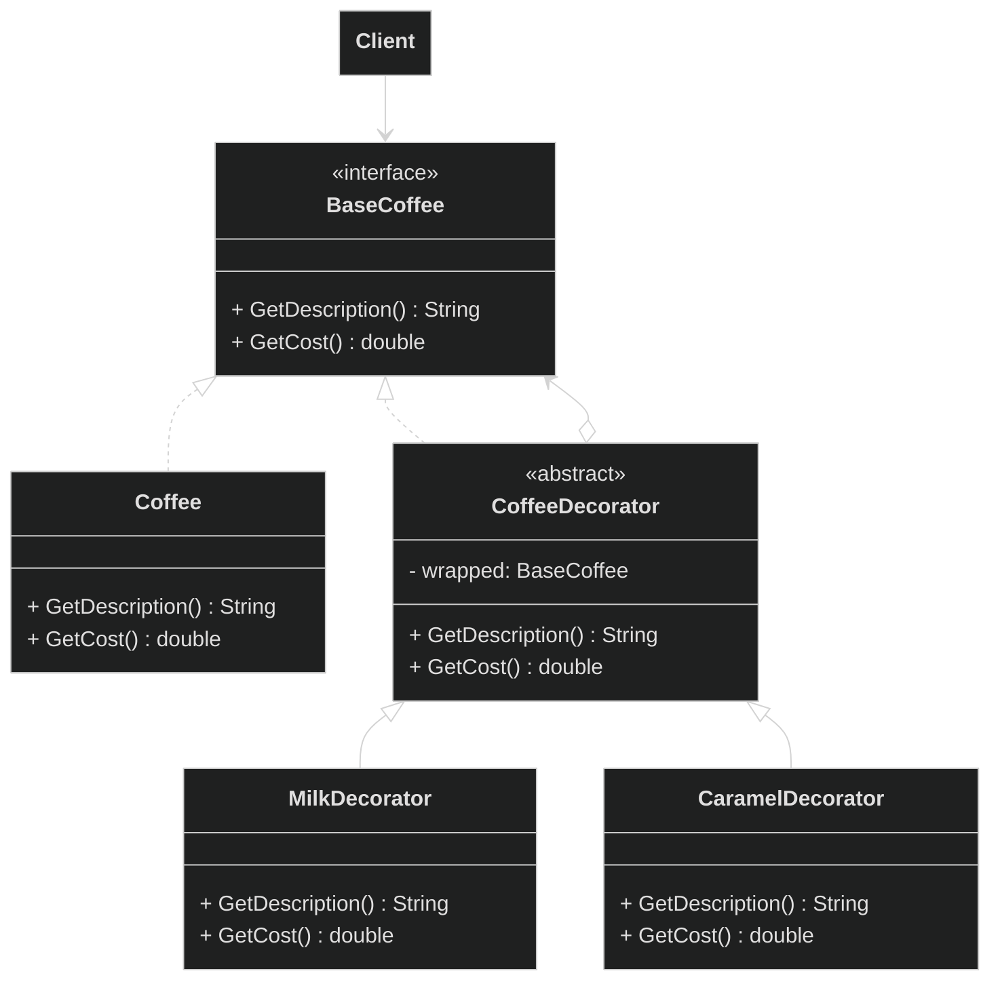

**Псевдокод**

**Класса `Coffee` вместе с интерфейсом:**

```pseudocode
// Базовый интерфейс для всех кофейных напитков
interface BaseCoffee {
  function GetDescription() : String
  function GetCost() : double
}

// Конкретный класс кофе
class Coffee implements BaseCoffee {
  function GetDescription() : String {
    return "Кофе"
  }

  function GetCost() : double {
    return 100.0
  }
}
```

**Обертки для класса `Coffee`:**

```pseudocode
// Абстрактный декоратор
abstract class CoffeeDecorator implements BaseCoffee {
  protected wrapped: BaseCoffee

  Constructor(coffee: BaseCoffee) {
    this.wrapped = coffee
  }

  function GetDescription() : String {
    return wrapped.GetDescription()
  }

  function GetCost() : double {
    return wrapped.GetCost()
  }
}

// Конкретные декораторы
class MilkDecorator extends CoffeeDecorator {
  function GetDescription() : String {
    return wrapped.GetDescription() + ", молоко"
  }

  function GetCost() : double {
    return wrapped.GetCost() + 20.0
  }
}

class CaramelDecorator extends CoffeeDecorator {
  function GetDescription() : String {
    return wrapped.GetDescription() + ", карамель"
  }

  function GetCost() : double {
    return wrapped.GetCost() + 30.0
  }
}

```

**Клиентский код:**

```pseudocode
function Main() {
    // Простой кофе
    simple_coffee = new Coffee()

    // Кофе с молоком
    coffee_with_milk = new MilkDecorator(new Coffee())

    // Кофе с молоком и карамелью
    fancy_coffee = new CaramelDecorator(
                    new MilkDecorator(
                      new Coffee()
                    )
                  )

  // Можем дополнить кофе на лету
  simple_coffee = new MilkDecorator(simple_coffee)
  simple_coffee = new CaramelDecorator(simple_coffee)
  // Кофе -> Кофе с Молоком -> Кофе с Молоком и Карамелью
}
```

</details>

**Общая диаграмма паттерна:**

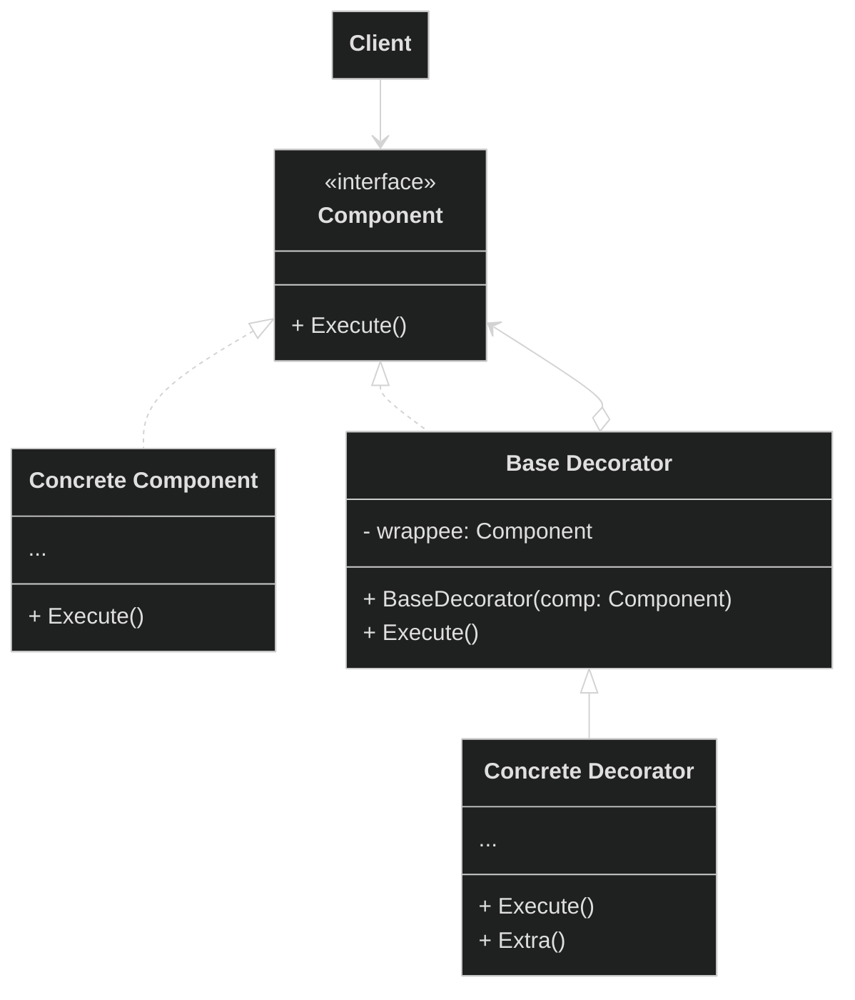

</details>

Facade
**Фасад** — это структурный паттерн проектирования, который предоставляет простой интерфейс к сложной системе классов, библиотеке или фреймворку.

Проблема
Решение

Flyweight
**Легковес** — это структурный паттерн проектирования, который позволяет вместить бóльшее количество объектов в отведённую оперативную память. Легковес экономит память, разделяя общее состояние объектов между собой, вместо хранения одинаковых данных в каждом объекте.

Проблема
Решение

Proxy
**Заместитель** — это структурный паттерн проектирования, который позволяет подставлять вместо реальных объектов специальные объекты-заменители. Эти объекты перехватывают вызовы к оригинальному объекту, позволяя сделать что-то до или после передачи вызова оригиналу.

Проблема
Решение
