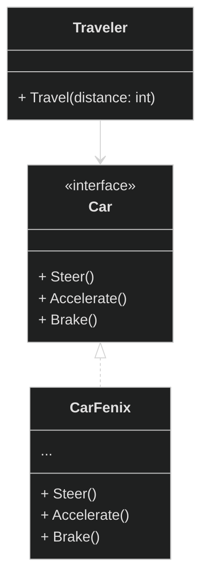
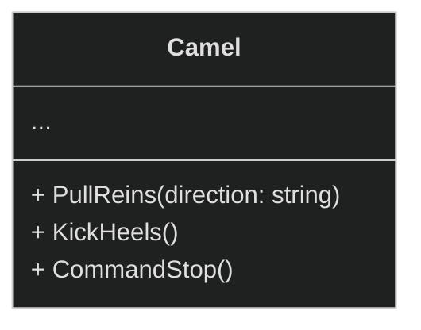
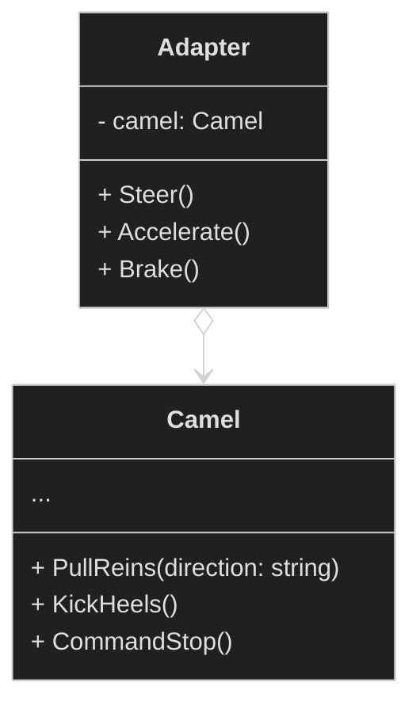
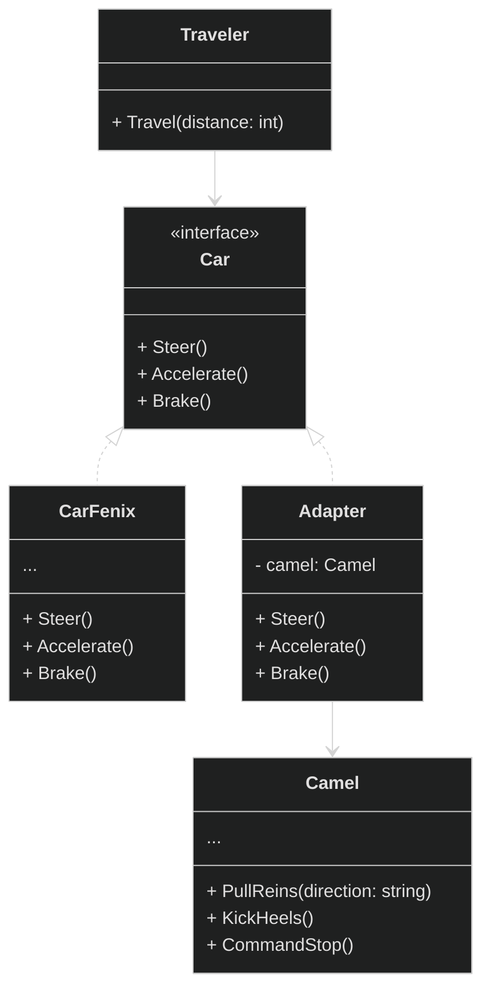
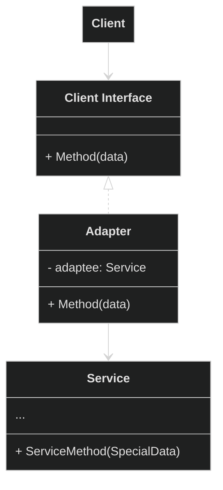
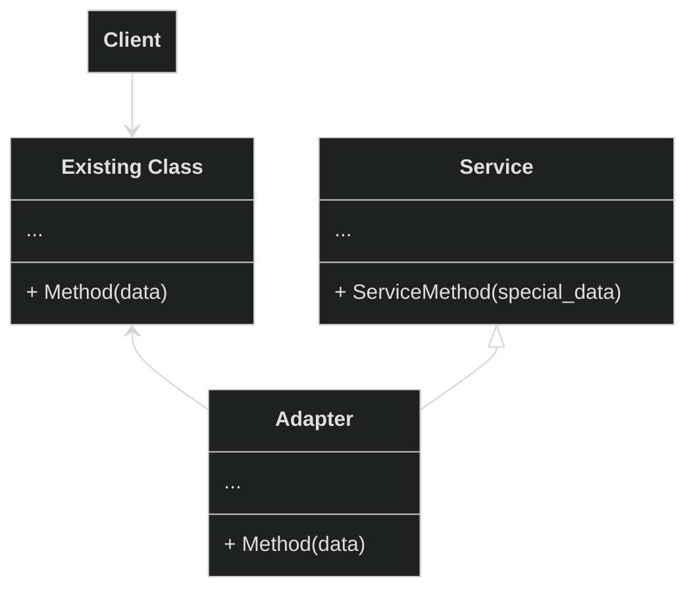

# Структурные паттерны проектирования

Отвечают за построение удобных в поддержке иерархий классов.

  Adapter

**Адаптер** - это структурный паттерн проектирования, который позволяет объектам с несовместимыми интерфейсами работать вместе.

  Проблема

Главный герой: Александр - опытный путешественник, который годами путешествовал по Европе на своём надежном автомобиле "Феникс", который реализует конкретный интерфейс управления. На этой машине он умеет: рулить `Steer()`, давать газ `Accelerate()` и тормозить `Brake()`

Александр решает отправиться в путешествие по Сахаре. Автомобиль "Феникс" беспомощно застревает в песках. Александр понимает, что единственный способ продолжить путь - нанять верблюда у местных бедуинов.

Главный герой не умеет управлять верблюдом, он не знает его команд. Для поворота нужно тянуть за поводья в нужную сторону, для движения вперед - легонько ударить пятками по бокам верблюда, а для остановки - натянуть поводья.

  Решение

Бедуины предлагают Александру создать **адаптер**. Это объект-переводчик, который трансформирует интерфейс или данные одного объекта в такой вид, чтобы он стал понятен другому объекту

В нашем случае это специальное седло, оснащенное рулём и педалями, которое преобразует автомобильные команды в верблюжьи:

- `Steer("left")` → Поворот руля налево → `PullReins("left")` (механизм тянет левый повод)
- `Accelerate()` → Нажатие педали газа → `KickHeels()` (механизм легенько ударяет пятками по бокам верблюда)
- `Brake()` → Нажатие педали тормоза → `CommandStop()` (механизм натягивает поводья)

Итоговое управление нашего путешественника будет выглядить следующим образом:

Заметим, что в данной реализации используется **ассоциация**. Адаптер содержит ссылку на служебный объект(Camel).

**Общая диаграмма паттерна через агрегацию:**

**Общая диаграмма паттерна через наследование:**

В данном случае адаптеру не нужен вложенный объект, так как он может наследовать как часть существующего класса так и часть сервиса.

Bridge
**Мост** — это структурный паттерн проектирования, который разделяет один или несколько классов на две отдельные иерархии — абстракцию и реализацию, позволяя изменять их независимо друг от друга.

Проблема
Решение

Composite
**Компоновщик** — это структурный паттерн проектирования, который позволяет сгруппировать множество объектов в древовидную структуру, а затем работать с ней так, как будто это единичный объект.

Проблема
Решение

Decorator
**Декоратор** — это структурный паттерн проектирования, который позволяет динамически добавлять объектам новую функциональность, оборачивая их в полезные «обёртки».

Проблема
Решение

Facade
**Фасад** — это структурный паттерн проектирования, который предоставляет простой интерфейс к сложной системе классов, библиотеке или фреймворку.

Проблема
Решение

Flyweight
**Легковес** — это структурный паттерн проектирования, который позволяет вместить бóльшее количество объектов в отведённую оперативную память. Легковес экономит память, разделяя общее состояние объектов между собой, вместо хранения одинаковых данных в каждом объекте.

Проблема
Решение

Proxy
**Заместитель** — это структурный паттерн проектирования, который позволяет подставлять вместо реальных объектов специальные объекты-заменители. Эти объекты перехватывают вызовы к оригинальному объекту, позволяя сделать что-то до или после передачи вызова оригиналу.

Проблема
Решение
