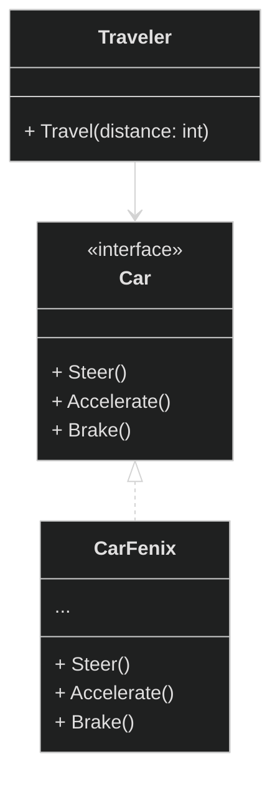
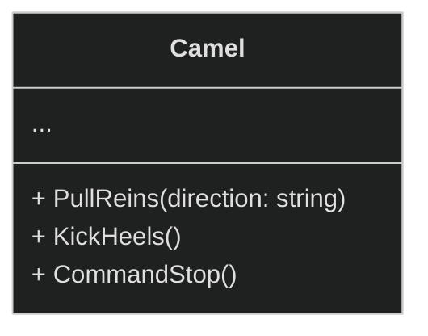
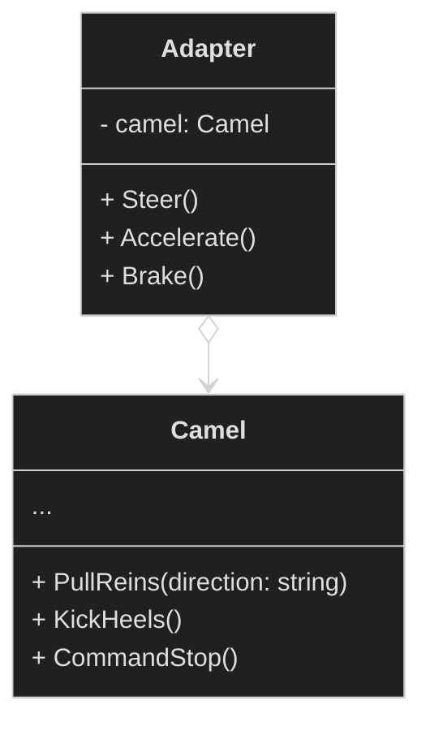
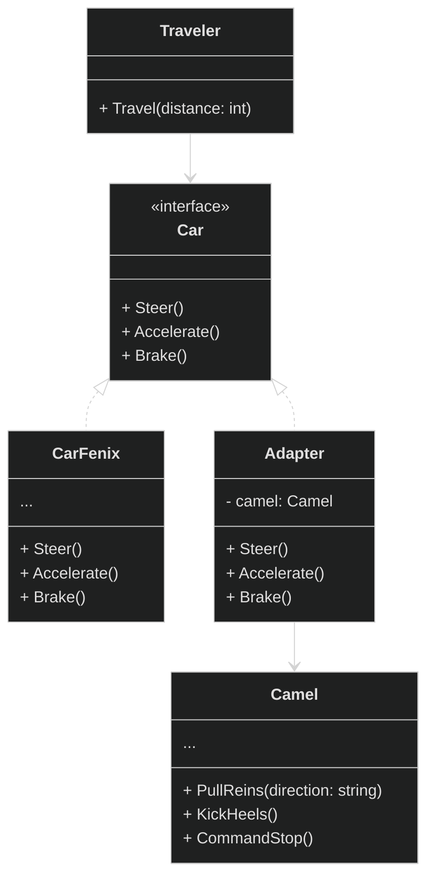
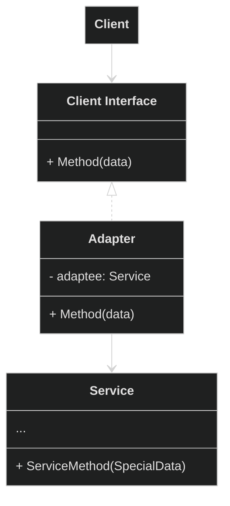
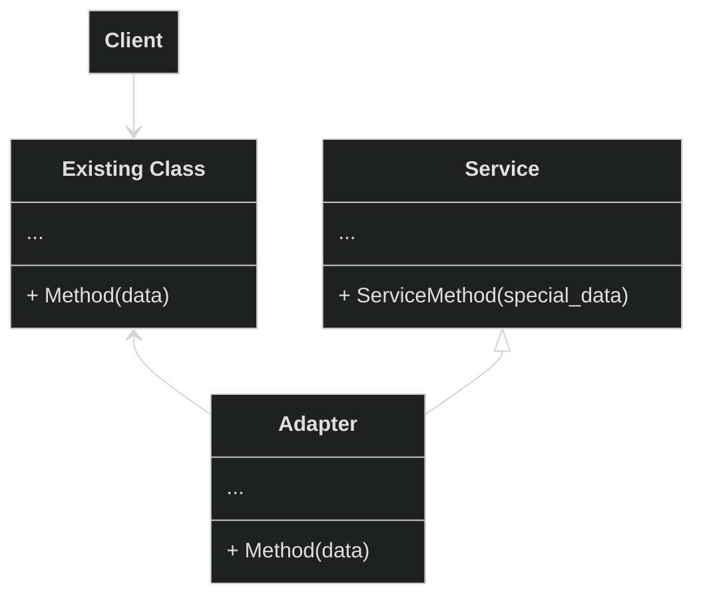
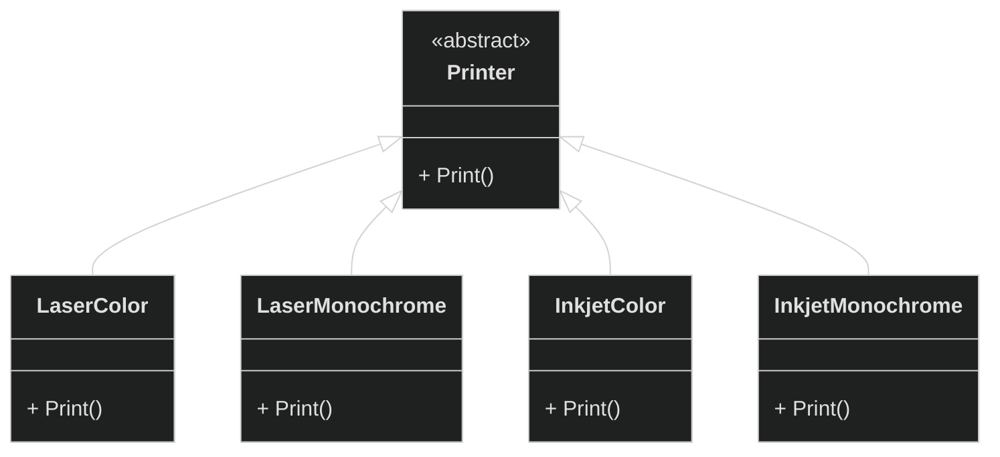
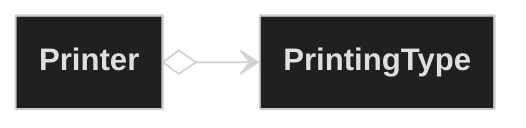
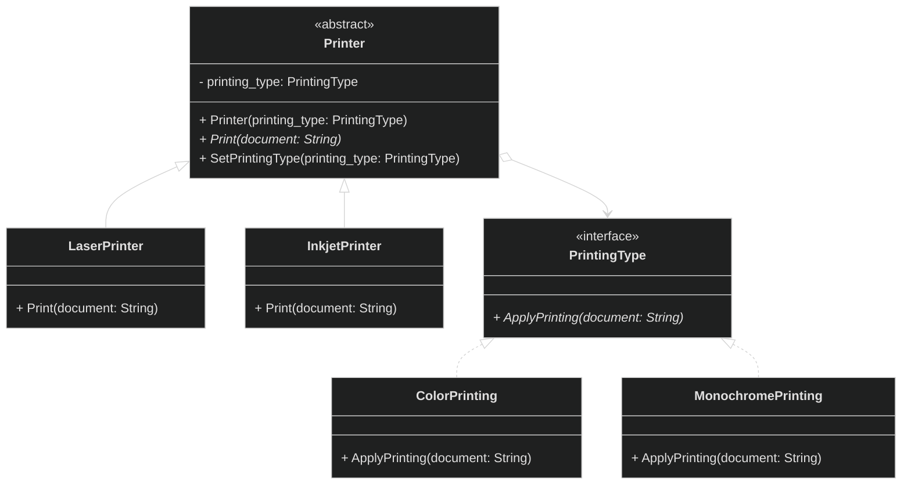
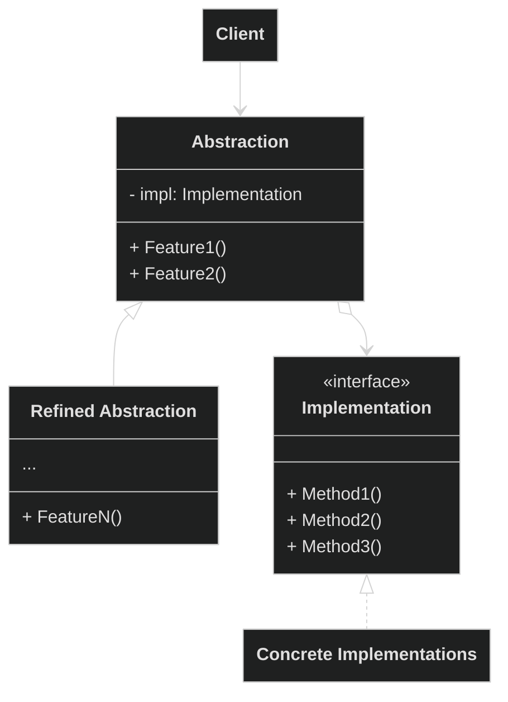

# Структурные паттерны проектирования

Отвечают за построение удобных в поддержке иерархий классов.

<details>
<summary>
  Adapter
</summary>

**Адаптер** - это структурный паттерн проектирования, который позволяет объектам с несовместимыми интерфейсами работать вместе.

<details>
<summary>
  Проблема
</summary>

Главный герой: Александр - опытный путешественник, который годами путешествовал по Европе на своём надежном автомобиле "Феникс", который реализует конкретный интерфейс управления. На этой машине он умеет: рулить `Steer()`, давать газ `Accelerate()` и тормозить `Brake()`



Александр решает отправиться в путешествие по Сахаре. Автомобиль "Феникс" беспомощно застревает в песках. Александр понимает, что единственный способ продолжить путь - нанять верблюда у местных бедуинов.



Главный герой не умеет управлять верблюдом, он не знает его команд. Для поворота нужно тянуть за поводья в нужную сторону, для движения вперед - легонько ударить пятками по бокам верблюда, а для остановки - натянуть поводья.

</details>

<details>
<summary>
  Решение
</summary>

Бедуины предлагают Александру создать **адаптер**. Это объект-переводчик, который трансформирует интерфейс или данные одного объекта в такой вид, чтобы он стал понятен другому объекту

В нашем случае это специальное седло, оснащенное рулём и педалями, которое преобразует автомобильные команды в верблюжьи:



- `Steer("left")` → Поворот руля налево → `PullReins("left")` (механизм тянет левый повод)
- `Accelerate()` → Нажатие педали газа → `KickHeels()` (механизм легенько ударяет пятками по бокам верблюда)
- `Brake()` → Нажатие педали тормоза → `CommandStop()` (механизм натягивает поводья)

Итоговое управление нашего путешественника будет выглядить следующим образом:



Заметим, что в данной реализации используется **ассоциация**. Адаптер содержит ссылку на служебный объект(Camel).

</details>

**Общая диаграмма паттерна через агрегацию:**



**Общая диаграмма паттерна через наследование:**



В данном случае адаптеру не нужен вложенный объект, так как он может наследовать как часть существующего класса так и часть сервиса.

</details>

<details>
<summary>
  Bridge
</summary>

**Мост** — это структурный паттерн проектирования, который разделяет один или несколько классов на две отдельные иерархии — абстракцию и реализацию, позволяя изменять их независимо друг от друга.

<details>
<summary>
  Проблема
</summary>

У вас есть базовый класс `Принтер` с двумя видами принтеров: `Лазерный` и `Струйный`. Теперь вы хотите добавить поддержку разных типов печати: `цветной` и `чёрно-белой`.

Если пойти простым путём наследования, придётся создать четыре отдельных класса:
- `ЛазерныйЦветной`
- `ЛазерныйЧернобелый`
- `СтруйныйЦветной`
- `СтруйныйЧернобелый`



- `Printer` = Принтер
- `LaserColor` = ЛазерныйЦветной
- `LaserMonochrome` = ЛазерныйЧернобелый
- `InkjetColor` = СтруйныйЦветной
- `InkjetMonochrome` = СтруйныйЧернобелый

На данный момент у нас `2 принтера` x `2 печати`, всего 4 подкласса. При добавлении новых видов принтеров и типов печати количество комбинаций будет расти. Так, если добавим еще один тип печати, то получится `3 х 2 = 6` подклассов. И это очень печально.

</details>

<details>
<summary>
  Решение
</summary>

Паттерн Мост предлагает отказаться от создания множества комбинаций через наследование. Вместо этого мы разделяем наши характеристики на две независимые части и связываем их через "мост".

Разделяем на две самостоятельные иерархии:

- Первая иерархия - типы принтеров (лазерный, струйный)
- Вторая иерархия - типы печати (цветная, чёрно-белая)

И заменяем наследование агрегацией:



Таким образом, мы разделили систему: тип печати стал отдельной иерархией с классами `Color` и `Monochrome`. Класс `Printer` теперь содержит ссылку на объект `PrintingType` и может поручать ему работу по обработке цветности. Эта связь между принтером и типом печати и есть тот самый "мост".

Главное преимущество: когда мы добавляем новые типы печати, классам принтеров не нужны изменения, и наоборот - новые принтеры легко работают с существующими типами печати.

Итак, **абстракция** — это образный слой управления чем-либо(`Printer`). Он не делает работу самостоятельно, а делегирует её слою реализации(`PrintingType`).



Реализация используя псевдокод:

**Абстракция:**

```pseudocode
class Printer {
  field printing_type: PrintingType  // Мост к реализации

  Constructor(printing_type: PrintingType) {
    this.printing_type = printing_type
  }

  abstract function Print(document: String)

  function SetPrintingType(printing_type: PrintingType) {
    this.printing_type = printing_type  // Меняем реализацию на лету!
  }
}

class LaserPrinter extends Printer {
  function Print(document: String) {
    Print("Лазерная печать: ")
    printing_type.ApplyPrinting(document)  // Делегируем реализацию
  }
}

class InkjetPrinter extends Printer {
  function Print(document: String) {
    Print("Струйная печать: ")
    printing_type.ApplyPrinting(document)  // Делегируем реализацию
  }
}
```

**Реализация:**

```pseudocode
interface PrintingType {
  function ApplyPrinting(document: String)
}

class ColorPrinting implements PrintingType {
  function ApplyPrinting(document: String) {
    Print("ЦВЕТНАЯ печать: " + document)
  }
}

class MonochromePrinting implements PrintingType {
  function ApplyPrinting(document: String) {
    Print("ЧЁРНО-БЕЛАЯ печать: " + document)
  }
}
```

**Клиент:**

```pseudocode
laser_сolor = new LaserPrinter(new ColorPrinting())
inkjet_mono = new InkjetPrinter(new MonochromePrinting())

// Работаем через абстракцию
laser_сolor.Print("Отчёт компании")
// Вывод: "Лазерная печать: ЦВЕТНАЯ печать: Отчёт компании"

inkjet_mono.Print("Черновик документа")
// Вывод: "Струйная печать: ЧЁРНО-БЕЛАЯ печать: Черновик документа"

// Меняем реализацию на лету!
laser_сolor.SetPrintingType(new MonochromePrinting())
laser_сolor.Print("Новый документ")
// Вывод: "Лазерная печать: ЧЁРНО-БЕЛАЯ печать: Новый документ"
```

</details>

**Общая диаграмма паттерна:**



</details>

Composite
**Компоновщик** — это структурный паттерн проектирования, который позволяет сгруппировать множество объектов в древовидную структуру, а затем работать с ней так, как будто это единичный объект.

Проблема
Решение

Decorator
**Декоратор** — это структурный паттерн проектирования, который позволяет динамически добавлять объектам новую функциональность, оборачивая их в полезные «обёртки».

Проблема
Решение

Facade
**Фасад** — это структурный паттерн проектирования, который предоставляет простой интерфейс к сложной системе классов, библиотеке или фреймворку.

Проблема
Решение

Flyweight
**Легковес** — это структурный паттерн проектирования, который позволяет вместить бóльшее количество объектов в отведённую оперативную память. Легковес экономит память, разделяя общее состояние объектов между собой, вместо хранения одинаковых данных в каждом объекте.

Проблема
Решение

Proxy
**Заместитель** — это структурный паттерн проектирования, который позволяет подставлять вместо реальных объектов специальные объекты-заменители. Эти объекты перехватывают вызовы к оригинальному объекту, позволяя сделать что-то до или после передачи вызова оригиналу.

Проблема
Решение
